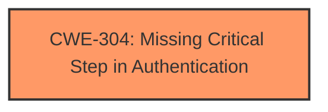

# Analysis for CVE-2024-12136

# Summary
| CWE ID | CWE Name | Confidence | CWE Abstraction Level | CWE Vulnerability Mapping Label | CWE-Vulnerability Mapping Notes |
|---|---|---|---|---|---|
| CWE-304 | Missing Critical Step in Authentication | 1.0 | Base | Primary CWE | Allowed |

## Evidence and Confidence

*   **Confidence Score:** 1.0
*   **Evidence Strength:** HIGH

## Relationship Analysis
The primary CWE is CWE-304 (Missing Critical Step in Authentication), which is a Base level CWE. While CWE-304 has no direct parent or child relationships, it falls under the broader category of authentication issues. The relationship analysis confirms that focusing on the specific **missing step** provides the most accurate and actionable classification.

## Vulnerability Chain
The vulnerability chain starts with the **missing critical step in authentication** (CWE-304), which leads directly to the **authentication bypass**.

## Summary of Analysis
The vulnerability description clearly states "**Missing Critical Step in Authentication** vulnerability in Elfatek Elektronics ANKA JPD-00028 allows Authentication Bypass." This directly aligns with CWE-304 (Missing Critical Step in Authentication). The phrase "**Missing Critical Step in Authentication**" is the root cause, leading to the impact of "**Authentication Bypass**."

The Retriever Results also list CWE-304 as the top result.

Relevant CWE Information:

# Enhanced Context (25 CWEs)
The following CWEs were identified as potentially relevant to this vulnerability:

## CWE-304: Missing Critical Step in Authentication
**Abstraction Level**: Base
**Similarity Score**: 0.74
**Source**: dense

**Description**:
The product implements an authentication technique, but it skips a step that weakens the technique.

**Mapping Guidance**:
- Usage: Allowed
- Rationale: This CWE entry is at the Base level of abstraction, which is a preferred level of abstraction for mapping to the root causes of vulnerabilities.