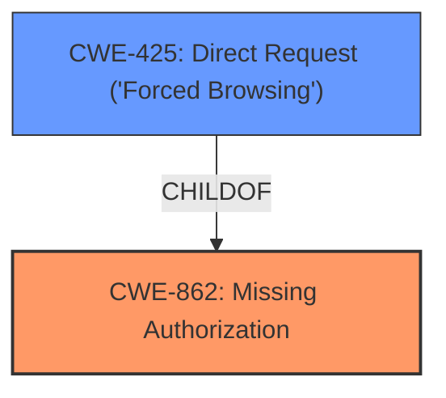

# Analysis Report for CVE-2024-12201

# Vulnerability Analysis Report: CVE-2024-12201

## Description

The Hash Form Drag & Drop Form Builder plugin for WordPress is vulnerable to unauthorized access due to a **missing capability check** when creating form styles in all versions up to, and including, 1.2.1. This makes it possible for authenticated attackers, with Contributor-level access and above, to create new form styles.

## Vulnerability Description Key Phrases

- **Rootcause:** missing capability check
- **Impact:** create new form styles
- **Attacker:** authenticated attackers with Contributor-level access and above
- **Product:** Hash Form Drag & Drop Form Builder plugin for WordPress
- **Version:** all versions up to and including 1.2.1
- **Component:** form styles creation

## Analysis (with Relationship Data)

# Summary
| CWE ID | CWE Name | Confidence | CWE Abstraction Level | CWE Vulnerability Mapping Label | CWE-Vulnerability Mapping Notes |
|---|---|---|---|---|---|
| CWE-862 | Missing Authorization | 1.0 | Class | Allowed-with-Review | Primary CWE. The product does not perform an authorization check when an actor attempts to access a resource or perform an action. |
| CWE-425 | Direct Request ('Forced Browsing') | 0.7 | Base | Allowed | Secondary. The web application does not adequately enforce appropriate authorization on all restricted URLs, scripts, or files. |

## Evidence and Confidence

*   **Confidence Score:** 0.9
*   **Evidence Strength:** HIGH

## Relationship Analysis
The primary CWE is CWE-862, **Missing Authorization**, which is a Class-level CWE. CWE-425, Direct Request ('Forced Browsing'), is a Base-level CWE and a ChildOf CWE-862. The vulnerability description clearly states a **missing capability check**, which directly aligns with the definition of CWE-862. While CWE-425 is more specific, the provided information doesn't fully support a direct request bypass; it focuses on the broader lack of authorization. Therefore, CWE-862 is chosen as the primary, with CWE-425 as a secondary candidate.



## Vulnerability Chain
The vulnerability chain starts with the **missing capability check (CWE-862)**, which allows authenticated attackers with Contributor-level access or higher to create new form styles. This can potentially lead to site defacement or other malicious activities. The root cause is the **missing authorization**, leading to unauthorized access and potential impact on the website's integrity.

## Summary of Analysis
The analysis indicates a clear **missing authorization** vulnerability. The vulnerability description explicitly mentions a **missing capability check**, which directly corresponds to CWE-862. The ability for Contributor-level users to create form styles without proper authorization is the core weakness. The selection of CWE-862 is based on the high confidence match with the vulnerability description and the retriever results.

The evidence from the vulnerability description:
"The Hash Form Drag & Drop Form Builder plugin for WordPress is vulnerable to unauthorized access due to a **missing capability check** when creating form styles in all versions up to, and including, 1.2.1. This makes it possible for authenticated attackers, with Contributor-level access and above, to create new form styles."

The graph relationships influenced the selection by highlighting the connection between CWE-862 and CWE-425. However, the evidence more strongly supports the broader **missing authorization** rather than a specific direct request bypass.

CWE-862 is chosen as the primary CWE because it accurately represents the root cause of the vulnerability at an appropriate level of abstraction (Class).

CWEs considered but not used:

*   CWE-863 (Incorrect Authorization): This was considered but not selected because the issue is not that the authorization is incorrect, but that it's **missing** entirely.
*   CWE-352 (Cross-Site Request Forgery): This was considered but not selected because there's no evidence suggesting a CSRF attack vector. The vulnerability is due to a **missing check**, not a forged request.
*   CWE-306 (Missing Authentication for Critical Function): This was considered but not selected as the users are authenticated, but the authorization check is missing after authentication.
*   CWE-425 (Direct Request ('Forced Browsing')): This was considered as a possibility, but is not specifically supported by the evidence so is a secondary candidate instead.
Relevant CWE Information:

# Enhanced Context (25 CWEs)
The following CWEs were identified as potentially relevant to this vulnerability:

## CWE-352: Cross-Site Request Forgery (CSRF)
**Abstraction Level**: Compound
**Similarity Score**: 0.72
**Source**: dense

**Description**:
The web application does not, or can not, sufficiently verify whether a well-formed, valid, consistent request was intentionally provided by the user who submitted the request.

**Mapping Guidance**:
- Usage: Allowed
- Rationale: This is a well-known Composite of multiple weaknesses that must all occur simultaneously, although it is attack-oriented in nature.


## CWE-472: External Control of Assumed-Immutable Web Parameter
**Abstraction Level**: Base
**Similarity Score**: 0.69
**Source**: dense

**Description**:
The web application does not sufficiently verify inputs that are assumed to be immutable but are actually externally controllable, such as hidden form fields.

**Mapping Guidance**:
- Usage: Allowed
- Rationale: This CWE entry is at the Base level of abstraction, which is a preferred level of abstraction for mapping to the root causes of vulnerabilities.


## CWE-425: Direct Request ('Forced Browsing')
**Abstraction Level**: Base
**Similarity Score**: 0.69
**Source**: dense

**Description**:
The web application does not adequately enforce appropriate authorization on all restricted URLs, scripts, or files.

**Mapping Guidance**:
- Usage: Allowed
- Rationale: This CWE entry is at the Base level of abstraction, which is a preferred level of abstraction for mapping to the root causes of vulnerabilities.


## CWE-434: Unrestricted Upload of File with Dangerous Type
**Abstraction Level**: Base
**Similarity Score**: 0.68
**Source**: dense

**Description**:
The product allows the upload or transfer of dangerous file types that are automatically processed within its environment.

**Mapping Guidance**:
- Usage: Allowed
- Rationale: This CWE entry is at the Base level of abstraction, which is a preferred level of abstraction for mapping to the root causes of vulnerabilities.


## CWE-639: Authorization Bypass Through User-Controlled Key
**Abstraction Level**: Base
**Similarity Score**: 0.68
**Source**: dense

**Description**:
The system's authorization functionality does not prevent one user from gaining access to another user's data or record by modifying the key value identifying the data.

**Mapping Guidance**:
- Usage: Allowed
- Rationale: This CWE entry is at the Base level of abstraction, which is a preferred level of abstraction for mapping to the root causes of vulnerabilities.


## CWE-116: Improper Encoding or Escaping of Output
**Abstraction Level**: Class
**Similarity Score**: 0.66
**Source**: dense

**Description**:
The product prepares a structured message for communication with another component, but encoding or escaping of the data is either missing or done incorrectly. As a result, the intended structure of the message is not preserved.

**Mapping Guidance**:
- Usage: Allowed-with-Review
- Rationale: This CWE entry is a Class and might have Base-level children that would be more appropriate


## CWE-862: Missing Authorization
**Abstraction Level**: Class
**Similarity Score**: 0.66
**Source**: dense

**Description**:
The product does not perform an authorization check when an actor attempts to access a resource or perform an action.

**Mapping Guidance**:
- Usage: Allowed-with-Review
- Rationale: This CWE entry is a Class and might have Base-level children that would be more appropriate


## CWE-328: Use of Weak Hash
**Abstraction Level**: Base
**Similarity Score**: 0.66
**Source**: dense

**Description**:
The product uses an algorithm that produces a digest (output value) that does not meet security expectations for a hash function that allows an adversary to reasonably determine the original input (preimage attack), find another input that can produce the same hash (2nd preimage attack), or find multiple inputs that evaluate to the same hash (birthday attack).

**Mapping Guidance**:
- Usage: Allowed
- Rationale: This CWE entry is at the Base level of abstraction, which is a preferred level of abstraction for mapping to the root causes of vulnerabilities.


## CWE-178: Improper Handling of Case Sensitivity
**Abstraction Level**: Base
**Similarity Score**: 0.66
**Source**: dense

**Description**:
The product does not properly account for differences in case sensitivity when accessing or determining the properties of a resource, leading to inconsistent results.

**Mapping Guidance**:
- Usage: Allowed
- Rationale: This CWE entry is at the Base level of abstraction, which is a preferred level of abstraction for mapping to the root causes of vulnerabilities.


## CWE-88: Improper Neutralization of Argument Delimiters in a Command ('Argument Injection')
**Abstraction Level**: Base
**Similarity Score**: 0.65
**Source**: dense

**Description**:
The product constructs a string for a command to be executed by a separate component
in another control sphere, but it does not properly delimit the
intended arguments, options, or switches within that command string


## CWE Relationship Analysis

Current CWEs represent these abstraction levels: .


### Vulnerability Chain Analysis

**Chain starting from CWE-863:**
- 863 (Incorrect Authorization) - ROOT


**Chain starting from CWE-116:**
- 116 (Improper Encoding or Escaping of Output) - ROOT


### CWE Relationship Diagram

```mermaid
graph TD
    classDef primary fill:#f96,stroke:#333,stroke-width:2px
    classDef secondary fill:#69f,stroke:#333
    classDef tertiary fill:#9e9,stroke:#333
```


*Report generated on 2025-07-13 02:26:48*
