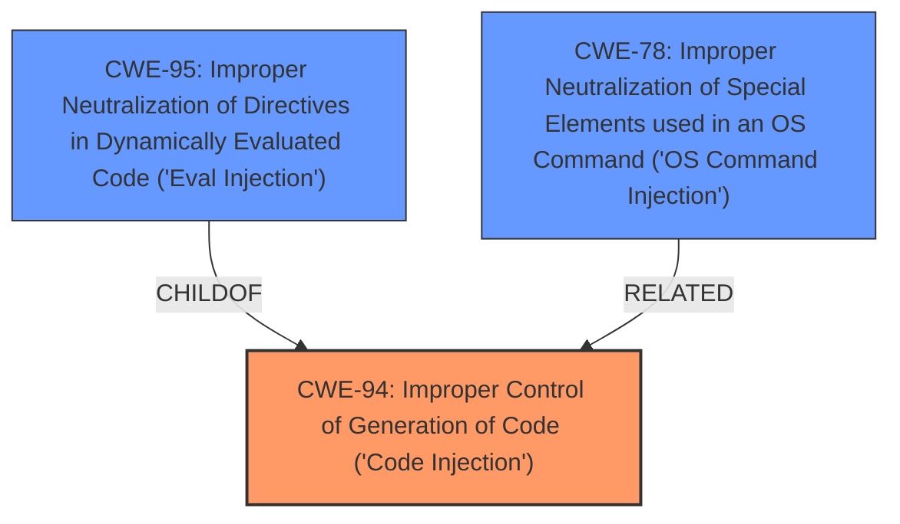

# Raw Analyzer Response for CVE-2024-12215

# Summary
| CWE ID | CWE Name | Confidence | CWE Abstraction Level | CWE Vulnerability Mapping Label | CWE-Vulnerability Mapping Notes |
|---|---|---|---|---|---|
| CWE-94 | Improper Control of Generation of Code ('Code Injection') | 0.8 | Base | Allowed-with-Review | Primary CWE |

## Evidence and Confidence

*   **Confidence Score:** 0.8
*   **Evidence Strength:** MEDIUM

## Relationship Analysis
The primary relationship considered here is the parent-child relationship between CWE-94 and its variants. The vulnerability description indicates that the `setup.py` file execution leads to arbitrary command execution. CWE-94 is a base class for code injection vulnerabilities where the application **improperly controls the generation of code**. The Retriever Results also suggest several other CWEs related to path traversal and command injection. However, the core issue is the **uncontrolled execution of code** from an external source, making CWE-94 the most relevant.

## Vulnerability Chain
The vulnerability chain is as follows:
1.  Application downloads a package from the Internet.
2.  Application executes the `setup.py` file within the downloaded package.
3.  **Improper Control of Generation of Code** (CWE-94): the application doesn't validate or control the code being executed.
4.  Remote Code Execution (Impact).

## Summary of Analysis
The primary weakness is the **improper control of the generated code** (`setup.py`). While the vulnerability description mentions downloading a package (which could be related to integrity checks), the root cause lies in the uncontrolled execution of the `setup.py` file. The `pull_package()` function downloads and extracts micro packages, but the `project_wheel_metadata()` function executes `setup.py` without proper validation.

The evidence supporting CWE-94 is the vulnerability description stating that the `setup.py` file inside the tar file can be executed, "leading to remote code execution (RCE) by running arbitrary commands on the victims machine." This clearly points to code injection, where the application executes code that it should not.

CWE-78, CWE-22, and CWE-23 were considered, but they are more focused on OS command injection and path traversal, respectively, while CWE-94 directly addresses the **uncontrolled code generation/execution**. CWE-79 is related to XSS. CWE-506 might be relevant if the downloaded package is intentionally malicious. However, the vulnerability exists even with a benign package if the `setup.py` contains malicious code, and the application executes it. CWE-88 is related to command argument injection but the issue isn't arguments, but the **execution of the `setup.py` file itself**.

The decision is based on the evidence provided, and the hierarchical relationships within the CWE structure support this classification. The selected CWE is at the optimal level of specificity because it directly addresses the **root cause of the vulnerability**: the **improper control of code generation**.

Relevant CWE Information:

# Enhanced Context (25 CWEs)
The following CWEs were identified as potentially relevant to this vulnerability:

## CWE-95: Improper Neutralization of Directives in Dynamically Evaluated Code ('Eval Injection')
**Abstraction Level**: Variant
**Similarity Score**: 0.71
**Source**: dense

**Description**:
The product receives input from an upstream component, but it does not neutralize or incorrectly neutralizes code syntax before using the input in a dynamic evaluation call (e.g. "eval").

**Mapping Guidance**:
- Usage: Allowed
- Rationale: This CWE entry is at the Variant level of abstraction, which is a preferred level of abstraction for mapping to the root causes of vulnerabilities.

## CWE-88: Improper Neutralization of Argument Delimiters in a Command ('Argument Injection')
**Abstraction Level**: Base
**Similarity Score**: 0.71
**Source**: dense

**Description**:
The product constructs a string for a command to be executed by a separate component
in another control sphere, but it does not properly delimit the
intended arguments, options, or switches within that command string.

## CWE-73: External Control of File Name or Path
**Abstraction Level**: Base
**Similarity Score**: 0.70
**Source**: dense

**Description**:
The product allows user input to control or influence paths or file names that are used in filesystem operations.

## CWE-74: Improper Neutralization of Special Elements in Output Used by a Downstream Component ('Injection')
**Abstraction Level**: Class
**Similarity Score**: 0.70
**Source**: dense

**Description**:
The product constructs all or part of a command, data structure, or record using externally-influenced input from an upstream component, but it does not neutralize or incorrectly neutralizes special elements that could modify how it is parsed or interpreted when it is sent to a downstream component.

## CWE-506: Embedded Malicious Code
**Abstraction Level**: Class
**Similarity Score**: 0.70
**Source**: dense

**Description**:
The product contains code that appears to be malicious in nature.

## CWE-923: Improper Restriction of Communication Channel to Intended Endpoints
**Abstraction Level**: Class
**Similarity Score**: 0.70
**Source**: dense

**Description**:
The product establishes a communication channel to (or from) an endpoint for privileged or protected operations, but it does not properly ensure that it is communicating with the correct endpoint.

## CWE-184: Incomplete List of Disallowed Inputs
**Abstraction Level**: Base
**Similarity Score**: 0.70
**Source**: dense

**Description**:
The product implements a protection mechanism that relies on a list of inputs (or properties of inputs) that are not allowed by policy or otherwise require other action to neutralize before additional processing takes place, but the list is incomplete.

## CWE-1286: Improper Validation of Syntactic Correctness of Input
**Abstraction Level**: Base
**Similarity Score**: 0.70
**Source**: dense

**Description**:
The product receives input that is expected to be well-formed - i.e., to comply with a certain syntax - but it does not validate or incorrectly validates that the input complies with the syntax.

## CWE-23: Relative Path Traversal
**Abstraction Level**: Base
**Similarity Score**: 0.69
**Source**: dense

**Description**:
The product uses external input to construct a pathname that should be within a restricted directory, but it does not properly neutralize sequences such as ".." that can resolve to a location that is outside of that directory.

## CWE-138: Improper Neutralization of Special Elements
**Abstraction Level**: Class
**Similarity Score**: 0.69
**Source**: dense

**Description**:
The product receives input from an upstream component, but it does not neutralize or incorrectly neutralizes special elements that could be interpreted as control elements or syntactic markers when they are sent to a downstream component.

## CWE-22: Improper Limitation of a Pathname to a Restricted Directory ('Path Traversal')
**Abstraction Level**: Base
**Similarity Score**: 528.79
**Source**: sparse

**Description**:
The product uses external input to construct a pathname that is intended to identify a file or directory that is located underneath a restricted parent directory, but the product does not properly neutralize special elements within the pathname that can cause the pathname to resolve to a location that is outside of the restricted directory.

## CWE-138: Improper Neutralization of Special Elements
**Abstraction Level**: Class
**Similarity Score**: 496.71
**Source**: sparse

**Description**:
The product receives input from an upstream component, but it does not neutralize or incorrectly neutralizes special elements that could be interpreted as control elements or syntactic markers when they are sent to a downstream component.

## CWE-23: Relative Path Traversal
**Abstraction Level**: Base
**Similarity Score**: 488.30
**Source**: sparse

**Description**:
The product uses external input to construct a pathname that should be within a restricted directory, but it does not properly neutralize sequences such as ".." that can resolve to a location that is outside of that directory.

## CWE-59: Improper Link Resolution Before File Access ('Link Following')
**Abstraction Level**: Base
**Similarity Score**: 484.02
**Source**: sparse

**Description**:
The product attempts to access a file based on the filename, but it does not properly prevent that filename from identifying a link or shortcut that resolves to an unintended resource.

## CWE-79: Improper Neutralization of Input