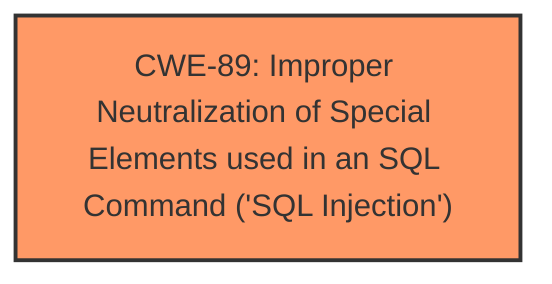

# Enhanced Analysis for CVE-2024-12228

# Summary
| CWE ID | CWE Name | Confidence | CWE Abstraction Level | CWE Vulnerability Mapping Label | CWE-Vulnerability Mapping Notes |
|---|---|---|---|---|---|
| CWE-89 | Improper Neutralization of Special Elements used in an SQL Command ('SQL Injection') | 1.0 | Base | Allowed | Primary CWE. The vulnerability is due to **insufficient user input validation** of the 'search' parameter in the `/admin/user-search.php` file, allowing attackers to inject malicious SQL queries. |

## Evidence and Confidence

*   **Confidence Score:** 1.0
*   **Evidence Strength:** HIGH

## Relationship Analysis
The primary relationship that influenced the CWE selection is the direct match of the vulnerability to the description of CWE-89. While other CWEs were considered based on the retriever results, they were deemed less specific to the **SQL injection** root cause. There are no relevant parent-child or chain relationships that significantly alter the primary mapping decision in this case.



## Vulnerability Chain
The vulnerability chain consists of:
1.  **Root Cause:** **Improper input validation** (explicitly stated in the CVE Reference Links Content Summary).
2.  **Weakness:** CWE-89 - Improper Neutralization of Special Elements used in an SQL Command ('SQL Injection')
3.  **Impact:** Unauthorized database access, sensitive data leakage, data tampering, system control, service interruption (explicitly stated in the CVE Reference Links Content Summary).

## Summary of Analysis
The initial analysis focused on identifying the root cause of the vulnerability, which was clearly identified as an **SQL injection** due to **insufficient input validation**. The provided evidence from the CVE Reference Links Content Summary strongly supports this assessment. The retriever results also highlighted CWE-89 as the top candidate.

The decision to assign CWE-89 is based on the following:

*   The vulnerability description explicitly mentions "**sql injection**".
*   The CVE Reference Links Content Summary confirms that the **root cause** is **insufficient user input validation** of the 'search' parameter, leading to **SQL injection**.
*   The retriever results list CWE-89 as the top match with a score of 1.0.
*   CWE-89 is at the Base level of abstraction, which is the preferred level.
*   The MITRE mapping guidance allows the use of CWE-89.

The other CWEs suggested by the retriever were considered but ultimately rejected because they represent either secondary impacts, prerequisite conditions, or are too general. For instance:

*   CWE-79 (Improper Neutralization of Input During Web Page Generation ('Cross-site Scripting')) is related to output encoding and is less directly related to the root cause of the vulnerability, which is an **SQL injection**.
*   CWE-434 (Unrestricted Upload of File with Dangerous Type) is not relevant because the vulnerability does not involve file uploads.
*   CWE-1336 (Improper Neutralization of Special Elements Used in a Template Engine) does not apply because the vulnerability is not related to a template engine.

The selected CWE is at the optimal level of specificity because it directly addresses the **root cause** of the **SQL injection** vulnerability.


## CWE Relationship Analysis

Current CWEs represent these abstraction levels: .


### Vulnerability Chain Analysis

**Chain starting from CWE-89:**
- 89 (Improper Neutralization of Special Elements used in an SQL Command ('SQL Injection')) - ROOT


**Chain starting from CWE-79:**
- 79 (Improper Neutralization of Input During Web Page Generation ('Cross-site Scripting')) - ROOT


### CWE Relationship Diagram

```mermaid
graph TD
    classDef primary fill:#f96,stroke:#333,stroke-width:2px
    classDef secondary fill:#69f,stroke:#333
    classDef tertiary fill:#9e9,stroke:#333
```