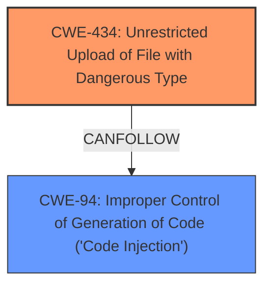

# Enhanced Analysis for CVE-2024-12233

# Summary
| CWE ID | CWE Name | Confidence | CWE Abstraction Level | CWE Vulnerability Mapping Label | CWE-Vulnerability Mapping Notes |
|---|---|---|---|---|---|
| CWE-434 | Unrestricted Upload of File with Dangerous Type | 1.0 | Base | Allowed | Primary CWE: The application allows uploading files without proper validation, leading to potential execution of malicious code. |
| CWE-94 | Improper Control of Generation of Code ('Code Injection') | 0.7 | Base | Allowed-with-Review | Secondary: The **unrestricted upload** allows for the potential injection of code, such as PHP, that can be executed by the server. |

## Evidence and Confidence

*   **Confidence Score:** 0.9
*   **Evidence Strength:** HIGH

## Relationship Analysis
The primary relationship is the potential for CWE-434 to lead to CWE-94. The **unrestricted upload** (CWE-434) creates an opportunity for an attacker to inject and execute code (CWE-94). The abstraction levels are appropriate, with CWE-434 being a Base weakness and CWE-94 a Base weakness, reflecting the specific nature of the vulnerability.



## Vulnerability Chain
The vulnerability chain starts with the **unrestricted file upload** (CWE-434), which then allows the attacker to upload a malicious file containing code. This leads to the server executing the injected code (CWE-94), resulting in remote code execution and potential server compromise.

## Summary of Analysis
The analysis is based on the provided vulnerability description and the CVE reference links content summary. The key evidence lies in the description of the "**unrestricted upload**" vulnerability in the `/registration.php` file, allowing attackers to upload files with malicious extensions like `.php`. The provided code snippet `move_uploaded_file($_FILES['img']['tmp_name'],"images/$e/".$_FILES['img']['name']);` confirms the lack of validation or sanitization of the uploaded filename.

The retriever results indicated CWE-434 as a strong candidate, further supporting the initial assessment. The relationship between CWE-434 and CWE-94 highlights how the **unrestricted upload** can lead to code injection and execution.

The selected CWEs are at the optimal level of specificity, with CWE-434 accurately representing the root cause of the **unrestricted file upload** and CWE-94 representing the potential for code injection as a consequence.

Relevant CWE Information:

# Enhanced Context (25 CWEs)
The following CWEs were identified as potentially relevant to this vulnerability:

## CWE-434: Unrestricted Upload of File with Dangerous Type
**Abstraction Level**: Base
**Similarity Score**: 0.83
**Source**: dense

**Description**:
The product allows the upload or transfer of dangerous file types that are automatically processed within its environment.

**Mapping Guidance**:
- Usage: Allowed
- Rationale: This CWE entry is at the Base level of abstraction, which is a preferred level of abstraction for mapping to the root causes of vulnerabilities.

## CWE-94: Improper Control of Generation of Code ('Code Injection')
**Abstraction Level**: base
**Similarity Score**: 2.28
**Source**: graph

**Description**:
CWE-94: Improper Control of Generation of Code ('Code Injection')

**Mapping Guidance**:
- Usage: Allowed-with-Review
- Rationale: This entry is frequently misused for vulnerabilities with a technical impact of "code execution," which does not by itself indicate a root cause weakness, since dozens of weaknesses can enable code execution.

**Relationships**:
- CANFOLLOW -> CWE-98
- PARENTOF -> CWE-96
- PARENTOF -> CWE-95
- PARENTOF -> CWE-1336
- CHILDOF -> CWE-913


## CWE Relationship Analysis

Current CWEs represent these abstraction levels: .


### Vulnerability Chain Analysis

**Chain starting from CWE-94:**
- 94 (Improper Control of Generation of Code ('Code Injection')) - ROOT


**Chain starting from CWE-1336:**
- 1336 (Improper Neutralization of Special Elements Used in a Template Engine) - ROOT


### CWE Relationship Diagram

```mermaid
graph TD
    classDef primary fill:#f96,stroke:#333,stroke-width:2px
    classDef secondary fill:#69f,stroke:#333
    classDef tertiary fill:#9e9,stroke:#333
```