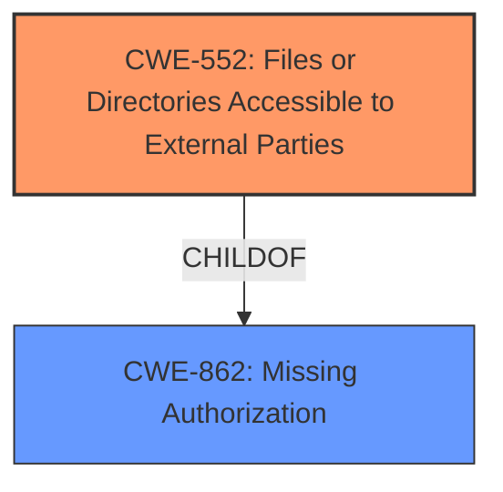

# Analysis for CVE-2024-12274

# Summary

| CWE ID | CWE Name | Confidence | CWE Abstraction Level | CWE Vulnerability Mapping Label | CWE-Vulnerability Mapping Notes |
|---|---|---|---|---|---|
| CWE-552 | Files or Directories Accessible to External Parties | 0.9 | Base | Allowed | Primary CWE. This vulnerability directly involves files being accessible to external parties due to an **unencrypted export** and predictable filenames. |
| CWE-862 | Missing Authorization | 0.7 | Class | Allowed-with-Review | Secondary candidate. The vulnerability exists because there is **missing authorization** for accessing the exported files. While present, CWE-552 is a better fit. |

## Evidence and Confidence

*   **Confidence Score:** 0.9
*   **Evidence Strength:** HIGH

## Relationship Analysis

The primary relationship that influenced the CWE selection is the parent-child relationship between CWE-862 (Missing Authorization) and CWE-552 (Files or Directories Accessible to External Parties). While the root cause involves a **missing authorization** check, the direct result is that files are accessible to external parties. CWE-552 is a more specific Base level CWE that directly describes the vulnerability, making it a better fit. CWE-862 is a Class level CWE, which is less specific.

## Vulnerability Chain

The vulnerability chain starts with the **unencrypted export** of settings data to a public folder. This leads to the creation of files with easily guessable names, and a **missing authorization** check to those files. The vulnerability then leads to unauthorized access to those files and information disclosure of sensitive data, including WordPress username, hashed password, email address, and phone number.

## Summary of Analysis

The initial analysis considered both CWE-552 and CWE-862. The vulnerability description clearly states that the "export settings functionality exports data to a public folder, with an easily guessable file name, allowing unauthenticated attackers to access the exported files." This aligns directly with CWE-552.

The CVE Reference Links Content Summary explicitly mentions that the vulnerability allows "unauthenticated access to exported files," suggesting a **lack of authorization**. However, the primary issue is that the files are being exported to a publicly accessible location without adequate protection. This makes CWE-552 the more accurate and specific choice.

The retriever results also list CWE-552 with a high score, which supports the decision. The graph relationships show that CWE-552 is a child of CWE-862, indicating a more specific classification.

The selection of CWE-552 is based on direct evidence from the vulnerability description and the CVE reference, combined with the hierarchical relationship analysis. CWE-552 accurately represents the vulnerability's root cause at the optimal level of specificity (Base).

Relevant CWE Information:

# Enhanced Context (25 CWEs)
The following CWEs were identified as potentially relevant to this vulnerability:

## CWE-425: Direct Request ('Forced Browsing')
**Abstraction Level**: Base
**Similarity Score**: 0.73
**Source**: dense

**Description**:
The web application does not adequately enforce appropriate authorization on all restricted URLs, scripts, or files.

**Mapping Guidance**:
- Usage: Allowed
- Rationale: This CWE entry is at the Base level of abstraction, which is a preferred level of abstraction for mapping to the root causes of vulnerabilities.

**Why Not Used**: While related to authorization issues, CWE-425 focuses on inadequate enforcement, while CWE-552 more directly addresses the public accessibility of the files.

## CWE-352: Cross-Site Request Forgery (CSRF)
**Abstraction Level**: Compound
**Similarity Score**: 0.73
**Source**: dense

**Description**:
The web application does not, or can not, sufficiently verify whether a well-formed, valid, consistent request was intentionally provided by the user who submitted the request.

**Mapping Guidance**:
- Usage: Allowed
- Rationale: This is a well-known Composite of multiple weaknesses that must all occur simultaneously, although it is attack-oriented in nature.

**Why Not Used**: CSRF is not relevant to this vulnerability, as the issue is not about verifying the origin of a request, but about the **unencrypted export** of data to a public location.

## CWE-472: External Control of Assumed-Immutable Web Parameter
**Abstraction Level**: Base
**Similarity Score**: 0.72
**Source**: dense

**Description**:
The web application does not sufficiently verify inputs that are assumed to be immutable but are actually externally controllable, such as hidden form fields.

**Mapping Guidance**:
- Usage: Allowed
- Rationale: This CWE entry is at the Base level of abstraction, which is a preferred level of abstraction for mapping to the root causes of vulnerabilities.

**Why Not Used**: This CWE is not applicable because the vulnerability doesn't involve external control of assumed immutable parameters.

## CWE-639: Authorization Bypass Through User-Controlled Key
**Abstraction Level**: Base
**Similarity Score**: 0.71
**Source**: dense

**Description**:
The system's authorization functionality does not prevent one user from gaining access to another user's data or record by modifying the key value identifying the data.

**Mapping Guidance**:
- Usage: Allowed
- Rationale: This CWE entry is at the Base level of abstraction, which is a preferred level of abstraction for mapping to the root causes of vulnerabilities.

**Why Not Used**: The vulnerability isn't about user-controlled keys for authorization bypass, but rather the public availability of sensitive data.

## CWE-862: Missing Authorization
**Abstraction Level**: Class
**Similarity Score**: 0.71
**Source**: dense

**Description**:
The product does not perform an authorization check when an actor attempts to access a resource or perform an action.

**Mapping Guidance**:
- Usage: Allowed-with-Review
- Rationale: This CWE entry is a Class and might have Base-level children that would be more appropriate

**Why Not Used**: Covered in detail above.

## CWE-434: Unrestricted Upload of File with Dangerous Type
**Abstraction Level**: Base
**Similarity Score**: 0.71
**Source**: dense

**Description**:
The product allows the upload or transfer of dangerous file types that are automatically processed within its environment.

**Mapping Guidance**:
- Usage: Allowed
- Rationale: This CWE entry is at the Base level of abstraction, which is a preferred level of abstraction for mapping to the root causes of vulnerabilities.

**Why Not Used**: This vulnerability is not about uploading dangerous file types, but rather about exporting data to a public folder.

## CWE-116: Improper Encoding or Escaping of Output
**Abstraction Level**: Class
**Similarity Score**: 0.71
**Source**: dense

**Description**:
The product prepares a structured message for communication with another component, but encoding or escaping of the data is either missing or done incorrectly. As a result, the intended structure of the message is not preserved.

**Mapping Guidance**:
- Usage: Allowed-with-Review
- Rationale: This CWE entry is a Class and might have Base-level children that would be more appropriate

**Why Not Used**: Improper encoding is not the primary issue in this vulnerability. The main problem is that the files are publicly accessible.

## CWE-538: Insertion of Sensitive Information into Externally-Accessible File or Directory
**Abstraction Level**: Base
**Similarity Score**: 0.69
**Source**: dense

**Description**:
The product places sensitive information into files or directories that are accessible to actors who are allowed to have access to the files, but not to the sensitive information.

**Mapping Guidance**:
- Usage: Allowed
- Rationale: This CWE entry is at the Base level of abstraction, which is a preferred level of abstraction for mapping to the root causes of vulnerabilities.

**Why Not Used**: While sensitive information is involved, CWE-552 more directly addresses the issue of the files being accessible to external parties.

## CWE-552: Files or Directories Accessible to External Parties
**Abstraction Level**: Base
**Similarity Score**: 0.69
**Source**: dense

**Description**:
The product makes files or directories accessible to unauthorized actors, even though they should not be.

**Mapping Guidance**:
- Usage: Allowed
- Rationale: This CWE entry is at the Base level of abstraction, which is a preferred level of abstraction for mapping to the root causes of vulnerabilities.

**Why Used**: Covered in detail above.

## CWE-359: Exposure of Private Personal Information to an Unauthorized Actor
**Abstraction Level**: Base
**Similarity Score**: 0.69
**Source**: dense

**Description**:
The product does not properly prevent a person's private, personal information from being accessed by actors who either (1) are not explicitly authorized to access the information or (2) do not have the implicit consent