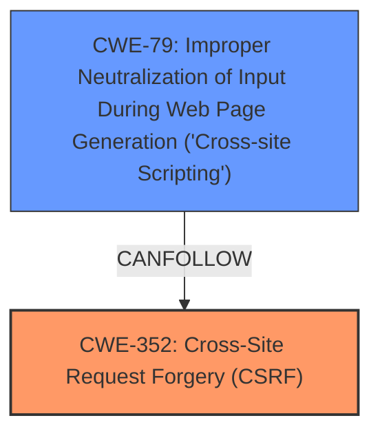

# Analysis for CVE-2024-12282

# Summary
| CWE ID | CWE Name | Confidence | CWE Abstraction Level | CWE Vulnerability Mapping Label | CWE-Vulnerability Mapping Notes |
|---|---|---|---|---|---|
| CWE-352 | Cross-Site Request Forgery (CSRF) | 1.0 | Compound | ROOTCAUSE | Allowed |
| CWE-79 | Improper Neutralization of Input During Web Page Generation ('Cross-site Scripting') | 1.0 | Base | WEAKNESS | Allowed |

## Evidence and Confidence

*   **Confidence Score:** 1.0
*   **Evidence Strength:** HIGH

## Relationship Analysis
The primary weakness is the **missing CSRF check**, which allows attackers to inject **Stored XSS** payloads. CWE-352 (Cross-Site Request Forgery) is the root cause, and CWE-79 (Improper Neutralization of Input During Web Page Generation) is the resulting weakness due to the lack of sanitization and escaping.

## Vulnerability Chain
1.  **Root Cause:** **Missing CSRF check** (CWE-352)
2.  **Weakness:** **Missing sanitization and escaping**, leading to **Improper Neutralization of Input** (CWE-79)
3.  **Impact:** Attackers inject **Stored XSS** payloads.

## Summary of Analysis
The analysis is based on the provided evidence that the WordPress plugin **does not have CSRF check** and is **missing sanitisation** as well as escaping. This allows attackers to inject **Stored XSS** payloads via a CSRF attack.
The most relevant CWEs are CWE-352 and CWE-79.
CWE-352 is the primary cause, as the **missing CSRF check** enables the attack.
CWE-79 is a secondary weakness, resulting from the **missing sanitisation** and escaping, allowing for the injection of **Stored XSS**.
The selected CWEs are at the optimal level of specificity, with CWE-352 being a Compound weakness and CWE-79 being a Base weakness.

Relevant CWE Information:

# Enhanced Context (25 CWEs)
The following CWEs were identified as potentially relevant to this vulnerability:

## CWE-352: Cross-Site Request Forgery (CSRF)
**Abstraction Level**: Compound
**Similarity Score**: 0.76
**Source**: dense

**Description**:
The web application does not, or can not, sufficiently verify whether a well-formed, valid, consistent request was intentionally provided by the user who submitted the request.

**Mapping Guidance**:
- Usage: Allowed
- Rationale: This is a well-known Composite of multiple weaknesses that must all occur simultaneously, although it is attack-oriented in nature.

**Technical Explanation:** The vulnerability description explicitly states that the plugin **does not have CSRF check**. This aligns directly with the description of CWE-352, which states that the web application **does not sufficiently verify** the request origin.
**Security Implications:** Attackers can perform actions on behalf of legitimate users without their knowledge or consent.
**Relationship to Other CWEs:** N/A
**Primary/Secondary:** Primary. This is the root cause of the vulnerability.
**Mapping Guidance Influence:** The official mapping guidance ALLOWS the use of CWE-352.

## CWE-79: Improper Neutralization of Input During Web Page Generation ('Cross-site Scripting')
**Abstraction Level**: Base
**Similarity Score**: 0.74
**Source**: dense

**Description**:
The product does not neutralize or incorrectly neutralizes user-controllable input before it is placed in output that is used as a web page that is served to other users.

**Mapping Guidance**:
- Usage: Allowed
- Rationale: This CWE entry is at the Base level of abstraction, which is a preferred level of abstraction for mapping to the root causes of vulnerabilities.

**Technical Explanation:** The vulnerability description states that the plugin is **missing sanitisation** as well as escaping, which allows attackers to inject **Stored XSS** payloads. This aligns directly with CWE-79, which describes **improper neutralization of input**.
**Security Implications:** Attackers can inject malicious scripts into web pages, which will be executed by other users' browsers.
**Relationship to Other CWEs:** ChildOf CWE-116, ParentOf CWE-87, 86, 85, 84, 83
**Primary/Secondary:** Secondary. This is a result of the missing CSRF check and **missing sanitisation**.
**Mapping Guidance Influence:** The official mapping guidance ALLOWS the use of CWE-79.

## CWE-116: Improper Encoding or Escaping of Output
**Abstraction Level**: Class
**Similarity Score**: 0.72
**Source**: dense

**Description**:
The product prepares a structured message for communication with another component, but encoding or escaping of the data is either missing or done incorrectly. As a result, the intended structure of the message is not preserved.

**Mapping Guidance**:
- Usage: Allowed-with-Review
- Rationale: This CWE entry is a Class and might have Base-level children that would be more appropriate

**Technical Explanation:** While the description mentions **missing sanitisation** as well as escaping, CWE-116 is too general. CWE-79, which is a child of CWE-116, is a better fit because it specifically addresses improper neutralization of input during web page generation, leading to **Cross-site Scripting**.
**Security Implications:** Incorrect encoding can lead to injection vulnerabilities.
**Relationship to Other CWEs:** Parent of CWE-79.
**Primary/Secondary:** Not applicable.
**Mapping Guidance Influence:** The official mapping guidance ALLOWS the use of CWE-116 with review, but suggests considering more specific Base-level children.

## CWE-862: Missing Authorization
**Abstraction Level**: Class
**Similarity Score**: 0.71
**Source**: dense

**Description**:
The product does not perform an authorization check when an actor attempts to access a resource or perform an action.

**Mapping Guidance**:
- Usage: Allowed-with-Review
- Rationale: This CWE entry is a Class and might have Base-level children that would be more appropriate

**Technical Explanation:** While there's a **missing CSRF check**, which relates to authorization, CWE-352 is a more specific and appropriate classification.
**Security Implications:** Unauthorized access to resources or actions.
**Relationship to Other CWEs:** N/A
**Primary/Secondary:** Not applicable.
**Mapping Guidance Influence:** The official mapping guidance ALLOWS the use of CWE-862 with review, but suggests considering more specific Base-level children.

## CWE-425: Direct Request ('Forced Browsing')
**Abstraction Level**: Base
**Similarity Score**: 0.75
**Source**: dense

**Description**:
The web application does not adequately enforce appropriate authorization on all restricted URLs, scripts, or files.

**Mapping Guidance**:
- Usage: Allowed
- Rationale: This CWE entry is at the Base level of abstraction, which is a preferred level of abstraction for mapping to the root causes of vulnerabilities.

**Technical Explanation:** Similar to CWE-862, CWE-425 relates to authorization, but the **missing CSRF check** is more directly addressed by CWE-352.
**Security Implications:** Users can access restricted resources without proper authorization.
**Relationship to Other CWEs:** N/A
**Primary/Secondary:** Not applicable.
**Mapping Guidance Influence:** The official mapping guidance ALLOWS the use of CWE-425.

## CWE-434: Unrestricted Upload of File with Dangerous Type
**Abstraction Level**: Base
**Similarity Score**: 0.73
**Source**: dense

**Description**:
The product allows the upload or transfer of dangerous file types that are automatically processed within its environment.

**Mapping Guidance**:
- Usage: Allowed
- Rationale: This CWE entry is at the Base level of abstraction, which is a preferred level of abstraction for mapping to the root causes of vulnerabilities.

**Technical Explanation:** This CWE is not relevant to the vulnerability description. There is no mention of file uploads.
**Security Implications:** N/A
**Relationship to Other CWEs:** N/A
**Primary/Secondary:** Not applicable.
**Mapping Guidance Influence:** The official mapping guidance ALLOWS the use of CWE-434.