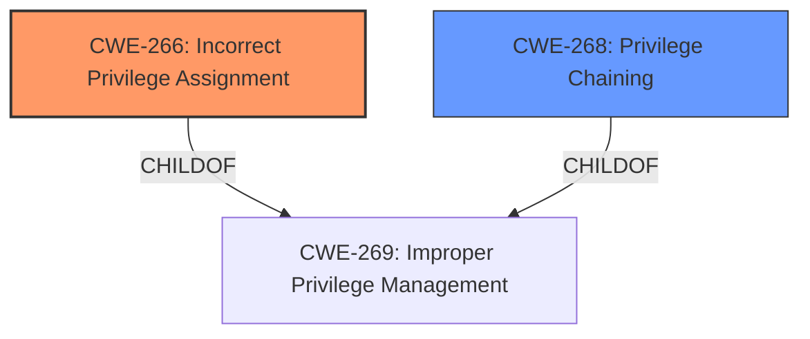

# Enhanced Analysis for CVE-2024-12284

# Summary

| CWE ID  | CWE Name                                                    | Confidence | CWE Abstraction Level | CWE Vulnerability Mapping Label | CWE-Vulnerability Mapping Notes |
| :-------- | :---------------------------------------------------------- | :--------- | :-------------------- | :------------------------------ | :------------------------------ |
| CWE-266   | Incorrect Privilege Assignment                              | 0.8        | Base                  | Primary                         | Allowed                         |
| CWE-268   | Privilege Chaining                                          | 0.5        | Base                  | Secondary                       | Allowed                         |

## Evidence and Confidence

*   **Confidence Score:** 0.7
*   **Evidence Strength:** MEDIUM

## Relationship Analysis
The primary relationship influencing the decision is the child-parent relationship. The vulnerability involves privilege escalation, which is related to the improper assignment of privileges.
CWE-266 (Incorrect Privilege Assignment) is a specific type of improper privilege management, making it a more suitable choice than its parent class CWE-269 (Improper Privilege Management). CWE-268 (Privilege Chaining) could be present if multiple privilege assignments lead to the escalation.



## Vulnerability Chain
The vulnerability chain starts with an **incorrect privilege assignment** (CWE-266), which could lead to **privilege chaining** (CWE-268), ultimately resulting in **privilege escalation**. The root cause is the initial **incorrect privilege assignment**.

## Summary of Analysis
The initial assessment considered CWE-269 (Improper Privilege Management) due to the vulnerability description explicitly mentioning "Authenticated privilege escalation." However, the CWE guidance discourages using CWE-269 directly and suggests identifying the root cause. The "CVE Reference Links Content Summary" mentions that the root cause is related to improper privilege management, but it doesn't provide enough detail.

Given that the vulnerability is related to privilege escalation, and the guidance suggests looking for the root cause, CWE-266 (Incorrect Privilege Assignment) is the best fit because it represents a specific type of improper privilege management that leads to privilege escalation. The vulnerability description states "Authenticated privilege escalation in NetScaler Console and NetScaler Agent allows," which implies that an authenticated user is gaining more privileges than they should have. This suggests that privileges were **incorrectly assigned** in the first place.

The relationship graph influenced the final selection by highlighting that CWE-266 is a child of CWE-269, making it a more specific and appropriate choice. The selected CWE is at the optimal level of specificity because it identifies the **root cause** of the privilege escalation. The guidance also highlights the importance of identifying whether privileges were assigned incorrectly.

Relevant CWE Information:

# Enhanced Context (25 CWEs)
The following CWEs were identified as potentially relevant to this vulnerability:

## CWE-266: Incorrect Privilege Assignment
**Abstraction Level**: Base
**Similarity Score**: 0.79
**Source**: dense

**Description**:
A product incorrectly assigns a privilege to a particular actor, creating an unintended sphere of control for that actor.

**Mapping Guidance**:
- Usage: Allowed
- Rationale: This CWE entry is at the Base level of abstraction, which is a preferred level of abstraction for mapping to the root causes of vulnerabilities.

## CWE-268: Privilege Chaining
**Abstraction Level**: base
**Similarity Score**: 2.47
**Source**: graph

**Description**:
CWE-268: Privilege Chaining

**Mapping Guidance**:
- Usage: Allowed
- Rationale: This CWE entry is at the Base level of abstraction, which is a preferred level of abstraction for mapping to the root causes of vulnerabilities.

# Complete CWE Specifications

CWE-266: Incorrect Privilege Assignment

CWE-268: Privilege Chaining

CWE-269: Improper Privilege Management


## CWE Relationship Analysis

Current CWEs represent these abstraction levels: .


### Vulnerability Chain Analysis

**Chain starting from CWE-266:**
- 266 (Incorrect Privilege Assignment) - ROOT


**Chain starting from CWE-269:**
- 269 (Improper Privilege Management) - ROOT


### CWE Relationship Diagram

```mermaid
graph TD
    classDef primary fill:#f96,stroke:#333,stroke-width:2px
    classDef secondary fill:#69f,stroke:#333
    classDef tertiary fill:#9e9,stroke:#333
```