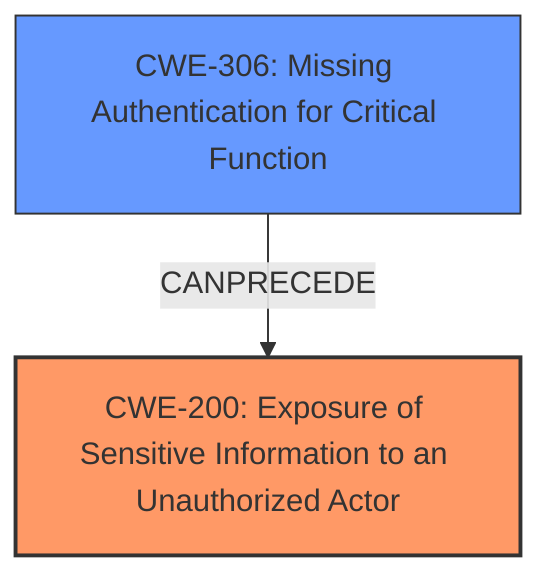

# Analysis for CVE-2024-12294

# Summary
| CWE ID  | CWE Name                                                                   | Confidence | CWE Abstraction Level | CWE Vulnerability Mapping Label | CWE-Vulnerability Mapping Notes |
|---------|----------------------------------------------------------------------------|------------|-----------------------|---------------------------------|---------------------------------|
| CWE-200 | Exposure of Sensitive Information to an Unauthorized Actor                                | 1          | Class                 | Primary                           | Allowed                       |
| CWE-306 | Missing Authentication for Critical Function                                   | 0.7        | Base                  | Secondary                         | Allowed                       |

## Evidence and Confidence

*   **Confidence Score:** 0.9
*   **Evidence Strength:** HIGH

## Relationship Analysis
The primary relationship influencing the decision is the parent-child relationship between CWE-200 (Exposure of Sensitive Information to an Unauthorized Actor) and its potential children which describe more specific types of information exposure. However, the description does not provide enough detail to select a more specific child. CWE-306 (Missing Authentication for Critical Function) is related because the sensitive information is exposed due to the missing authentication on the `get_legacy_cookies` function, but it is not the direct cause of the exposure, so it is listed as a secondary CWE. The abstraction levels were considered, favoring the more specific Base level CWE-306 over Class or Pillar level options when supported by the evidence.

## Vulnerability Chain
The vulnerability chain starts with a **missing authentication** check on the `get_legacy_cookies` function (CWE-306), which allows an unauthenticated attacker to access the function. This then leads to the **exposure of sensitive information** (CWE-200) such as titles and permalinks of private, password-protected, pending, and draft posts.

## Summary of Analysis
The initial analysis focused on the **Sensitive Information Exposure** aspect of the vulnerability, which aligns directly with CWE-200 (Exposure of Sensitive Information to an Unauthorized Actor). The evidence from the vulnerability description states: "This makes it possible for unauthenticated attackers to extract sensitive data including titles and permalinks of private, password-protected, pending, and draft posts." This clearly indicates that sensitive information is being exposed. The lack of authentication is a contributing factor, but the primary weakness is the exposure itself. The graph relationships influenced the decision to include CWE-306 as a secondary CWE because the missing authentication allows the exposure to occur. CWE-200 is chosen because it is a more direct representation of the vulnerability. The selected CWEs are at the optimal level of specificity because the description does not provide enough detail to choose a more specific child of CWE-200, such as CWE-532 (Insertion of Sensitive Information into Log File) or CWE-201 (Insertion of Sensitive Information Into Sent Data).

Relevant CWE Information:
- **CWE-200: Exposure of Sensitive Information to an Unauthorized Actor**: The code transmits data to another actor, but a portion of the data includes sensitive information that should not be accessible to that actor.
- **CWE-306: Missing Authentication for Critical Function**: The product does not perform any authentication for functionality that requires a provable user identity or consumes a significant amount of resources.