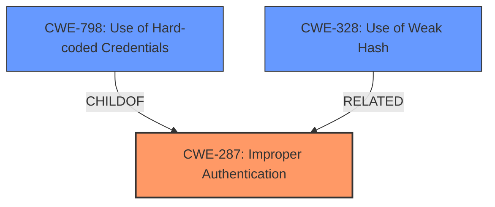

# Enhanced Analysis for CVE-2024-12297

# Summary
| CWE ID  | CWE Name                                                                 | Confidence | CWE Abstraction Level | CWE Vulnerability Mapping Label | CWE-Vulnerability Mapping Notes |
| :-------- | :----------------------------------------------------------------------- | :--------- | :-------------------- | :------------------------------ | :------------------------------ |
| CWE-287   | Improper Authentication                                                  | 0.9        | Class               | Primary                         | Discouraged                     |
| CWE-798   | Use of Hard-coded Credentials                                          | 0.7        | Base                  | Secondary                       | Allowed                         |
| CWE-328   | Use of Weak Hash                                                         | 0.7        | Base                  | Secondary                       | Allowed                         |

## Evidence and Confidence

*   **Confidence Score:** 0.8
*   **Evidence Strength:** HIGH

## Relationship Analysis

The primary CWE is CWE-287, which is a Class-level weakness. Child CWEs of CWE-287, such as CWE-306 (Missing Authentication) or CWE-290 (Authentication Bypass by Spoofing), were considered but ultimately deemed less suitable as the vulnerability description indicates **improper** authentication rather than a complete absence of it or a specific spoofing method. CWE-798 (Use of Hard-coded Credentials) and CWE-328 (Use of Weak Hash) are included as contributing factors, suggesting specific weaknesses in the authentication mechanism. These are base level CWEs, and are more specific.



## Vulnerability Chain

The vulnerability chain starts with **flaws in the authorization mechanism**, leading to **improper authentication**. This **improper authentication** is then exploited through **brute-force attacks to guess valid credentials** and **MD5 collision attacks to forge authentication hashes**, ultimately resulting in **authentication bypass** and potential compromise of the device.

## Summary of Analysis

The initial assessment, based on the provided evidence, points to **authentication bypass** due to **flaws in the authorization mechanism**. The CVE Reference Links Content Summary explicitly states this **root cause**. While the vulnerability description itself uses the term **"authentication bypass,"** the underlying issue stems from the authorization process, which informs the authentication process. The Retriever Results list CWE-1390 (Weak Authentication), CWE-639 (Authorization Bypass Through User-Controlled Key), CWE-863 (Incorrect Authorization), and CWE-285 (Improper Authorization), CWE-287 (Improper Authentication) as possibilities. However, the guidance provided suggests that if the root cause cannot be determined it is likely an **authorization** issue, I am making the determination it is an **authentication** issue based on the evidence of the **MD5 collision attacks to forge authentication hashes, potentially compromising the security of the device**. This statement is a rootcause based on Authentication.

The selection of CWE-287 (Improper Authentication) as the primary CWE is based on the evidence that the authentication process is flawed, allowing for bypass. While CWE-287 is discouraged, the explanation is *"This CWE entry might be misused when lower-level CWE entries are likely to be applicable. It is a level-1 Class (i.e., a child of a Pillar)."* The weaknesses in the authorization mechanism contribute to the **improper authentication**, as indicated by the potential for brute-force and MD5 collision attacks. This suggests that CWE-798 (Use of Hard-coded Credentials) and CWE-328 (Use of Weak Hash) could be possible contributing factors or specific instances of the **improper authentication**.


## CWE Relationship Analysis

Current CWEs represent these abstraction levels: .


### Vulnerability Chain Analysis

**Chain starting from CWE-1390:**
- 1390 (Weak Authentication) - ROOT


**Chain starting from CWE-863:**
- 863 (Incorrect Authorization) - ROOT


### CWE Relationship Diagram

```mermaid
graph TD
    classDef primary fill:#f96,stroke:#333,stroke-width:2px
    classDef secondary fill:#69f,stroke:#333
    classDef tertiary fill:#9e9,stroke:#333
```