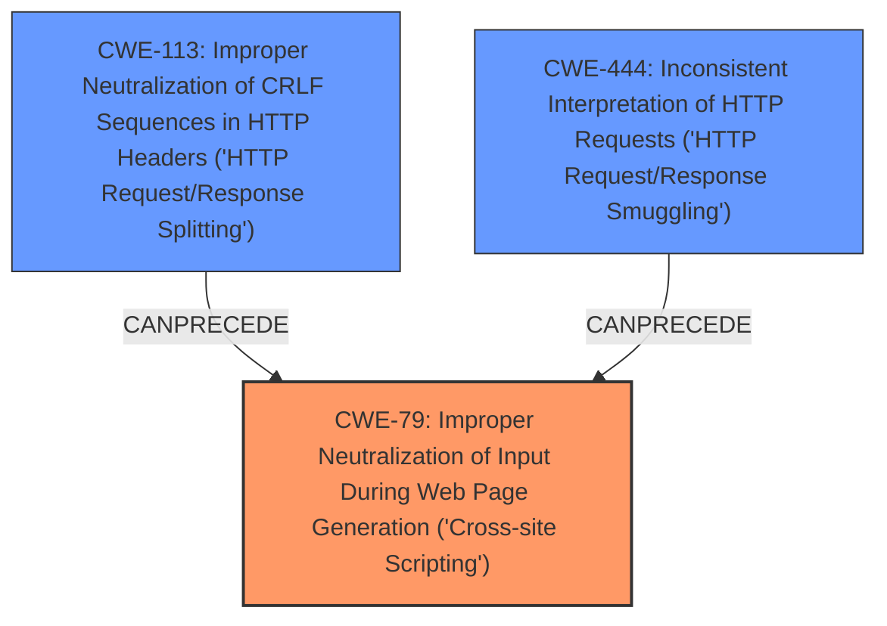

# Analysis for CVE-2024-12314

# Summary
| CWE ID | CWE Name | Confidence | CWE Abstraction Level | CWE Vulnerability Mapping Label | CWE-Vulnerability Mapping Notes |
|---|---|---|---|---|---|
| CWE-79 | Improper Neutralization of Input During Web Page Generation ('Cross-site Scripting') | 0.9 | Base | Primary | Allowed |
| CWE-444 | Inconsistent Interpretation of HTTP Requests ('HTTP Request/Response Smuggling') | 0.7 | Base | Secondary | Allowed |
| CWE-113 | Improper Neutralization of CRLF Sequences in HTTP Headers ('HTTP Request/Response Splitting') | 0.6 | Variant | Secondary | Allowed |

## Evidence and Confidence

*   **Confidence Score:** 0.8
*   **Evidence Strength:** MEDIUM

## Relationship Analysis
The primary CWE selected is CWE-79, which addresses the improper neutralization of input during web page generation, leading to Cross-Site Scripting. CWE-444 and CWE-113 were considered as contributing factors. The relationships are as follows:
  - CWE-79 is a Base level CWE, providing a specific description of the XSS vulnerability.
  - CWE-113 is a Variant of CWE-20 (Improper Input Validation) and can precede CWE-79.
  - CWE-444 describes a potential mechanism related to how HTTP requests are interpreted, which might contribute to the **cache poisoning** and subsequent XSS.

## Vulnerability Chain
The vulnerability chain starts with the **cache poisoning** due to storing HTTP headers in cached data, potentially influenced by inconsistent interpretation of HTTP requests. This leads to unsanitized HTTP headers being stored, and ultimately, Cross-Site Scripting (XSS) when the cached data is served to users.
  - Root Cause: **Cache Poisoning** due to storing HTTP headers in cached data.
  - Contributing Factor: Inconsistent interpretation of HTTP requests (CWE-444) and improper neutralization of CRLF sequences (CWE-113), which may exacerbate the issue.
  - Impact: Cross-Site Scripting (CWE-79).

## Summary of Analysis
The primary vulnerability is Cross-Site Scripting (XSS) resulting from **cache poisoning**, where unsanitized HTTP headers are stored in the cache. The description explicitly mentions that the plugin stores HTTP headers in the cached data, and this makes it possible for unauthenticated attackers to poison the cache. The **weakness** is **cache poisoning** and the **impact** is Cross-Site Scripting.

CWE-79 is the most direct match for the XSS vulnerability. CWE-444 and CWE-113 were considered due to their potential roles in request manipulation and header handling, possibly contributing to the **cache poisoning** mechanism.

The selection of CWE-79 is based on the evidence of XSS, which is the direct result of the stored, unsanitized HTTP headers. CWE-444 and CWE-113 are included as contributing factors due to the potential of HTTP request smuggling and CRLF injection playing a role in how the headers are processed and stored in the cache. My assessment is based on the provided evidence, particularly the key phrases that highlight the root cause and impact.

Relevant CWE Information:

# Enhanced Context (25 CWEs)
The following CWEs were identified as potentially relevant to this vulnerability:

## CWE-352: Cross-Site Request Forgery (CSRF)
**Abstraction Level**: Compound
**Similarity Score**: 0.75
**Source**: dense

**Description**:
The web application does not, or can not, sufficiently verify whether a well-formed, valid, consistent request was intentionally provided by the user who submitted the request.

**Mapping Guidance**:
- Usage: Allowed
- Rationale: This is a well-known Composite of multiple weaknesses that must all occur simultaneously, although it is attack-oriented in nature.

*Not selected because CSRF is not mentioned in the description.*

## CWE-425: Direct Request ('Forced Browsing')
**Abstraction Level**: Base
**Similarity Score**: 0.72
**Source**: dense

**Description**:
The web application does not adequately enforce appropriate authorization on all restricted URLs, scripts, or files.

**Mapping Guidance**:
- Usage: Allowed
- Rationale: This CWE entry is at the Base level of abstraction, which is a preferred level of abstraction for mapping to the root causes of vulnerabilities.

*Not selected because the vulnerability is about **cache poisoning** through unsanitized headers.*

## CWE-96: Improper Neutralization of Directives in Statically Saved Code ('Static Code Injection')
**Abstraction Level**: Base
**Similarity Score**: 0.72
**Source**: dense

**Description**:
The product receives input from an upstream component, but it does not neutralize or incorrectly neutralizes code syntax before inserting the input into an executable resource, such as a library, configuration file, or template.

**Mapping Guidance**:
- Usage: Allowed
- Rationale: This CWE entry is at the Base level of abstraction, which is a preferred level of abstraction for mapping to the root causes of vulnerabilities.

*Not selected because the injection is not into static code.*

## CWE-472: External Control of Assumed-Immutable Web Parameter
**Abstraction Level**: Base
**Similarity Score**: 0.70
**Source**: dense

**Description**:
The web application does not sufficiently verify inputs that are assumed to be immutable but are actually externally controllable, such as hidden form fields.

**Mapping Guidance**:
- Usage: Allowed
- Rationale: This CWE entry is at the Base level of abstraction, which is a preferred level of abstraction for mapping to the root causes of vulnerabilities.

*Not selected because the description doesn't focus on immutable web parameters.*

## CWE-74: Improper Neutralization of Special Elements in Output Used by a Downstream Component ('Injection')
**Abstraction Level**: Class
**Similarity Score**: 0.70
**Source**: dense

**Description**:
The product constructs all or part of a command, data structure, or record using externally-influenced input from an upstream component, but it does not neutralize or incorrectly neutralizes special elements that could modify how it is parsed or interpreted when it is sent to a downstream component.

**Mapping Guidance**:
- Usage: Discouraged
- Rationale: CWE-74 is high-level and often misused when lower-level weaknesses are more appropriate.

*Not selected because CWE-79 is more specific and appropriate.*

## CWE-113: Improper Neutralization of CRLF Sequences in HTTP Headers ('HTTP Request/Response Splitting')
**Abstraction Level**: Variant
**Similarity Score**: 0.70
**Source**: dense

**Description**:
The product receives data from an HTTP agent/component (e.g., web server, proxy, browser, etc.), but it does not neutralize or incorrectly neutralizes CR and LF characters before the data is included in outgoing HTTP headers.

**Mapping Guidance**:
- Usage: Allowed
- Rationale: This CWE entry is at the Variant level of abstraction, which is a preferred level of abstraction for mapping to the root causes of vulnerabilities.

*Selected as a secondary factor because improper neutralization of CRLF sequences can contribute to HTTP header manipulation and **cache poisoning**.*

## CWE-80: Improper Neutralization of Script-Related HTML Tags in a Web Page (Basic XSS)
**Abstraction Level**: Variant
**Similarity Score**: 0.70
**Source**: dense

**Description**:
The product receives input from an upstream component, but it does not neutralize or incorrectly neutralizes special characters such as "<", ">", and "&" that could be interpreted as web-scripting elements when they are sent to a downstream component that processes web pages.

*Not selected because CWE-79 (Improper Neutralization of Input During Web Page Generation ('Cross-site Scripting')) is the more general case, and this is not specifically about script-related HTML tags.*

## CWE-502: Deserialization of Untrusted Data
**Abstraction Level**: Base
**Similarity Score**: 0.69
**Source**: dense

**Description**:
The product deserializes untrusted data without sufficiently ensuring that the resulting data will be valid.

**Mapping Guidance**:
- Usage: Allowed
- Rationale: This CWE entry is at the Base level of abstraction, which is a preferred level of abstraction for mapping to the root causes of vulnerabilities.

*Not selected because deserialization is not mentioned in the description.*

## CWE-434: Unrestricted Upload of File with Dangerous Type