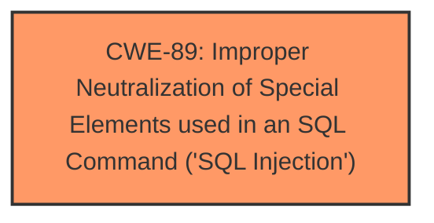

# Analysis Report for CVE-2024-12351

# Vulnerability Analysis Report: CVE-2024-12351

## Description

A vulnerability classified as critical has been found in JFinalCMS 1.0. This affects the function findPage of the file src\main\java\com\cms\entity\ContentModel.java of the component File Content Handler. The manipulation of the argument name leads to **sql injection**. It is possible to initiate the attack remotely.

## Vulnerability Description Key Phrases

- **Weakness:** sql injection
- **Product:** JFinalCMS
- **Version:** 1.0
- **Component:** findPage in src/main/java/com/cms/entity/ContentModel.java

## Analysis (with Relationship Data)

# Summary
| CWE ID | CWE Name | Confidence | CWE Abstraction Level | CWE Vulnerability Mapping Label | CWE-Vulnerability Mapping Notes |
|---|---|---|---|---|---|
| CWE-89 | Improper Neutralization of Special Elements used in an SQL Command ('SQL Injection') | 1.0 | Base | Allowed | Primary CWE. The vulnerability is caused by the **improper neutralization** of special elements in an SQL command, leading to **SQL injection**. |

## Evidence and Confidence

*   **Confidence Score:** 1.0
*   **Evidence Strength:** HIGH

## Relationship Analysis
The primary relationship that influenced the decision was the direct match of the vulnerability description to CWE-89. The other CWEs listed were related to input validation or output encoding issues, but the description specifically stated that the root cause was **SQL injection**, making CWE-89 the most appropriate choice. There are no parent-child or chain relationships that are relevant in this case.



## Vulnerability Chain
The vulnerability chain is straightforward:
1.  **Root Cause:** CWE-89 - Improper Neutralization of Special Elements used in an SQL Command ('SQL Injection'). The application fails to properly sanitize user input before using it in an SQL query.
2.  **Impact:** The attacker can inject arbitrary SQL commands, potentially leading to data leakage, modification, or deletion.

## Summary of Analysis
The vulnerability description clearly states that the application is vulnerable to **SQL injection** due to **improper neutralization** of input. The evidence for this is: "The manipulation of the argument name leads to **sql injection**". The top retriever result is CWE-89, which directly matches this description. The retriever also provided alternative CWEs, but the evidence indicates that CWE-89 is the only one that applies. The abstraction level for CWE-89 is "Base," which is the preferred level. Therefore, the best and only CWE that applies is CWE-89.

Relevant CWE Information:

# Enhanced Context (25 CWEs)
The following CWEs were identified as potentially relevant to this vulnerability:

## CWE-89: Improper Neutralization of Special Elements used in an SQL Command ('SQL Injection')
**Abstraction Level**: Base
**Similarity Score**: 0.74
**Source**: dense

**Description**:
The product constructs all or part of an SQL command using externally-influenced input from an upstream component, but it does not neutralize or incorrectly neutralizes special elements that could modify the intended SQL command when it is sent to a downstream component. Without sufficient removal or quoting of SQL syntax in user-controllable inputs, the generated SQL query can cause those inputs to be interpreted as SQL instead of ordinary user data.

**Mapping Guidance**:
- Usage: Allowed
- Rationale: This CWE entry is at the Base level of abstraction, which is a preferred level of abstraction for mapping to the root causes of vulnerabilities.

## CWE-434: Unrestricted Upload of File with Dangerous Type
CWE-434 was considered, but it is not relevant because the vulnerability does not involve file uploads.

## CWE-96: Improper Neutralization of Directives in Statically Saved Code ('Static Code Injection')
CWE-96 was considered, but it is not relevant because the vulnerability does not involve static code injection.

## CWE-1336: Improper Neutralization of Special Elements Used in a Template Engine
CWE-1336 was considered, but it is not relevant because the vulnerability does not involve template engine injection.

## CWE-80: Improper Neutralization of Script-Related HTML Tags in a Web Page (Basic XSS)
CWE-80 was considered, but it is not relevant because the vulnerability is **SQL injection**, not Cross-Site Scripting (XSS).

## CWE-79: Improper Neutralization of Input During Web Page Generation ('Cross-site Scripting')
CWE-79 was considered, but it is not relevant because the vulnerability is **SQL injection**, not Cross-Site Scripting (XSS).

## CWE-425: Direct Request ('Forced Browsing')
CWE-425 was considered, but it is not relevant because the vulnerability is **SQL injection**, not forced browsing.

## CWE-116: Improper Encoding or Escaping of Output
CWE-116 was considered, but it is not relevant because the vulnerability is about **improper neutralization** of input, not about output encoding or escaping.

## CWE-917: Improper Neutralization of Special Elements used in an Expression Language Statement ('Expression Language Injection')
CWE-917 was considered, but it is not relevant because the vulnerability does not involve expression language injection.

## CWE-472: External Control of Assumed-Immutable Web Parameter
CWE-472 was considered, but it is not relevant because the vulnerability is **SQL injection**, not external control of assumed-immutable parameters.

## CWE-113: Improper Neutralization of CRLF Sequences in HTTP Headers ('HTTP Request/Response Splitting')
CWE-113 was considered, but it is not relevant because the vulnerability is **SQL injection**, not CRLF injection in HTTP headers.

## CWE-93: Improper Neutralization of CRLF Sequences ('CRLF Injection')
CWE-93 was considered, but it is not relevant because the vulnerability is **SQL injection**, not CRLF injection.

## CWE-117: Improper Output Neutralization for Logs
CWE-117 was considered, but it is not relevant because the vulnerability is **SQL injection**, not improper output neutralization for logs.

## CWE-502: Deserialization of Untrusted Data
CWE-502 was considered, but it is not relevant because the vulnerability does not involve deserialization of untrusted data.

## CWE-73: External Control of File Name or Path
CWE-73 was considered, but it is not relevant because the vulnerability does not involve external control of file name or path.

## CWE-184: Incomplete List of Disallowed Inputs
CWE-184 was considered, but it is not relevant because the vulnerability does not involve an incomplete list of disallowed inputs.

## CWE-494: Download of Code Without Integrity Check
CWE-494 was considered, but it is not relevant because the vulnerability does not involve downloading code without integrity check.

## CWE-183: Permissive List of Allowed Inputs
CWE-183 was considered, but it is not relevant because the vulnerability does not involve a permissive list of allowed inputs.


## CWE Relationship Analysis

Current CWEs represent these abstraction levels: .


### Vulnerability Chain Analysis

**Chain starting from CWE-183:**
- 183 (Permissive List of Allowed Inputs) - ROOT


**Chain starting from CWE-89:**
- 89 (Improper Neutralization of Special Elements used in an SQL Command ('SQL Injection')) - ROOT


### CWE Relationship Diagram

```mermaid
graph TD
    classDef primary fill:#f96,stroke:#333,stroke-width:2px
    classDef secondary fill:#69f,stroke:#333
    classDef tertiary fill:#9e9,stroke:#333
```


*Report generated on 2025-07-13 02:38:58*
