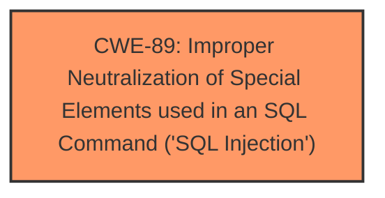

# Analysis Report for CVE-2024-12360

# Vulnerability Analysis Report: CVE-2024-12360

## Description

A vulnerability was found in code-projects Online Class and Exam Scheduling System 1.0. It has been rated as critical. This issue affects some unknown processing of the file class_update.php. The manipulation of the argument id leads to **sql injection**. The attack may be initiated remotely. The exploit has been disclosed to the public and may be used.

## Vulnerability Description Key Phrases

- **Weakness:** sql injection
- **Product:** code-projects Online Class and Exam Scheduling System
- **Version:** 1
- **Component:** class_update.php

## Analysis (with Relationship Data)

# Summary
| CWE ID | CWE Name | Confidence | CWE Abstraction Level | CWE Vulnerability Mapping Label | CWE-Vulnerability Mapping Notes |
|---|---|---|---|---|---|
| CWE-89 | Improper Neutralization of Special Elements used in an SQL Command ('SQL Injection') | 1.0 | Base | Allowed | Primary CWE. The vulnerability description explicitly mentions "sql injection" as the weakness. |

## Evidence and Confidence

*   **Confidence Score:** 1.0
*   **Evidence Strength:** HIGH

## Relationship Analysis
The primary relationship is that CWE-89 stands alone as the direct root cause. There are no clear parent-child or chain relationships that directly influence the selection in this case, as the description points directly to SQL Injection. The abstraction level is Base, which is the preferred level.



## Vulnerability Chain
The vulnerability chain is straightforward:

1.  **Root Cause:** CWE-89 - Improper Neutralization of Special Elements used in an SQL Command ('SQL Injection'). The application fails to neutralize special elements in SQL commands, allowing manipulation of the query.

## Summary of Analysis
The vulnerability description explicitly states that the manipulation of the argument 'id' leads to **sql injection** in the file `class_update.php`. The Retriever Results also list CWE-89 as the top candidate with a score of 1.0.

The evidence directly supports the selection of CWE-89 as the primary weakness.

Relevant CWE Information:

# Enhanced Context (25 CWEs)
The following CWEs were identified as potentially relevant to this vulnerability:

## CWE-89: Improper Neutralization of Special Elements used in an SQL Command ('SQL Injection')
**Abstraction Level**: Base
**Similarity Score**: 0.78
**Source**: dense

**Description**:
The product constructs all or part of an SQL command using externally-influenced input from an upstream component, but it does not neutralize or incorrectly neutralizes special elements that could modify the intended SQL command when it is sent to a downstream component. Without sufficient removal or quoting of SQL syntax in user-controllable inputs, the generated SQL query can cause those inputs to be interpreted as SQL instead of ordinary user data.

**Mapping Guidance**:
- Usage: Allowed
- Rationale: This CWE entry is at the Base level of abstraction, which is a preferred level of abstraction for mapping to the root causes of vulnerabilities.


## CWE Relationship Analysis

Current CWEs represent these abstraction levels: .


### Vulnerability Chain Analysis

**Chain starting from CWE-89:**
- 89 (Improper Neutralization of Special Elements used in an SQL Command ('SQL Injection')) - ROOT


### CWE Relationship Diagram

```mermaid
graph TD
    classDef primary fill:#f96,stroke:#333,stroke-width:2px
    classDef secondary fill:#69f,stroke:#333
    classDef tertiary fill:#9e9,stroke:#333
```


*Report generated on 2025-07-13 02:41:05*
