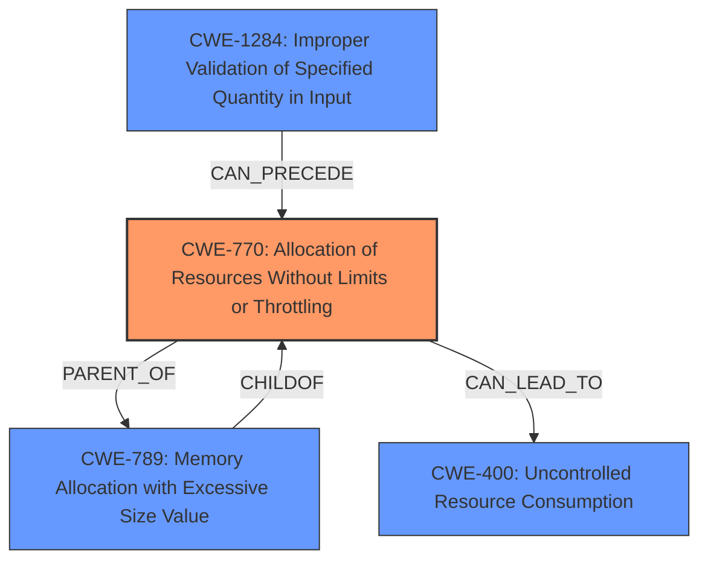

# Enhanced Analysis for CVE-2024-12401

# Summary
| CWE ID | CWE Name | Confidence | CWE Abstraction Level | CWE Vulnerability Mapping Label | CWE-Vulnerability Mapping Notes |
|---|---|---|---|---|---|
| CWE-770 | Allocation of Resources Without Limits or Throttling | 0.9 | Base | Allowed | Primary CWE. The product allocates resources without any limits or throttling. |
| CWE-1284 | Improper Validation of Specified Quantity in Input | 0.7 | Base | Allowed | Secondary Candidate. The product does not validate the size of the input. |
| CWE-400 | Uncontrolled Resource Consumption | 0.6 | Class | Discouraged | Secondary Candidate. The product does not properly control the allocation and maintenance of a limited resource. |
| CWE-789 | Memory Allocation with Excessive Size Value | 0.5 | Variant | Allowed | Secondary Candidate. The product allocates memory based on an untrusted, large size value, but it does not ensure that the size is within expected limits. |

## Evidence and Confidence

*   **Confidence Score:** 0.8
*   **Evidence Strength:** HIGH

## Relationship Analysis
The primary weakness is **CWE-770 Allocation of Resources Without Limits or Throttling**, because the software does not limit the size of PEM data it processes. **CWE-1284 Improper Validation of Specified Quantity in Input** is a related weakness because the size of the input is not validated. **CWE-400 Uncontrolled Resource Consumption** is a higher-level weakness describing the resulting resource exhaustion. **CWE-789 Memory Allocation with Excessive Size Value** is a variant of **CWE-770**, but it is not as appropriate since the issue isn't specifically about memory allocation but more generally about resource allocation.



## Vulnerability Chain
The vulnerability chain starts with the lack of input validation (**CWE-1284**) leading to uncontrolled resource allocation (**CWE-770**), which in turn results in resource consumption (**CWE-400**) and ultimately a denial-of-service.

## Summary of Analysis
The analysis is based on the evidence provided in the CVE Reference Links Content Summary, which clearly indicates a **lack of input validation** and **uncontrolled resource consumption**. The vulnerability description key phrases also support this assessment with the **impact** being denial of service.

The primary CWE is **CWE-770 Allocation of Resources Without Limits or Throttling** because the root cause is the **failure** to limit the size of the PEM data being processed.
The evidence for this is:
"The vulnerability stems from the `pem.Decode()` function in the Go standard library. This function, when processing specially crafted, large PEM inputs, exhibits excessive CPU consumption and takes a long time to process, leading to a potential denial-of-service (DoS)."
"The vulnerability exists due to the **lack of input validation** or size limitations in how PEM data is handled before being passed to the `pem.Decode` function."

**CWE-1284** is included as a secondary candidate because the "lack of input validation" is explicitly mentioned.

**CWE-400** is a secondary candidate because it describes the outcome of resource exhaustion but is not the root cause.

**CWE-789** is a secondary candidate because the description mentions memory allocation, but the core issue is broader than just memory.

The selected CWEs are at the optimal level of specificity because they directly address the identified weaknesses and align with the provided evidence and MITRE mapping guidance.

Relevant CWE Information:

# Enhanced Context (25 CWEs)
The following CWEs were identified as potentially relevant to this vulnerability:

## CWE-789: Memory Allocation with Excessive Size Value
**Abstraction Level**: Variant
**Similarity Score**: 0.74
**Source**: dense

**Description**:
The product allocates memory based on an untrusted, large size value, but it does not ensure that the size is within expected limits, allowing arbitrary amounts of memory to be allocated.

**Mapping Guidance**:
- Usage: Allowed
- Rationale: This CWE entry is at the Variant level of abstraction, which is a preferred level of abstraction for mapping to the root causes of vulnerabilities.

*This CWE was considered because the description mentions large PEM inputs, but the issue is not limited to memory allocation.*

## CWE-1284: Improper Validation of Specified Quantity in Input
**Abstraction Level**: Base
**Similarity Score**: 0.73
**Source**: dense

**Description**:
The product receives input that is expected to specify a quantity (such as size or length), but it does not validate or incorrectly validates that the quantity has the required properties.

**Mapping Guidance**:
- Usage: Allowed
- Rationale: This CWE entry is at the Base level of abstraction, which is a preferred level of abstraction for mapping to the root causes of vulnerabilities.

*This CWE was considered because the description mentions a lack of input validation or size limitations.*

## CWE-295: Improper Certificate Validation
**Abstraction Level**: Base
**Similarity Score**: 0.73
**Source**: dense

**Description**:
The product does not validate, or incorrectly validates, a certificate.

**Mapping Guidance**:
- Usage: Allowed
- Rationale: This CWE entry is at the Base level of abstraction, which is a preferred level of abstraction for mapping to the root causes of vulnerabilities.

*This CWE was not considered, as the vulnerability does not stem from improper certificate validation, but rather from the uncontrolled processing of PEM data.*

## CWE-755: Improper Handling of Exceptional Conditions
**Abstraction Level**: Class
**Similarity Score**: 0.73
**Source**: dense

**Description**:
The product does not handle or incorrectly handles an exceptional condition.

**Mapping Guidance**:
- Usage: Discouraged
- Rationale: This CWE entry is a level-1 Class (i.e., a child of a Pillar). It might have lower-level children that would be more appropriate

*This CWE was not considered because it is too generic.*

## CWE-770: Allocation of Resources Without Limits or Throttling
**Abstraction Level**: Base
**Similarity Score**: 0.73
**Source**: dense

**Description**:
The product allocates a reusable resource or group of resources on behalf of an actor without imposing any restrictions on the size or number of resources that can be allocated, in violation of the intended security policy for that actor.

**Mapping Guidance**:
- Usage: Allowed
- Rationale: This CWE entry is at the Base level of abstraction, which is a preferred level of abstraction for mapping to the root causes of vulnerabilities.

*This CWE was selected as the primary cause.*

## CWE-617: Reachable Assertion
**Abstraction Level**: Base
**Similarity Score**: 0.73
**Source**: dense

**Description**:
The product contains an assert() or similar statement that can be triggered by an attacker, which leads to an application exit or other behavior that is more severe than necessary.

**Mapping Guidance**:
- Usage: Allowed
- Rationale: This CWE entry is at the Base level of abstraction, which is a preferred level of abstraction for mapping to the root causes of vulnerabilities.

*This CWE was not considered, as there is no mention of assertions being triggered by an attacker.*

## CWE-400: Uncontrolled Resource Consumption
**Abstraction Level**: Class
**Similarity Score**: 0.73
**Source**: dense

**Description**:
The product does not properly control the allocation and maintenance of a limited resource, thereby enabling an actor to influence the amount of resources consumed, eventually leading to the exhaustion of available resources.

**Mapping Guidance**:
- Usage: Discouraged
- Rationale: CWE-400 is intended for incorrect behaviors in which the product is expected to track and restrict how many resources it consumes, but CWE-400 is often misused because it is conflated with the "technical impact" of vulnerabilities in which resource consumption occurs. It is sometimes used for low-information vulnerability reports. It is a level-1 Class (i.e., a child of a Pillar).

*This CWE was considered because it is the impact of the vulnerability but not the root cause.*

## CWE-212: Improper Removal of Sensitive Information Before


## CWE Relationship Analysis

Current CWEs represent these abstraction levels: .


### Vulnerability Chain Analysis

**Chain starting from CWE-1284:**
- 1284 (Improper Validation of Specified Quantity in Input) - ROOT


**Chain starting from CWE-400:**
- 400 (Uncontrolled Resource Consumption) - ROOT


### CWE Relationship Diagram

```mermaid
graph TD
    classDef primary fill:#f96,stroke:#333,stroke-width:2px
    classDef secondary fill:#69f,stroke:#333
    classDef tertiary fill:#9e9,stroke:#333
```