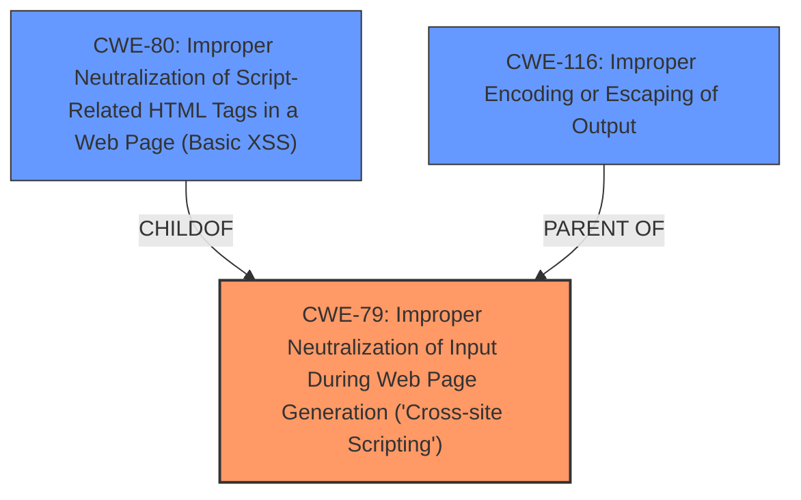

# Raw Analyzer Response for CVE-2024-12419

# Summary
| CWE ID | CWE Name | Confidence | CWE Abstraction Level | CWE Vulnerability Mapping Label | CWE-Vulnerability Mapping Notes |
|---|---|---|---|---|---|
| CWE-79 | Improper Neutralization of Input During Web Page Generation ('Cross-site Scripting') | 0.9 | Base | Allowed | Primary CWE |

## Evidence and Confidence

*   **Confidence Score:** 0.9
*   **Evidence Strength:** HIGH

## Relationship Analysis
The primary CWE selected is CWE-79, which is a Base level CWE. Several other CWEs were considered, particularly those related to authorization and code injection, but the description most strongly suggests improper neutralization of input.

## Vulnerability Chain
The vulnerability chain begins with **improper input validation**, leading to arbitrary shortcode execution and Reflected Cross-Site Scripting.
  - **Root Cause:** **Improper input validation**
  - **Weakness:** Arbitrary shortcode execution, XSS

## Summary of Analysis
The vulnerability description indicates that the CF7 WOW Styler WordPress Plugin is vulnerable to arbitrary shortcode execution due to **improper input validation**. This allows unauthenticated attackers to execute arbitrary shortcodes. The functionality is also vulnerable to Reflected Cross-Site Scripting. The primary weakness is the **improper neutralization** of input, which aligns directly with CWE-79.

The key phrase "does not properly validate a value before running do_shortcode" points to the root cause being **improper input validation**. This allows for the execution of arbitrary shortcodes and XSS.

CWE-79 (Improper Neutralization of Input During Web Page Generation ('Cross-site Scripting')) is selected as the primary CWE because the vulnerability description states that the plugin allows users to execute an action that does not properly validate a value before running do_shortcode, making it possible for unauthenticated attackers to execute arbitrary shortcodes and is also vulnerable to Reflected Cross-Site Scripting. This directly corresponds to the **improper neutralization** of input during web page generation.

Other CWEs Considered but Not Used:

*   CWE-352 (Cross-Site Request Forgery (CSRF)): While CSRF is a web application vulnerability, the description focuses on shortcode execution and XSS due to **improper input validation**, not a forged request.
*   CWE-116 (Improper Encoding or Escaping of Output): Although encoding/escaping issues can be related to XSS, the primary issue is **improper input validation** before shortcode execution.
*   CWE-138 (Improper Neutralization of Special Elements): This is a more general class, and CWE-79 is more specific to web page generation.
*   CWE-862 (Missing Authorization) and CWE-863 (Incorrect Authorization): While authorization issues might be present, the core issue is the **improper handling of input** leading to shortcode execution.
*   CWE-89 (Improper Neutralization of Special Elements used in an SQL Command ('SQL Injection')): SQL injection is not mentioned in the description.
*   CWE-434 (Unrestricted Upload of File with Dangerous Type): File uploads are not mentioned.
*   CWE-96 (Improper Neutralization of Directives in Statically Saved Code ('Static Code Injection')): While related to code injection, the vulnerability focuses on shortcode execution within a web page context, making CWE-79 a better fit.
*   CWE-471 (Modification of Assumed-Immutable Data (MAID)): This CWE does not directly relate to the vulnerability described.

The confidence level is high (0.9) because the vulnerability description explicitly mentions **improper input validation** leading to arbitrary shortcode execution and XSS, which strongly aligns with the characteristics of CWE-79.