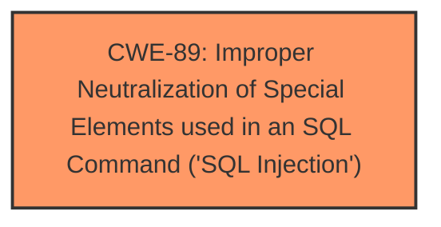

# Enhanced Analysis for CVE-2024-12473

# Summary

| CWE ID | CWE Name | Confidence | CWE Abstraction Level | CWE Vulnerability Mapping Label | CWE-Vulnerability Mapping Notes |
|---|---|---|---|---|---|
| CWE-89 | Improper Neutralization of Special Elements used in an SQL Command ('SQL Injection') | 1.0 | Base | Allowed | Primary CWE |

## Evidence and Confidence

*   **Confidence Score:** 1.0
*   **Evidence Strength:** HIGH

## Relationship Analysis
The primary relationship influencing the CWE selection is that of a direct match between the vulnerability description which explicitly states **SQL Injection** and the description of CWE-89 which is "Improper Neutralization of Special Elements used in an SQL Command ('SQL Injection')". There are no parent-child, chain, or peer relationships that impact the selection of CWE-89 in this case. The abstraction level of Base is appropriate as it represents a specific type of weakness.



## Vulnerability Chain
The vulnerability chain starts with the **insufficient escaping on the user supplied parameter and lack of sufficient preparation on the existing SQL query**, leading directly to the **SQL injection** vulnerability, which then allows attackers to **append additional SQL queries into already existing queries** and **extract sensitive information from the database**.

## Summary of Analysis
The analysis is based on the provided evidence which explicitly describes an **SQL injection** vulnerability due to **insufficient escaping on the user supplied parameter and lack of sufficient preparation on the existing SQL query**. The retriever results strongly support CWE-89 as the most relevant CWE. The hierarchical relationships did not influence the selection, as CWE-89 is already at the Base level of abstraction. The selected CWE is at the optimal level of specificity as it directly addresses the type of vulnerability described.

Relevant CWE Information:

# Enhanced Context (25 CWEs)
The following CWEs were identified as potentially relevant to this vulnerability:

## CWE-116: Improper Encoding or Escaping of Output
**Abstraction Level**: Class
**Similarity Score**: 0.75
**Source**: dense

**Description**:
The product prepares a structured message for communication with another component, but encoding or escaping of the data is either missing or done incorrectly. As a result, the intended structure of the message is not preserved.

**Mapping Guidance**:
- Usage: Allowed-with-Review
- Rationale: This CWE entry is a Class and might have Base-level children that would be more appropriate

## CWE-89: Improper Neutralization of Special Elements used in an SQL Command ('SQL Injection')
**Abstraction Level**: Base
**Similarity Score**: 726.11
**Source**: sparse

**Description**:
The product constructs all or part of an SQL command using externally-influenced input from an upstream component, but it does not neutralize or incorrectly neutralizes special elements that could modify the intended SQL command when it is sent to a downstream component. Without sufficient removal or quoting of SQL syntax in user-controllable inputs, the generated SQL query can cause those inputs to be interpreted as SQL instead of ordinary user data.

**Mapping Guidance**:
- Usage: Allowed
- Rationale: This CWE entry is at the Base level of abstraction, which is a preferred level of abstraction for mapping to the root causes of vulnerabilities.

**Technical Explanation for CWE-89:**

*   How the vulnerability's details match the CWE's characteristics: The vulnerability description explicitly states that the plugin is vulnerable to **SQL Injection** due to **insufficient escaping on the user supplied parameter and lack of sufficient preparation on the existing SQL query**. This directly aligns with the CWE-89 description, which covers scenarios where a product constructs an SQL command using externally-influenced input without properly neutralizing special elements.
*   The security implications and potential impact: The security implication is that an attacker can inject arbitrary SQL code, potentially leading to data leakage, modification, or deletion.
*   Any parent-child relationships or chain patterns that influenced your mapping: There are no parent-child relationships or chain patterns that influence this mapping decision.
*   Whether the weakness is primary or secondary in the vulnerability: This is the primary weakness as it is the root cause of the vulnerability.
*   How the official MITRE mapping guidance influenced your decision: The MITRE mapping guidance allows for the usage of CWE-89, as it is at the Base level of abstraction, which is preferred.

**Other CWEs Considered But Not Used:**

*   CWE-116 (Improper Encoding or Escaping of Output): While **insufficient escaping** is mentioned as part of the root cause, CWE-89 is more specific because it directly identifies the vulnerability as **SQL Injection**. CWE-116 is also a Class level CWE and the guidance recommends considering Base level CWEs first.
*   CWE-352 (Cross-Site Request Forgery (CSRF)): This CWE is not relevant as the vulnerability is not related to CSRF.
*   CWE-502 (Deserialization of Untrusted Data): This CWE is not relevant as the vulnerability is not related to deserialization of untrusted data.
*   CWE-90 (Improper Neutralization of Special Elements used in an LDAP Query ('LDAP Injection')): This CWE is not relevant as the vulnerability is an **SQL Injection**, not an LDAP Injection.
*   CWE-434 (Unrestricted Upload of File with Dangerous Type): This CWE is not relevant as the vulnerability is not related to file uploads.
*   CWE-96 (Improper Neutralization of Directives in Statically Saved Code ('Static Code Injection')): This CWE is not relevant as the vulnerability is an **SQL Injection**, not a Static Code Injection.
*   CWE-79 (Improper Neutralization of Input During Web Page Generation ('Cross-site Scripting')): This CWE is not relevant as the vulnerability is an **SQL Injection**, not Cross-site Scripting.


## CWE Relationship Analysis

Current CWEs represent these abstraction levels: .


### Vulnerability Chain Analysis

**Chain starting from CWE-90:**
- 90 (Improper Neutralization of Special Elements used in an LDAP Query ('LDAP Injection')) - ROOT


**Chain starting from CWE-89:**
- 89 (Improper Neutralization of Special Elements used in an SQL Command ('SQL Injection')) - ROOT


### CWE Relationship Diagram

```mermaid
graph TD
    classDef primary fill:#f96,stroke:#333,stroke-width:2px
    classDef secondary fill:#69f,stroke:#333
    classDef tertiary fill:#9e9,stroke:#333
```