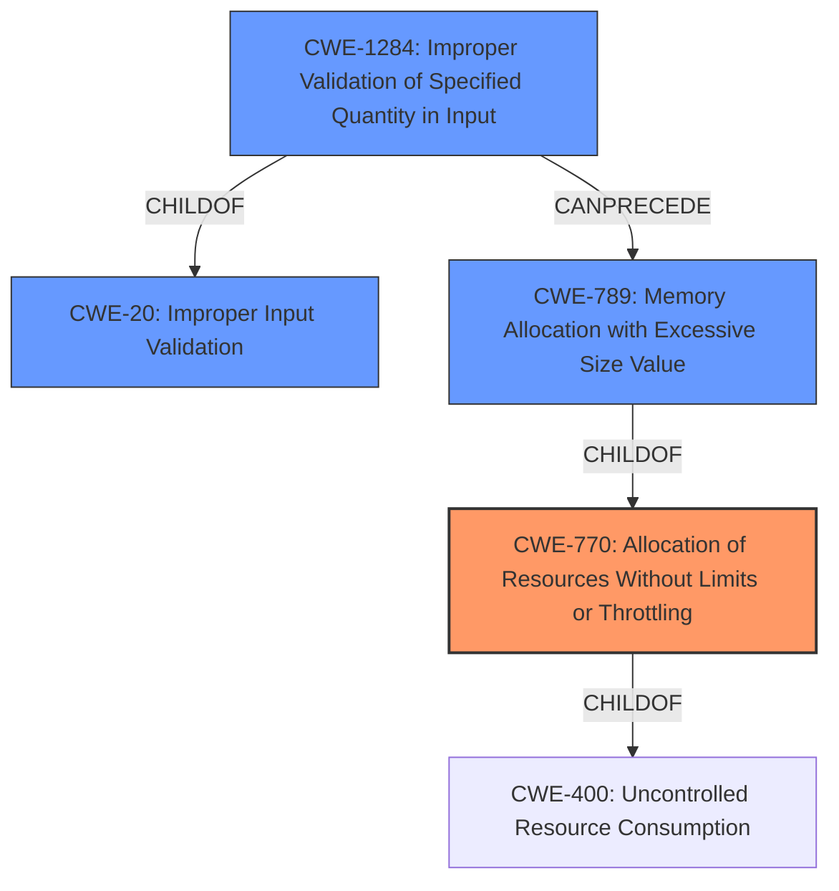

# Raw Analyzer Response for CVE-2024-12534

# Summary
| CWE ID | CWE Name | Confidence | CWE Abstraction Level | CWE Vulnerability Mapping Label | CWE-Vulnerability Mapping Notes |
|---|---|---|---|---|---|
| CWE-770 | Allocation of Resources Without Limits or Throttling | 0.9 | Base | Primary CWE | Allowed |
| CWE-1284 | Improper Validation of Specified Quantity in Input | 0.7 | Base | Secondary Candidate | Allowed |
| CWE-20 | Improper Input Validation | 0.5 | Class | Secondary Candidate | Discouraged |

## Evidence and Confidence

*   **Confidence Score:** 0.8
*   **Evidence Strength:** HIGH

## Relationship Analysis
The primary CWE is CWE-770, which is a Base level CWE describing the allocation of resources without limits. CWE-1284 (Improper Validation of Specified Quantity in Input) is a child of CWE-20 (Improper Input Validation) and can precede CWE-789 (Memory Allocation with Excessive Size Value) which is a child of CWE-770. This shows a potential chain where improper input validation leads to excessive memory allocation. The choice of CWE-770 is preferred over its parent CWE-400 (Uncontrolled Resource Consumption) as it is more specific.

## Vulnerability Chain
The vulnerability chain starts with the **lack of character length validation** (which could be mapped to CWE-1284). This leads to the ability to submit excessively large strings. This then results in the allocation of resources without limits or throttling (CWE-770), exhausting server resources (CPU, memory, and disk space), and finally resulting in a Denial of Service (DoS) condition.

## Summary of Analysis
The analysis indicates that the primary weakness is the lack of resource management, specifically, allocating resources without limits. This is directly caused by the **lack of character length validation**, but the more direct cause of the denial of service is the resource allocation. The vulnerability description clearly states that the application allows users to submit large payloads due to the **lack of character length validation**, leading to resource exhaustion.

The retriever results support the selection of CWE-770, with a high score. CWE-1284 is also a strong candidate, representing the **improper validation of the specified quantity in input**. CWE-20 is a more general case of input validation.

The choice of CWE-770 is optimal because it directly addresses the **root cause** of the denial-of-service vulnerability. The application does not limit or throttle the resources allocated based on the input size, leading to resource exhaustion. CWE-1284 is a contributing factor. CWE-20 is too general.

Relevant CWE Information:

**CWE-770: Allocation of Resources Without Limits or Throttling**
The product allocates resources without imposing any limits or throttling, which can lead to resource exhaustion and denial of service.

**CWE-1284: Improper Validation of Specified Quantity in Input**
The product receives an input value that specifies a quantity, but it does not validate that the quantity is within acceptable limits.

**CWE-20: Improper Input Validation**
The product receives input but does not validate or incorrectly validates that the input has the properties that are required to process the data safely and correctly.