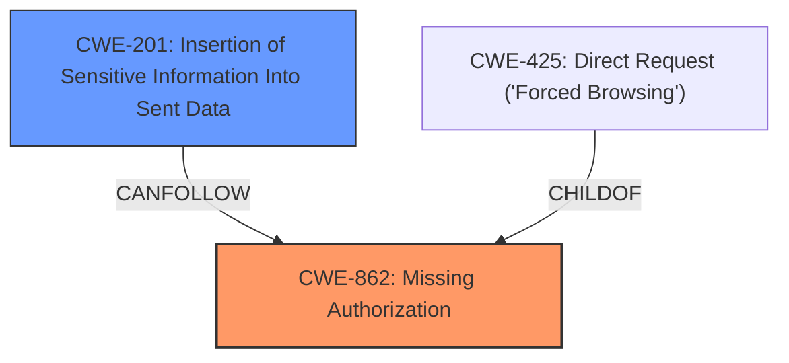

# Analysis Report for CVE-2024-12558

# Vulnerability Analysis Report: CVE-2024-12558

## Description

The WP BASE Booking of Appointments, Services and Events plugin for WordPress is vulnerable to unauthorized access of data due to a **missing capability check** on the export_db function in all versions up to, and including, 4.9.2. This makes it possible for authenticated attackers, with Subscriber-level access and above, to expose sensitive information from the database, such as the hashed administrator password.

## Vulnerability Description Key Phrases

- **Rootcause:** missing capability check
- **Impact:** unauthorized access of data
- **Attacker:** authenticated attackers
- **Product:** WP BASE Booking of Appointments, Services and Events plugin
- **Version:** up to and including 4.9.2
- **Component:** export_db function

## Analysis (with Relationship Data)

# Summary
| CWE ID | CWE Name | Confidence | CWE Abstraction Level | CWE Vulnerability Mapping Label | CWE-Vulnerability Mapping Notes |
|---|---|---|---|---|---|
| CWE-862 | Missing Authorization | 1.0 | Class | Primary | Allowed-with-Review |
| CWE-201 | Insertion of Sensitive Information Into Sent Data | 0.7 | Base | Secondary | Allowed |

## Evidence and Confidence

*   **Confidence Score:** 0.85
*   **Evidence Strength:** HIGH

## Relationship Analysis
The primary relationship that impacted my decision was the parent-child relationship between CWE-862 (Missing Authorization) and its potential base-level children. While a more specific child CWE might exist, the available information does not provide enough detail to pinpoint it.
CWE-201 (Insertion of Sensitive Information Into Sent Data) is a secondary concern, as the **missing authorization** directly leads to the exposure of sensitive data.



## Vulnerability Chain
The vulnerability chain starts with the **missing authorization check** (CWE-862) on the `export_db` function. This allows unauthorized access, which then leads to the **exposure of sensitive information** (CWE-201) from the database. The chain is: **Missing Authorization** -> Sensitive Information Exposure.

## Summary of Analysis
The analysis is primarily based on the provided evidence, which clearly states a **missing capability check** on the `export_db` function. The "Vulnerability Description Key Phrases" section explicitly identifies "**missing capability check**" as the root cause. The "CVE Reference Links Content Summary" section reinforces this by stating, "The vulnerability stems from a **missing capability check** on the `export_db` function."
CWE-862 is the most appropriate primary classification because it directly addresses the **missing authorization**.

CWE-201 is a secondary classification because the **missing authorization** leads to the insertion of sensitive information into sent data (the exported database file).

The selected CWEs are at the optimal level of specificity given the available information. While more specific child CWEs of CWE-862 might exist, there isn't enough detail to confidently select one.

Relevant CWE Information:

# Enhanced Context (25 CWEs)
The following CWEs were identified as potentially relevant to this vulnerability:

## CWE-352: Cross-Site Request Forgery (CSRF)
**Abstraction Level**: Compound
**Similarity Score**: 0.74
**Source**: dense

**Description**:
The web application does not, or can not, sufficiently verify whether a well-formed, valid, consistent request was intentionally provided by the user who submitted the request.

**Mapping Guidance**:
- Usage: Allowed
- Rationale: This is a well-known Composite of multiple weaknesses that must all occur simultaneously, although it is attack-oriented in nature.

*   **CWE-352 Rejected:** While CSRF could be a potential attack vector, the root cause is the **missing authorization** check, not the lack of CSRF protection.

## CWE-472: External Control of Assumed-Immutable Web Parameter
**Abstraction Level**: Base
**Similarity Score**: 0.73
**Source**: dense

**Description**:
The web application does not sufficiently verify inputs that are assumed to be immutable but are actually externally controllable, such as hidden form fields.

**Mapping Guidance**:
- Usage: Allowed
- Rationale: This CWE entry is at the Base level of abstraction, which is a preferred level of abstraction for mapping to the root causes of vulnerabilities.

*   **CWE-472 Rejected:** This CWE is not applicable because the vulnerability doesn't involve external control of assumed immutable parameters. The issue is the **lack of authorization** to access the function.

## CWE-425: Direct Request ('Forced Browsing')
**Abstraction Level**: Base
**Similarity Score**: 0.72
**Source**: dense

**Description**:
The web application does not adequately enforce appropriate authorization on all restricted URLs, scripts, or files.

**Mapping Guidance**:
- Usage: Allowed
- Rationale: This CWE entry is at the Base level of abstraction, which is a preferred level of abstraction for mapping to the root causes of vulnerabilities.

*   **CWE-425 Considered:** CWE-425 is a child of CWE-862 and could be a good fit but since the vulnerability description clearly states a **missing capability check**, I am sticking with the broader CWE-862

## CWE-639: Authorization Bypass Through User-Controlled Key
**Abstraction Level**: Base
**Similarity Score**: 0.72
**Source**: dense

**Description**:
The system's authorization functionality does not prevent one user from gaining access to another user's data or record by modifying the key value identifying the data.

**Mapping Guidance**:
- Usage: Allowed
- Rationale: This CWE entry is at the Base level of abstraction, which is a preferred level of abstraction for mapping to the root causes of vulnerabilities.

*   **CWE-639 Rejected:** This CWE doesn't fit as it involves modifying a key value, which isn't the case here. The vulnerability is due to a **missing authorization** check, not bypassing authorization through a modified key.

## CWE-862: Missing Authorization
**Abstraction Level**: Class
**Similarity Score**: 0.72
**Source**: dense

**Description**:
The product does not perform an authorization check when an actor attempts to access a resource or perform an action.

**Mapping Guidance**:
- Usage: Allowed-with-Review
- Rationale: This CWE entry is a Class and might have Base-level children that would be more appropriate

*   **CWE-862 Selected:** The vulnerability description explicitly states a **missing capability check** on the `export_db` function, which directly aligns with the definition of CWE-862.

## CWE-89: Improper Neutralization of Special Elements used in an SQL Command ('SQL Injection')
**Abstraction Level**: Base
**Similarity Score**: 0.70
**Source**: dense

**Description**:
The product constructs all or part of an SQL command using externally-influenced input from an upstream component, but it does not neutralize or incorrectly neutralizes special elements that could modify the intended SQL command when it is sent to a downstream component. Without sufficient removal or quoting of SQL syntax in user-controllable inputs, the generated SQL query can cause those inputs to be interpreted as SQL instead of ordinary user data.

**Mapping Guidance**:
- Usage: Allowed
- Rationale: This CWE entry is at the Base level of abstraction, which is a preferred level of abstraction for mapping to the root causes of vulnerabilities.

*   **CWE-89 Rejected:** This CWE is not applicable as there is no SQL injection involved. The vulnerability stems from the **lack of authorization**.

## CWE-201: Insertion of Sensitive Information Into Sent Data
**Abstraction Level**: Base
**Similarity Score**: 0.69
**Source**: dense

**Description**:
The code transmits data to another actor, but a portion of the data includes sensitive information that should not be accessible to that actor.

**Mapping Guidance**:
- Usage: Allowed
- Rationale: This CWE entry is at the Base level of abstraction, which is a preferred level of abstraction for mapping to the root causes of vulnerabilities.

*   **CWE-201 Selected as Secondary:** The **missing authorization** leads directly to sensitive information being exposed in the exported database file.


## CWE Relationship Analysis

Current CWEs represent these abstraction levels: .


### Vulnerability Chain Analysis

**Chain starting from CWE-89:**
- 89 (Improper Neutralization of Special Elements used in an SQL Command ('SQL Injection')) - ROOT


**Chain starting from CWE-862:**
- 862 (Missing Authorization) - ROOT


### CWE Relationship Diagram

```mermaid
graph TD
    classDef primary fill:#f96,stroke:#333,stroke-width:2px
    classDef secondary fill:#69f,stroke:#333
    classDef tertiary fill:#9e9,stroke:#333
```


*Report generated on 2025-07-13 02:57:16*
