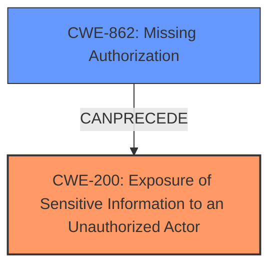

# Analysis Report for CVE-2024-12584

# Vulnerability Analysis Report: CVE-2024-12584

## Description

The 140+ Widgets | Xpro Addons For Elementor FREE plugin for WordPress is vulnerable to Sensitive Information Exposure in all versions up to, and including, 1.4.6.2 via the duplicate function. This makes it possible for authenticated attackers, with Contributor-level access and above, to extract potentially sensitive data from draft, scheduled (future), private, and password protected posts.

## Vulnerability Description Key Phrases

- **Component:** duplicate function
- **Weakness:** sensitive information exposure
- **Product:** 140+ Widgets | Xpro Addons For Elementor FREE plugin for WordPress
- **Impact:** extract potentially sensitive data, Sensitive Information Exposure
- **Attacker:** authenticated attackers with Contributor-level access and above
- **Version:** all versions up to and including 1.4.6.2

## Analysis (with Relationship Data)

# Summary
| CWE ID | CWE Name | Confidence | CWE Abstraction Level | CWE Vulnerability Mapping Label | CWE-Vulnerability Mapping Notes |
|---|---|---|---|---|---|
| CWE-200 | Exposure of Sensitive Information to an Unauthorized Actor | 0.9 | Class | Primary | Allowed, This CWE identifies the **sensitive information exposure** |
| CWE-862 | Missing Authorization | 0.6 | Class | Secondary | Allowed-with-Review, The **missing authorization** is a possible root cause. |

## Evidence and Confidence

*   **Confidence Score:** 0.75
*   **Evidence Strength:** MEDIUM

## Relationship Analysis
The primary relationship that influenced the decision was the parent-child relationship between CWE-200 and its potential children. While CWE-200 is a Class-level CWE, it accurately captures the **sensitive information exposure**. CWE-862, Missing Authorization, is a potential root cause, indicating a **missing** security check. These are related as CWE-862 could CanPrecede CWE-200, meaning that a missing authorization check can lead to the exposure of sensitive information.



## Vulnerability Chain
The vulnerability chain starts with a **missing authorization** check (CWE-862). This **missing** check allows authenticated attackers with Contributor-level access and above to use the "duplicate function" to extract sensitive data from draft, scheduled, private, and password-protected posts, ultimately leading to **sensitive information exposure** (CWE-200).

## Summary of Analysis
The initial analysis focused on identifying the core weakness described in the vulnerability. The description clearly indicates a **sensitive information exposure** through the "duplicate function" of the plugin. The retriever results pointed to CWE-200, Exposure of Sensitive Information to an Unauthorized Actor, as a strong candidate. The description also mentions that authenticated attackers with Contributor-level access and above can extract sensitive data, suggesting a potential **missing** or **incorrect authorization** mechanism.

The primary decision to map CWE-200 is based on the explicit mention of "Sensitive Information Exposure" in the vulnerability description and key phrases.

The decision to include CWE-862 is based on the fact that the vulnerability allows authenticated attackers with Contributor-level access to extract data they should not have access to. This implies a **missing authorization** check.

Relevant CWE Information:

# Enhanced Context (25 CWEs)
The following CWEs were identified as potentially relevant to this vulnerability:

## CWE-352: Cross-Site Request Forgery (CSRF)
**Abstraction Level**: Compound
**Similarity Score**: 0.70
**Source**: dense

**Description**:
The web application does not, or can not, sufficiently verify whether a well-formed, valid, consistent request was intentionally provided by the user who submitted the request.

**Mapping Guidance**:
- Usage: Allowed
- Rationale: This is a well-known Composite of multiple weaknesses that must all occur simultaneously, although it is attack-oriented in nature.

*Not Used:* This CWE does not fit the vulnerability description because there is no evidence of CSRF.

## CWE-425: Direct Request ('Forced Browsing')
**Abstraction Level**: Base
**Similarity Score**: 0.70
**Source**: dense

**Description**:
The web application does not adequately enforce appropriate authorization on all restricted URLs, scripts, or files.

**Mapping Guidance**:
- Usage: Allowed
- Rationale: This CWE entry is at the Base level of abstraction, which is a preferred level of abstraction for mapping to the root causes of vulnerabilities.

*Not Used:* While related to authorization, the description doesn't specify that the vulnerability is due to accessing restricted URLs or files.

## CWE-472: External Control of Assumed-Immutable Web Parameter
**Abstraction Level**: Base
**Similarity Score**: 0.69
**Source**: dense

**Description**:
The web application does not sufficiently verify inputs that are assumed to be immutable but are actually externally controllable, such as hidden form fields.

**Mapping Guidance**:
- Usage: Allowed
- Rationale: This CWE entry is at the Base level of abstraction, which is a preferred level of abstraction for mapping to the root causes of vulnerabilities.

*Not Used:* There's no mention of externally controlled parameters in the description.

## CWE-434: Unrestricted Upload of File with Dangerous Type
**Abstraction Level**: Base
**Similarity Score**: 0.69
**Source**: dense

**Description**:
The product allows the upload or transfer of dangerous file types that are automatically processed within its environment.

**Mapping Guidance**:
- Usage: Allowed
- Rationale: This CWE entry is at the Base level of abstraction, which is a preferred level of abstraction for mapping to the root causes of vulnerabilities.

*Not Used:* The description does not involve file uploads.

## CWE-639: Authorization Bypass Through User-Controlled Key
**Abstraction Level**: Base
**Similarity Score**: 0.68
**Source**: dense

**Description**:
The system's authorization functionality does not prevent one user from gaining access to another user's data or record by modifying the key value identifying the data.

**Mapping Guidance**:
- Usage: Allowed
- Rationale: This CWE entry is at the Base level of abstraction, which is a preferred level of abstraction for mapping to the root causes of vulnerabilities.

*Not Used:* The description doesn't explicitly mention user-controlled keys.

## CWE-116: Improper Encoding or Escaping of Output
**Abstraction Level**: Class
**Similarity Score**: 0.68
**Source**: dense

**Description**:
The product prepares a structured message for communication with another component, but encoding or escaping of the data is either missing or done incorrectly. As a result, the intended structure of the message is not preserved.

**Mapping Guidance**:
- Usage: Allowed-with-Review
- Rationale: This CWE entry is a Class and might have Base-level children that would be more appropriate

*Not Used:* The vulnerability isn't related to encoding or escaping of output.

## CWE-538: Insertion of Sensitive Information into Externally-Accessible File or Directory
**Abstraction Level**: Base
**Similarity Score**: 0.68
**Source**: dense

**Description**:
The product places sensitive information into files or directories that are accessible to actors who are allowed to have access to the files, but not to the sensitive information.

**Mapping Guidance**:
- Usage: Allowed
- Rationale: This CWE entry is at the Base level of abstraction, which is a preferred level of abstraction for mapping to the root causes of vulnerabilities.

*Not Used:* The vulnerability relates to data exposure through a function, not files.

## CWE-201: Insertion of Sensitive Information Into Sent Data
**Abstraction Level**: Base
**Similarity Score**: 0.67
**Source**: dense

**Description**:
The code transmits data to another actor, but a portion of the data includes sensitive information that should not be accessible to that actor.

**Mapping Guidance**:
- Usage: Allowed
- Rationale: This CWE entry is at the Base level of abstraction, which is a preferred level of abstraction for mapping to the root causes of vulnerabilities.

*Not Used:* While the impact is **sensitive information exposure**, this CWE is about sending sensitive information, which isn't the primary mechanism.

## CWE-209: Generation of Error Message Containing Sensitive Information
**Abstraction Level**: Base
**Similarity Score**: 0.67
**Source**: dense

**Description**:
The product generates an error message that includes sensitive information about its environment, users, or associated data.

**Mapping Guidance**:
- Usage: Allowed
- Rationale: This CWE entry is at the Base level of abstraction, which is a preferred level of abstraction for mapping to the root causes of vulnerabilities.

*Not Used:* The description doesn't involve error messages.

## CWE-212: Improper Removal of Sensitive Information Before Storage or Transfer
**Abstraction Level**: Base
**Similarity Score**: 0.66
**Source**: dense

**Description**:
The product stores, transfers, or shares a resource that contains sensitive information, but it does not properly remove that information before the product makes the resource available to unauthorized actors.

**Mapping Guidance**:
- Usage: Allowed
- Rationale: This CWE entry is at the Base level of abstraction, which is a preferred level of abstraction for mapping to the root causes of vulnerabilities.

*Not Used:* The description doesn't focus on improper removal of sensitive information.

## CWE-863: Incorrect Authorization
**Abstraction Level**: Class
**Similarity Score**: 563.00
**Source**: sparse

**Description**:
The product performs an authorization check when an actor attempts to access a resource or perform an action, but it does not correctly perform the check.

**Mapping Guidance**:
-


## CWE Relationship Analysis

Current CWEs represent these abstraction levels: .


### Vulnerability Chain Analysis

**Chain starting from CWE-863:**
- 863 (Incorrect Authorization) - ROOT


**Chain starting from CWE-116:**
- 116 (Improper Encoding or Escaping of Output) - ROOT


### CWE Relationship Diagram

```mermaid
graph TD
    classDef primary fill:#f96,stroke:#333,stroke-width:2px
    classDef secondary fill:#69f,stroke:#333
    classDef tertiary fill:#9e9,stroke:#333
```


*Report generated on 2025-07-13 02:59:11*
