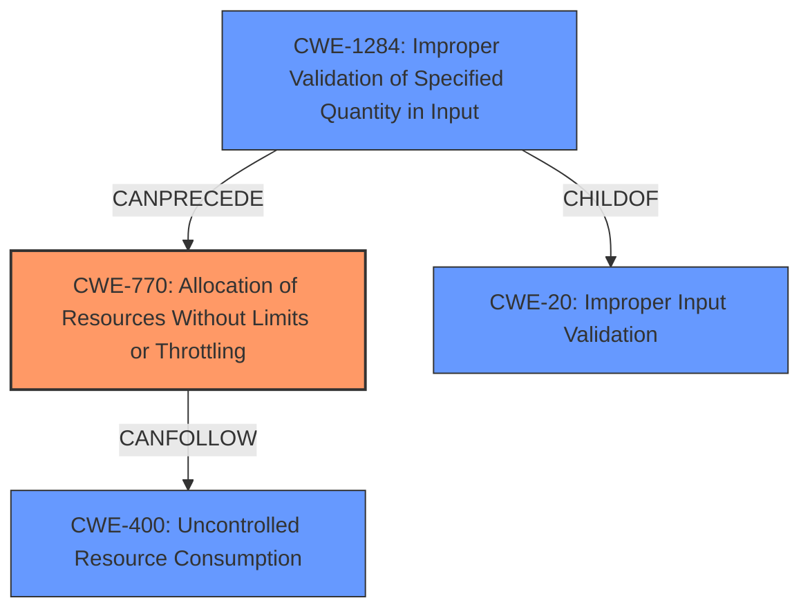

# Enhanced Analysis for CVE-2024-12601

# Summary
| CWE ID  | CWE Name                                                | Confidence | CWE Abstraction Level | CWE Vulnerability Mapping Label | CWE-Vulnerability Mapping Notes |
| :------- | :------------------------------------------------------- | :--------- | :-------------------- | :------------------------------ | :----------------------------- |
| CWE-770  | Allocation of Resources Without Limits or Throttling    | 0.9        | Base                  | Allowed                       | Primary CWE                    |
| CWE-1284 | Improper Validation of Specified Quantity in Input       | 0.7        | Base                  | Allowed                       | Secondary Candidate            |
| CWE-400  | Uncontrolled Resource Consumption                       | 0.6        | Class                 | Discouraged                     | Secondary Candidate            |
| CWE-20   | Improper Input Validation                               | 0.5        | Class                 | Discouraged                     | Secondary Candidate            |

## Evidence and Confidence

*   **Confidence Score:** 0.8
*   **Evidence Strength:** HIGH

## Relationship Analysis
The primary weakness is **CWE-770: Allocation of Resources Without Limits or Throttling**, a Base level CWE, because the application does not limit the resources allocated for CAPTCHA image generation. This can lead to **CWE-400: Uncontrolled Resource Consumption**, a Class level CWE, as an impact. The **CWE-1284: Improper Validation of Specified Quantity in Input** is included as a secondary cause because the height and width parameters are not validated, which allows for excessive values to be passed, contributing to resource exhaustion. **CWE-20: Improper Input Validation** is a more general Class level CWE that could apply, but it is less specific than CWE-1284 and CWE-770.



## Vulnerability Chain
The vulnerability chain starts with the **lack of input validation** (**CWE-1284**) for the height and width parameters. This leads to **unlimited resource allocation** (**CWE-770**) when generating CAPTCHA images. Finally, this results in **uncontrolled resource consumption** (**CWE-400**) and ultimately a denial of service.

## Summary of Analysis
The primary CWE is **CWE-770: Allocation of Resources Without Limits or Throttling** because the root cause of the vulnerability is the application's failure to limit the resources allocated for CAPTCHA image generation. The vulnerability description and the CVE reference link content summary both point to this root cause. Specifically, the "Root Cause: The vulnerability is due to the lack of input sanitization and validation for the height and width parameters used to generate CAPTCHA images. The plugin doesn't impose any limit on the size of the image requested." supports this. **CWE-1284** is a secondary factor, as the **improper validation** of the image dimensions contributes to the excessive resource allocation. **CWE-400** is a consequence or impact of the lack of resource control. **CWE-20** is too general.

Relevant CWE Information:
*   **CWE-770:** The product allocates a reusable resource or group of resources on behalf of an actor without imposing any restrictions on the size or number of resources that can be allocated. This aligns with the vulnerability where the server allocates resources for generating CAPTCHA images without any limit on the height and width parameters.
*   **CWE-1284:** The product receives input that is expected to specify a quantity (such as size or length), but it does not validate or incorrectly validates that the quantity has the required properties. This accurately describes the **lack of validation** for the height and width parameters.
*   **CWE-400:** The product does not properly control the allocation and maintenance of a limited resource, thereby enabling an actor to influence the amount of resources consumed, eventually leading to the exhaustion of available resources. This is the impact of the vulnerability, but not the root cause.
*   **CWE-20:** The product receives input or data, but it does not validate or incorrectly validates that the input has the properties that are required to process the data safely and correctly. While this is true, it's a general class and **CWE-1284** is more specific.


## CWE Relationship Analysis

Current CWEs represent these abstraction levels: .


### Vulnerability Chain Analysis

**Chain starting from CWE-1284:**
- 1284 (Improper Validation of Specified Quantity in Input) - ROOT


**Chain starting from CWE-400:**
- 400 (Uncontrolled Resource Consumption) - ROOT


### CWE Relationship Diagram

```mermaid
graph TD
    classDef primary fill:#f96,stroke:#333,stroke-width:2px
    classDef secondary fill:#69f,stroke:#333
    classDef tertiary fill:#9e9,stroke:#333
```