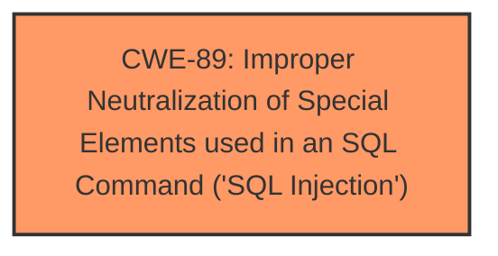

# Enhanced Analysis for CVE-2024-12609

# Summary
| CWE ID | CWE Name | Confidence | CWE Abstraction Level | CWE Vulnerability Mapping Label | CWE-Vulnerability Mapping Notes |
|---|---|---|---|---|---|
| CWE-89 | Improper Neutralization of Special Elements used in an SQL Command ('SQL Injection') | 1.0 | Base | Allowed | Primary CWE |

## Evidence and Confidence

*   **Confidence Score:** 1.0
*   **Evidence Strength:** HIGH

## Relationship Analysis
The primary relationship that influenced my decision was the hierarchical relationship of CWE-89. CWE-89 is a base level CWE, which is the preferred level of abstraction. There are no chain or peer relationships that change that.



## Vulnerability Chain
The vulnerability chain starts with **insufficient escaping on the user supplied parameter and lack of sufficient preparation on the existing SQL query**, which leads to SQL Injection and allows an attacker to extract sensitive information from the database. The root cause is CWE-89.

## Summary of Analysis
The vulnerability description clearly indicates an SQL Injection vulnerability due to **insufficient escaping on the user supplied parameter and lack of sufficient preparation on the existing SQL query**. The description states that this makes it possible for authenticated attackers, with Student-level access and above, to append additional SQL queries into already existing queries that can be used to extract sensitive information from the database.

CWE-89, "Improper Neutralization of Special Elements used in an SQL Command ('SQL Injection')", is a base level CWE that directly addresses this vulnerability. The description of CWE-89 matches the vulnerability: "The product constructs all or part of an SQL command using externally-influenced input from an upstream component, but it does not neutralize or incorrectly neutralizes special elements that could modify the intended SQL command when it is sent to a downstream component."

The other CWEs were not selected because they did not describe the root cause of the vulnerability.
- CWE-116: Improper Encoding or Escaping of Output - Class level, not specific enough.
- CWE-352: Cross-Site Request Forgery (CSRF) - Compound, not related to SQL injection.
- CWE-434: Unrestricted Upload of File with Dangerous Type - Base, not related to SQL injection.
- CWE-472: External Control of Assumed-Immutable Web Parameter - Base, not directly related to SQL injection.
- CWE-79: Improper Neutralization of Input During Web Page Generation ('Cross-site Scripting') - Base, not related to SQL injection.

Based on the evidence, relationship analysis, and mapping guidance, CWE-89 is the most appropriate and specific CWE for this vulnerability.


## CWE Relationship Analysis

Current CWEs represent these abstraction levels: .


### Vulnerability Chain Analysis

**Chain starting from CWE-89:**
- 89 (Improper Neutralization of Special Elements used in an SQL Command ('SQL Injection')) - ROOT


**Chain starting from CWE-116:**
- 116 (Improper Encoding or Escaping of Output) - ROOT


### CWE Relationship Diagram

```mermaid
graph TD
    classDef primary fill:#f96,stroke:#333,stroke-width:2px
    classDef secondary fill:#69f,stroke:#333
    classDef tertiary fill:#9e9,stroke:#333
```