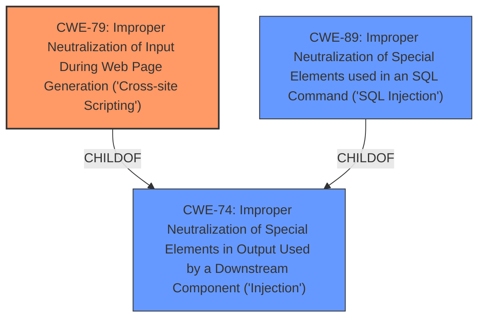

# Analysis Report for CVE-2024-12739

# Vulnerability Analysis Report: CVE-2024-12739

## Description

The Mobile Contact Bar WordPress plugin before 3.0.5 **does not sanitise and escape some of its settings**, which could allow high privilege users such as admin to perform Stored Cross-Site Scripting attacks even when the unfiltered_html capability is disallowed (for example in multisite setup).

## Vulnerability Description Key Phrases

- **Rootcause:** does not sanitise and escape some of its settings
- **Weakness:** cross-site scripting
- **Product:** Mobile Contact Bar WordPress plugin
- **Impact:** stored cross-site scripting attacks, perform XSS
- **Attacker:** high privilege users
- **Version:** before 3.0.5

## Analysis (with Relationship Data)

# Summary
| CWE ID | CWE Name | Confidence | CWE Abstraction Level | CWE Vulnerability Mapping Label | CWE-Vulnerability Mapping Notes |
|---|---|---|---|---|---|
| CWE-79 | Improper Neutralization of Input During Web Page Generation ('Cross-site Scripting') | 1.0 | Base | Allowed | Primary CWE |

## Evidence and Confidence

*   **Confidence Score:** 1.0
*   **Evidence Strength:** HIGH

## Relationship Analysis
The primary relationship influencing the decision is the direct match of the vulnerability description to CWE-79, which describes improper neutralization of input during web page generation. While other CWEs like CWE-862 (Missing Authorization) and CWE-863 (Incorrect Authorization) relate to authorization issues, this vulnerability is directly about the **lack of sanitization and escaping**, leading to XSS. The abstraction level of CWE-79 as 'Base' is optimal as it directly describes the weakness.



## Vulnerability Chain
The vulnerability chain starts with the **lack of sanitization and escaping** of settings within the Mobile Contact Bar WordPress plugin. This **root cause** (CWE-79) allows high-privilege users to inject malicious JavaScript code, leading to a Stored Cross-Site Scripting (XSS) attack.

## Summary of Analysis
The analysis is primarily based on the vulnerability description, which clearly states that the plugin **"does not sanitise and escape some of its settings"**, which directly corresponds to the definition of CWE-79. The CVE Reference Links Content Summary reinforces this by stating, "The plugin 'Mobile Contact Bar' does not sanitize and escape some of its settings. This allows high-privilege users, such as admins, to perform Stored Cross-Site Scripting (XSS) attacks."

The relationships between CWEs were considered, especially the parent-child relationship between CWE-79 and CWE-74 (Improper Neutralization of Special Elements in Output Used by a Downstream Component ('Injection')). However, CWE-79 is more specific and directly relevant to the XSS vulnerability.

The selected CWE is at the optimal level of specificity because it accurately describes the **root cause** of the vulnerability, which is the **improper neutralization of input** during web page generation.

Relevant CWE Information:
- CWE-79: Improper Neutralization of Input During Web Page Generation ('Cross-site Scripting') - This is the most relevant CWE as it directly addresses the vulnerability description of **not sanitizing and escaping settings**, leading to stored XSS.


## CWE Relationship Analysis

Current CWEs represent these abstraction levels: .


### Vulnerability Chain Analysis

**Chain starting from CWE-863:**
- 863 (Incorrect Authorization) - ROOT


**Chain starting from CWE-89:**
- 89 (Improper Neutralization of Special Elements used in an SQL Command ('SQL Injection')) - ROOT


### CWE Relationship Diagram

```mermaid
graph TD
    classDef primary fill:#f96,stroke:#333,stroke-width:2px
    classDef secondary fill:#69f,stroke:#333
    classDef tertiary fill:#9e9,stroke:#333
```


*Report generated on 2025-07-13 03:06:54*
