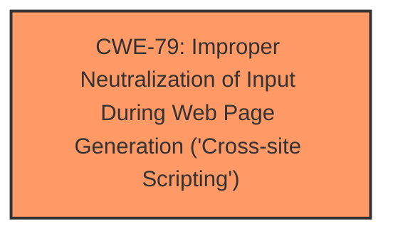

# Analysis for CVE-2024-12743

# Summary
| CWE ID | CWE Name | Confidence | CWE Abstraction Level | CWE Vulnerability Mapping Label | CWE-Vulnerability Mapping Notes |
|---|---|---|---|---|---|
| CWE-79 | Improper Neutralization of Input During Web Page Generation ('Cross-site Scripting') | 1 | Base | Primary | Allowed |

## Evidence and Confidence

*   **Confidence Score:** 1
*   **Evidence Strength:** HIGH

## Relationship Analysis
The primary relationship that impacted my decision was the parent-child relationship of CWE-79 to more specific XSS variants. However, the description did not provide enough detail to select a variant over the base CWE.

## Vulnerability Chain
The vulnerability chain starts with the **failure to sanitize and escape settings**, leading to the **Stored Cross-Site Scripting (XSS)** vulnerability.
  - The **primary CWE** is CWE-79 which represents the **root cause** in the Vulnerability Chain
  - Input => **Improper Sanitization/Escaping** => XSS

## Summary of Analysis
Based on the provided evidence, the primary weakness is the **failure to sanitize and escape settings**, which results in a Stored Cross-Site Scripting (XSS) vulnerability. The vulnerability description states that the "plugin **does not sanitise and escape some of its settings**, which could allow high privilege users such as admin to perform Stored Cross-Site Scripting attacks." The CVE Reference Links Content Summary confirms this by stating, "The plugin **does not sanitise and escape some of its settings**, allowing for XSS attacks" and "Stored Cross-Site Scripting (XSS)".

CWE-79 (Improper Neutralization of Input During Web Page Generation ('Cross-site Scripting')) is the most appropriate CWE because it directly addresses the root cause of the vulnerability, which is the **lack of proper sanitization and escaping of user-controlled input before it is used in a web page.** The description of CWE-79 states, "The product does not neutralize or incorrectly neutralizes user-controllable input before it is placed in output that is used as a web page that is served to other users." This aligns perfectly with the vulnerability description.

I considered other CWEs from the Retriever Results, such as CWE-352 (Cross-Site Request Forgery (CSRF)), CWE-862 (Missing Authorization), and CWE-89 (Improper Neutralization of Special Elements used in an SQL Command ('SQL Injection')). However, these CWEs do not accurately represent the root cause of this specific vulnerability. The issue is not related to CSRF, missing authorization, or SQL injection. The primary issue is the **improper handling of input that leads to XSS**.

The selection of CWE-79 is at the optimal level of specificity because the vulnerability description doesn't provide enough details to pinpoint a more specific variant of XSS.