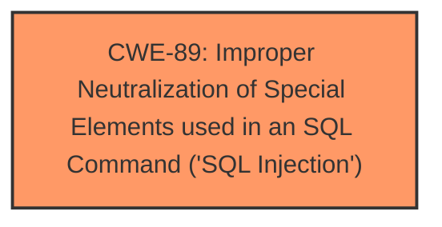

# Analysis for CVE-2024-12787

# Summary
| CWE ID | CWE Name | Confidence | CWE Abstraction Level | CWE Vulnerability Mapping Label | CWE-Vulnerability Mapping Notes |
|---|---|---|---|---|---|
| CWE-89 | Improper Neutralization of Special Elements used in an SQL Command ('SQL Injection') | 1.0 | Base | Primary | Allowed |

## Evidence and Confidence

*   **Confidence Score:** 1.0
*   **Evidence Strength:** HIGH

## Relationship Analysis
The primary relationship is that CWE-89 is a Base level weakness which is the preferred level of abstraction. There are no child CWEs that would be more specific, and the description clearly indicates an SQL Injection vulnerability.

## Vulnerability Chain
The vulnerability chain consists of a single element: the **improper neutralization** of special elements used in an SQL command, which leads directly to SQL injection.

## Summary of Analysis
The analysis is based on direct evidence from the vulnerability description. The description explicitly mentions "**sql injection**" in the context of manipulating the `student_emailid` argument in `/student/check_student_login.php`. This aligns directly with the definition of CWE-89, which involves constructing SQL commands using externally-influenced input without proper neutralization.

The selection of CWE-89 is at the optimal level of specificity because it directly addresses the **root cause** of the vulnerability: the **improper neutralization** of special elements in an SQL command.

Relevant CWE Information:

# Enhanced Context (25 CWEs)
The following CWEs were identified as potentially relevant to this vulnerability:

## CWE-89: Improper Neutralization of Special Elements used in an SQL Command ('SQL Injection')
**Abstraction Level**: Base
**Similarity Score**: 1.00
**Source**: dense

**Description**:
The product constructs all or part of an SQL command using externally-influenced input from an upstream component, but it does not neutralize or incorrectly neutralizes special elements that could modify the intended SQL command when it is sent to a downstream component. Without sufficient removal or quoting of SQL syntax in user-controllable inputs, the generated SQL query can cause those inputs to be interpreted as SQL instead of ordinary user data.

**Mapping Guidance**:
- Usage: Allowed
- Rationale: This CWE entry is at the Base level of abstraction, which is a preferred level of abstraction for mapping to the root causes of vulnerabilities.

The vulnerability description explicitly mentions "SQL injection" as the **weakness** resulting from the manipulation of the `student_emailid` argument in the `/student/check_student_login.php` file. This aligns perfectly with the definition of CWE-89.

The high confidence score is due to the explicit mention of "SQL injection" in the vulnerability description, making the mapping straightforward and direct.