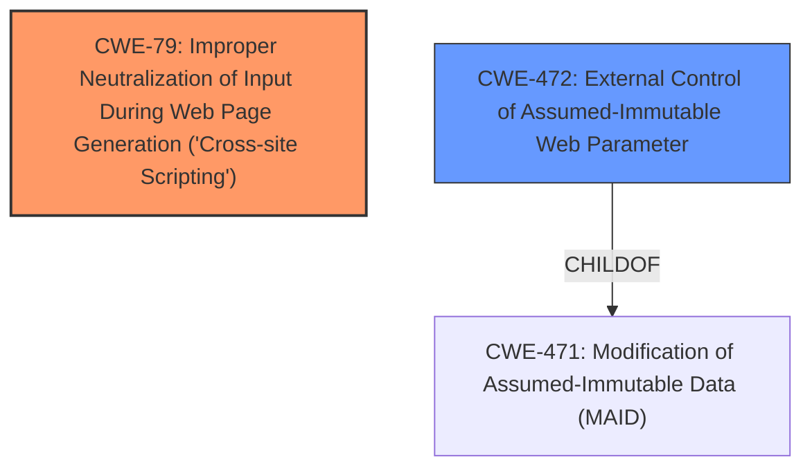

# Analysis Report for CVE-2024-12800

# Vulnerability Analysis Report: CVE-2024-12800

## Description

The IP Based Login WordPress plugin before 2.4.1 **does not sanitise values when importing**, which could allow high privilege users such as admin to perform Stored **Cross-Site Scripting** attacks even when the unfiltered_html capability is disallowed (for example in multisite setup).

## Vulnerability Description Key Phrases

- **Rootcause:** does not sanitise values when importing
- **Weakness:** Cross-Site Scripting
- **Impact:** Stored Cross-Site Scripting attacks
- **Attacker:** high privilege users
- **Product:** IP Based Login WordPress plugin
- **Version:** before 2.4.1

## Analysis (with Relationship Data)

# Summary

| CWE ID | CWE Name | Confidence | CWE Abstraction Level | CWE Vulnerability Mapping Label | CWE-Vulnerability Mapping Notes |
|---|---|---|---|---|---|
| CWE-79 | Improper Neutralization of Input During Web Page Generation ('Cross-site Scripting') | 1.0 | Base | Primary CWE | Allowed |
| CWE-472 | External Control of Assumed-Immutable Web Parameter | 0.7 | Base | Secondary Candidate | Allowed |

## Evidence and Confidence

*   **Confidence Score:** 0.9
*   **Evidence Strength:** HIGH

## Relationship Analysis

The primary relationship that influenced the selection was that CWE-79 is a Base level CWE which is preferred. CWE-79 is also listed as a top CWE for similar CVE Descriptions.
CWE-472 is a child of CWE-471, showing a potential chain, where immutable data is modified, leading to potential XSS.



## Vulnerability Chain

The vulnerability chain starts with the **failure to sanitize values when importing**. This **root cause** leads to the **Cross-Site Scripting** vulnerability, which can be exploited by high-privilege users to perform Stored Cross-Site Scripting attacks. The chain is:

1.  **Improper Input Handling**: **does not sanitise values when importing**
2.  **Cross-Site Scripting (XSS)**: CWE-79
3.  **Impact**: Stored Cross-Site Scripting attacks.

## Summary of Analysis

The initial analysis focused on identifying the **root cause** of the vulnerability. The vulnerability description clearly states that the plugin **does not sanitise values when importing**, which is the primary cause of the Stored Cross-Site Scripting vulnerability.

The selection of CWE-79 is based on the direct evidence provided in the vulnerability description and the CVE Reference Links Content Summary, which states "Root cause of vulnerability: The plugin **does not sanitize values when importing**" and "Weaknesses/vulnerabilities present: Stored Cross-Site Scripting (XSS)".

CWE-472 was considered as a secondary CWE because the vulnerability involves the **External Control of Assumed-Immutable Web Parameter**. The plugin **does not sanitise values when importing**, implying that it might be treating external data as immutable without proper validation, potentially leading to the XSS vulnerability.

CWE-79 is the more specific and direct representation of the vulnerability, as it directly addresses the **Cross-Site Scripting** weakness. CWE-79 is a Base level CWE which is preferred.

Relevant CWE Information:

# Enhanced Context (25 CWEs)
The following CWEs were identified as potentially relevant to this vulnerability:

## CWE-472: External Control of Assumed-Immutable Web Parameter
**Abstraction Level**: Base
**Similarity Score**: 0.80
**Source**: dense

**Description**:
The web application **does not sufficiently verify inputs that are assumed to be immutable** but are actually externally controllable, such as hidden form fields.

**Mapping Guidance**:
- Usage: Allowed
- Rationale: This CWE entry is at the Base level of abstraction, which is a preferred level of abstraction for mapping to the root causes of vulnerabilities.

## CWE-79: Improper Neutralization of Input During Web Page Generation ('Cross-site Scripting')
**Abstraction Level**: base
**Similarity Score**: 4.47
**Source**: graph

**Description**:
CWE-79: Improper Neutralization of Input During Web Page Generation ('Cross-site Scripting')

**Mapping Guidance**:
- Usage: Allowed
- Rationale: This CWE entry is at the Base level of abstraction, which is a preferred level of abstraction for mapping to the root causes of vulnerabilities.

**Relationships**:
- PARENTOF -> CWE-87
- PARENTOF -> CWE-86
- PARENTOF -> CWE-85
- PARENTOF -> CWE-84
- PARENTOF -> CWE-83

### Detailed Analysis for Selected CWEs:

*   **CWE-79: Improper Neutralization of Input During Web Page Generation ('Cross-site Scripting')**
    *   **Explanation:** The plugin **does not sanitise values when importing**, leading to the possibility of injecting malicious scripts into web pages.
    *   **Match:** This aligns directly with the CWE description, as the plugin fails to neutralize input during web page generation, resulting in XSS.
    *   **Impact:** An attacker can inject malicious scripts that execute in the context of other users' browsers, potentially leading to session hijacking, information theft, or defacement.
    *   **Relationship:** CWE-79 is a base CWE, representing a direct cause of the XSS vulnerability.
    *   **Usage:** Allowed, as it directly represents the **root cause** of the XSS vulnerability.
*   **CWE-472: External Control of Assumed-Immutable Web Parameter**
    *   **Explanation:** The plugin might be treating external data as immutable without proper validation, potentially leading to the XSS vulnerability.
    *   **Match:** This aligns with the CWE description, as the plugin fails to verify inputs that are assumed to be immutable but are actually externally controllable.
    *   **Impact:** An attacker can manipulate these parameters to inject malicious scripts into web pages.
    *   **Relationship:** CWE-472 is a child of CWE-471.
    *   **Usage:** Allowed, as it captures the aspect of external control over assumed-immutable parameters.

### Considered but Not Used:

*   **CWE-862: Missing Authorization** - While authorization might be a factor in the broader context of the application, the primary issue is the lack of input sanitization, not a missing authorization check.
*   **CWE-89: Improper Neutralization of Special Elements used in an SQL Command ('SQL Injection')** - This CWE is specific to SQL injection vulnerabilities, which is not the case here.
*   **CWE-434: Unrestricted Upload of File with Dangerous Type** - While the vulnerability involves importing a file, the core issue is the lack of sanitization, not the unrestricted upload of a dangerous file type.
*   **CWE-116: Improper Encoding or Escaping of Output** - This CWE relates to encoding or escaping output, which is not the primary issue described in the vulnerability.


## CWE Relationship Analysis

Current CWEs represent these abstraction levels: .


### Vulnerability Chain Analysis

**Chain starting from CWE-87:**
- 87 (Improper Neutralization of Alternate XSS Syntax) - ROOT


**Chain starting from CWE-471:**
- 471 (Modification of Assumed-Immutable Data (MAID)) - ROOT


### CWE Relationship Diagram

```mermaid
graph TD
    classDef primary fill:#f96,stroke:#333,stroke-width:2px
    classDef secondary fill:#69f,stroke:#333
    classDef tertiary fill:#9e9,stroke:#333
```


*Report generated on 2025-07-13 03:13:09*
