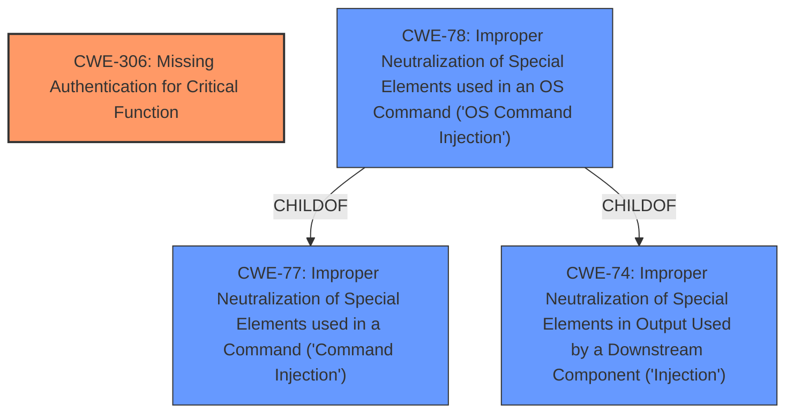

# Raw Analyzer Response for CVE-2024-12847

# Summary
| CWE ID | CWE Name | Confidence | CWE Abstraction Level | CWE Vulnerability Mapping Label | CWE-Vulnerability Mapping Notes |
|---|---|---|---|---|---|
| CWE-306 | Missing Authentication for Critical Function | 1.0 | Base | Primary CWE | Allowed |
| CWE-78 | Improper Neutralization of Special Elements used in an OS Command ('OS Command Injection') | 0.9 | Base | Secondary Candidate | Allowed |

## Evidence and Confidence

*   **Confidence Score:** 0.95
*   **Evidence Strength:** HIGH

## Relationship Analysis
The primary CWE is CWE-306, which indicates a missing authentication mechanism for a critical function. CWE-78 is a child of CWE-77 (Improper Neutralization of Special Elements used in a Command ('Command Injection')) and CWE-74 (Improper Neutralization of Special Elements in Output Used by a Downstream Component ('Injection')). While CWE-78 could be considered, the initial and most critical flaw is the missing authentication, making CWE-306 the more appropriate primary classification.

## Vulnerability Chain
The vulnerability chain starts with the **missing authentication** (CWE-306). This allows an attacker to send **crafted HTTP requests** to the `setup.cgi` endpoint. Because there is no authentication, the attacker can then leverage the `setup.cgi` endpoint to **execute arbitrary operating system commands** as root. This is enabled by **improper neutralization of special elements** used in an OS command (CWE-78).

## Summary of Analysis
The initial analysis identified CWE-306 as the primary weakness, stemming from the **missing authentication** for the `setup.cgi` endpoint. This allows an unauthenticated attacker to execute arbitrary commands.

The retriever results and the vulnerability description both support this conclusion. The "CVE Reference Links Content Summary" states that "The embedded web server skips authentication checks for specific URLs containing the "currentsetting.htm" substring," and that "setup.cgi" can then be abused to execute arbitrary commands. This directly points to CWE-306.

CWE-78 is a secondary consideration, as the successful execution of commands relies on the **improper neutralization of special elements**, but this is a consequence of the initial **missing authentication**.

The relationship graph reinforces the decision to prioritize CWE-306, as it represents the root cause enabling the subsequent command execution. The selected CWEs are at the optimal level of specificity, with CWE-306 being a Base level weakness.

Relevant CWE Information:

# Enhanced Context (25 CWEs)
The following CWEs were identified as potentially relevant to this vulnerability:

## CWE-41: Improper Resolution of Path Equivalence
**Abstraction Level**: Base
**Similarity Score**: 0.77

## CWE-74: Improper Neutralization of Special Elements in Output Used by a Downstream Component ('Injection')
**Abstraction Level**: Class
**Similarity Score**: 0.76

## CWE-288: Authentication Bypass Using an Alternate Path or Channel
**Abstraction Level**: Base
**Similarity Score**: 0.76

## CWE-497: Exposure of Sensitive System Information to an Unauthorized Control Sphere
**Abstraction Level**: Base
**Similarity Score**: 0.76

## CWE-1391: Use of Weak Credentials
**Abstraction Level**: Class
**Similarity Score**: 0.75

## CWE-303: Incorrect Implementation of Authentication Algorithm
**Abstraction Level**: Base
**Similarity Score**: 0.75

## CWE-23: Relative Path Traversal
**Abstraction Level**: Base
**Similarity Score**: 0.75

## CWE-668: Exposure of Resource to Wrong Sphere
**Abstraction Level**: Class
**Similarity Score**: 0.75

## CWE-345: Insufficient Verification of Data Authenticity
**Abstraction Level**: Class
**Similarity Score**: 0.75

## CWE-923: Improper Restriction of Communication Channel to Intended Endpoints
**Abstraction Level**: Class
**Similarity Score**: 0.75

## CWE-306: Missing Authentication for Critical Function
**Abstraction Level**: Base
**Similarity Score**: 1739.26

**Description**:
The product does not perform any authentication for functionality that requires a provable user identity or consumes a significant amount of resources.

**Mapping Guidance**:
- Usage: Allowed
- Rationale: This CWE entry is at the Base level of abstraction, which is a preferred level of abstraction for mapping to the root causes of vulnerabilities.

## CWE-22: Improper Limitation of a Pathname to a Restricted Directory ('Path Traversal')
**Abstraction Level**: Base
**Similarity Score**: 1725.45

## CWE-863: Incorrect Authorization
**Abstraction Level**: Class
**Similarity Score**: 1704.56

## CWE-285: Improper Authorization
**Abstraction Level**: Class
**Similarity Score**: 1689.86

## CWE-287: Improper Authentication
**Abstraction Level**: Class
**Similarity Score**: 1677.79

## CWE-22: Improper Limitation of a Pathname to a Restricted Directory ('Path Traversal')
**Abstraction Level**: base
**Similarity Score**: 4.33

## CWE-78: Improper Neutralization of Special Elements used in an OS Command ('OS Command Injection')
**Abstraction Level**: base
**Similarity Score**: 3.14

**Description**:
CWE-78: Improper Neutralization of Special Elements used in an OS Command ('OS Command Injection')

**Mapping Guidance**:
- Usage: Allowed
- Rationale: This CWE entry is at the Base level of abstraction, which is a preferred level of abstraction for mapping to the root causes of vulnerabilities.

## CWE-89: Improper Neutralization of Special Elements used in an SQL Command ('SQL Injection')
**Abstraction Level**: base
**Similarity Score**: 3.14

## CWE-41: Improper Resolution of Path Equivalence
**Abstraction Level**: Base
**Similarity Score**: 2.91

## CWE-73: External Control of File Name or Path
**Abstraction Level**: Base
**Similarity Score**: 2.90

## CWE-306: Missing Authentication for Critical Function
**Abstraction Level**: base
**Similarity Score**: 2.47

## CWE-94: Improper Control of Generation of Code ('Code Injection')
**Abstraction Level**: base
**Similarity Score**: 2.42

## CWE-79: Improper Neutralization of Input During Web Page Generation ('Cross-site Scripting')
**Abstraction Level**: base
**Similarity Score**: 2.42

## CWE-613: Insufficient Session Expiration
**Abstraction Level**: base
**Similarity Score**: 2.21

## CWE-184: Incomplete List of Disallowed Inputs
**Abstraction Level**: base
**Similarity Score**: 2.21

---

**CWE-306: Missing Authentication for Critical Function**
*Technical Explanation:* The vulnerability lies in the fact that the `setup.cgi` endpoint lacks any authentication mechanism. This allows anyone with network access to the device to send requests to this endpoint and execute commands. This directly matches the CWE-306 description: "The product does not perform any authentication for functionality that requires a provable user identity or consumes a significant amount of resources."
*Security Implications:* The security implication is severe, as an attacker can gain root privileges on the device.
*Parent-Child Relationships:* CWE-306 is a child of CWE-287 (Improper Authentication), but CWE-306 is more specific as it explicitly highlights the *missing* authentication.
*Primary/Secondary:* Primary CWE
*Mapping Guidance:* The MITRE mapping guidance ALLOWS this mapping, as it's a Base level weakness.

**CWE-78: Improper Neutralization of Special Elements used in an OS Command ('OS Command Injection')**
*Technical Explanation:* Once an attacker bypasses authentication, they can inject OS commands via the `setup.cgi` endpoint because the application fails to properly neutralize special elements in the input.
*Security Implications:* This allows the attacker to execute arbitrary commands with root privileges on the device.
*Parent-Child Relationships:* CWE-78 is a child of CWE-