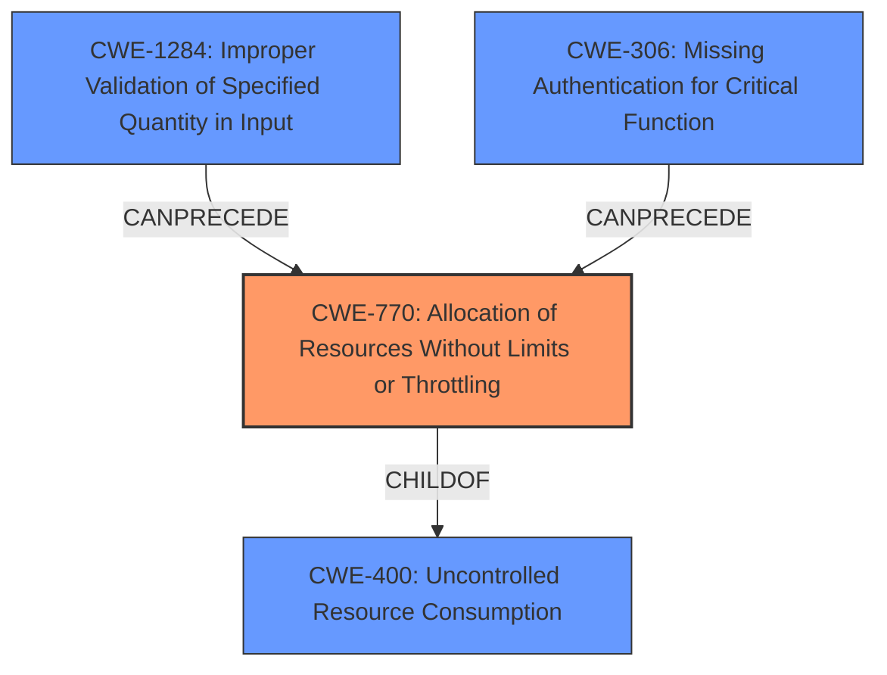

# Analysis Report for CVE-2024-12864

# Vulnerability Analysis Report: CVE-2024-12864

## Description

A **Denial of Service (DoS) vulnerability** was discovered in the file upload feature of netease-youdao/qanything version v2.0.0. The vulnerability is due to **improper handling of form-data with a large filename** in the file upload request. An attacker can exploit this vulnerability by sending a large filename, causing the server to become overwhelmed and unavailable for legitimate users. This attack **does not require authentication**, making it highly scalable and increasing the risk of exploitation.

## Vulnerability Description Key Phrases

- **Rootcause:** ['improper handling of form-data with a large filename', 'does not require authentication']
- **Weakness:** Denial of Service (DoS) vulnerability
- **Impact:** Denial of Service (DoS)
- **Attacker:** attacker
- **Product:** netease-youdao/qanything
- **Version:** v2.0.0
- **Component:** file upload feature

## Analysis (with Relationship Data)

# Summary

| CWE ID    | CWE Name                                                                             | Confidence | CWE Abstraction Level | CWE Vulnerability Mapping Label | CWE-Vulnerability Mapping Notes |
| --------- | ------------------------------------------------------------------------------------ | ---------- | ----------------------- | ------------------------------- | ------------------------------- |
| CWE-770   | Allocation of Resources Without Limits or Throttling                               | 0.9        | Base                    | Primary                         | Allowed                         |
| CWE-400   | Uncontrolled Resource Consumption                                                    | 0.7        | Class                   | Secondary                       | Allowed-with-Review            |
| CWE-306   | Missing Authentication for Critical Function                                         | 0.6        | Base                    | Secondary                       | Allowed                         |
| CWE-1284  | Improper Validation of Specified Quantity in Input                                 | 0.6        | Base                    | Secondary                       | Allowed                         |

## Evidence and Confidence

*   **Confidence Score:** 0.8
*   **Evidence Strength:** HIGH

## Relationship Analysis

The primary CWE is CWE-770, which describes the **root cause** of the vulnerability: the allocation of resources without limits. CWE-400 is a parent of CWE-770 and represents the broader category of resource consumption issues. CWE-306 and CWE-1284 are related in that the missing authentication and improper input validation contribute to the vulnerability's exploitability and impact. The abstraction levels influenced the selection by favoring the more specific Base CWE-770 over the broader Class CWE-400.



## Vulnerability Chain

The vulnerability chain starts with **missing authentication** (CWE-306) and **improper input validation** (CWE-1284), which allows an attacker to send a large filename. This leads to the **allocation of resources without limits** (CWE-770), eventually resulting in **uncontrolled resource consumption** (CWE-400) and a **Denial of Service (DoS)**.

CWE-306 -> CWE-1284 -> CWE-770 -> CWE-400 -> DoS

## Summary of Analysis

The analysis is based on the provided vulnerability description, which indicates that the root cause is the **improper handling of form-data with a large filename**, leading to a **Denial of Service**. The description explicitly states that the attack **does not require authentication**, which also contributes to the exploitability of the vulnerability.

The graph relationships show that CWE-770 is a child of CWE-400, indicating that it is a more specific type of resource consumption issue. CWE-306 and CWE-1284 can precede CWE-770, highlighting their role in enabling the vulnerability.

CWE-770 is the most appropriate primary CWE because it directly addresses the **allocation of resources without limits**, which is the **root cause** of the DoS vulnerability. CWE-400 is a broader category that encompasses resource consumption issues, but CWE-770 provides a more specific description of the weakness. CWE-306 and CWE-1284 are included as secondary CWEs because they contribute to the vulnerability's exploitability by allowing unauthenticated users to send large filenames without proper validation.

The selected CWEs are at the optimal level of specificity because they accurately represent the weakness and its contributing factors, based on the available evidence.

Relevant CWE Information:

# Enhanced Context (25 CWEs)
The following CWEs were identified as potentially relevant to this vulnerability:

## CWE-770: Allocation of Resources Without Limits or Throttling
**Abstraction Level**: Base
**Similarity Score**: 3700.94
**Source**: sparse

**Description**:
The product allocates a reusable resource or group of resources on behalf of an actor without imposing any restrictions on the size or number of resources that can be allocated, in violation of the intended security policy for that actor.

**Mapping Guidance**:
- Usage: Allowed
- Rationale: This CWE entry is at the Base level of abstraction, which is a preferred level of abstraction for mapping to the root causes of vulnerabilities.

### 1. CWE-770: Allocation of Resources Without Limits or Throttling (Score: 598.95)
The product allocates a reusable resource or group of resources on behalf of an actor without imposing any restrictions on the size or number of resources that can be allocated, in violation of the intended security policy for that actor....

*Explanation*: This CWE directly matches the vulnerability where the server allocates resources without limit based on filename size.

## CWE-400: Uncontrolled Resource Consumption
**Abstraction Level**: Class
**Similarity Score**: 531.97
**Source**: Keyphrase CWE Analysis

**Description**:
The product does not properly control the allocation and maintenance of a limited resource, thereby enabling an actor to influence the amount of resources consumed, eventually leading to the exhaustion of available resources....

### 4. CWE-400: Uncontrolled Resource Consumption (Score: 531.97)
The product does not properly control the allocation and maintenance of a limited resource, thereby enabling an actor to influence the amount of resources consumed, eventually leading to the exhaustion of available resources....

*Explanation*: Although highly relevant as the impact, it is less specific than CWE-770

## CWE-306: Missing Authentication for Critical Function
**Abstraction Level**: Base
**Similarity Score**: 537.35
**Source**: Keyphrase CWE Analysis

**Description**:
The product does not perform any authentication for functionality that requires a provable user identity or consumes a significant amount of resources....

### 3. CWE-306: Missing Authentication for Critical Function (Score: 537.35)
The product does not perform any authentication for functionality that requires a provable user identity or consumes a significant amount of resources....

*Explanation*: The description includes "does not require authentication" which directly applies to this.

## CWE-1284: Improper Validation of Specified Quantity in Input
**Abstraction Level**: Base
**Similarity Score**: 527.89
**Source**: Keyphrase CWE Analysis

**Description**:
The product receives input that is expected to specify a quantity (such as size or length), but it does not validate or incorrectly validates that the quantity has the required properties....

### 5. CWE-1284: Improper Validation of Specified Quantity in Input (Score: 527.89)
The product receives input that is expected to specify a quantity (such as size or length), but it does not validate or incorrectly validates that the quantity has the required properties....

*Explanation*: The vulnerability includes "**improper handling of form-data with a large filename**" which means that size validation is missing for the filename.


## CWE Relationship Analysis

Current CWEs represent these abstraction levels: .


### Vulnerability Chain Analysis

**Chain starting from CWE-306:**
- 306 (Missing Authentication for Critical Function) - ROOT


**Chain starting from CWE-400:**
- 400 (Uncontrolled Resource Consumption) - ROOT


### CWE Relationship Diagram

```mermaid
graph TD
    classDef primary fill:#f96,stroke:#333,stroke-width:2px
    classDef secondary fill:#69f,stroke:#333
    classDef tertiary fill:#9e9,stroke:#333
```


*Report generated on 2025-07-13 03:15:17*
