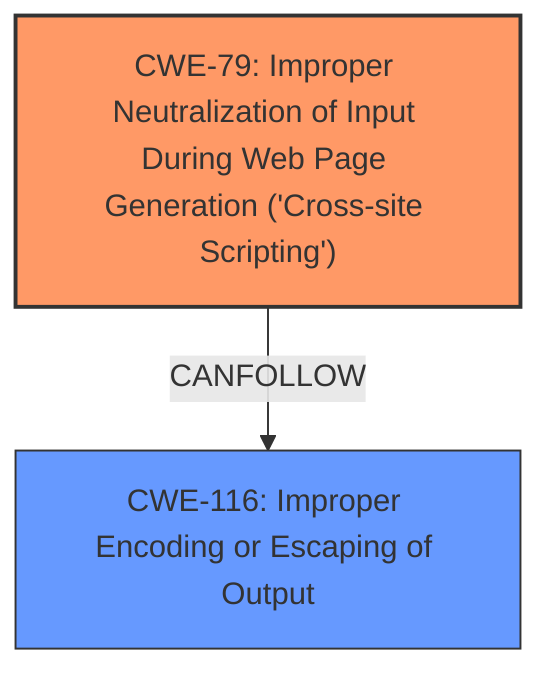

# Enhanced Analysis for CVE-2024-12873

# Summary
| CWE ID | CWE Name | Confidence | CWE Abstraction Level | CWE Vulnerability Mapping Label | CWE-Vulnerability Mapping Notes |
|---|---|---|---|---|---|
| CWE-79 | Improper Neutralization of Input During Web Page Generation ('Cross-site Scripting') | 1.0 | Base | Primary | Allowed |
| CWE-116 | Improper Encoding or Escaping of Output | 0.7 | Class | Secondary | Allowed-with-Review |

## Evidence and Confidence

*   **Confidence Score:** 0.9
*   **Evidence Strength:** HIGH

## Relationship Analysis
The primary relationship influencing the decision is the parent-child relationship between CWE-116 and potential more specific CWEs related to output encoding. CWE-79 is a base level CWE for XSS and is appropriate, but CWE-116 is a class-level CWE that could be a factor. There are chain relationships, where improper escaping (CWE-116) can lead to XSS (CWE-79), supporting the selection of both. The analysis favors a specific Base CWE (CWE-79) for the XSS vulnerability, but recognizes CWE-116 (Class) as a contributing factor due to **improper input sanitization**.



## Vulnerability Chain
The vulnerability chain starts with **improper input sanitization**, leading to the insertion of unsanitized data into the web page, which results in Cross-Site Scripting.
  - Root Cause: **Improper input sanitization**
  - Weakness: CWE-79 Improper Neutralization of Input During Web Page Generation ('Cross-site Scripting')
  - Impact: Cross-Site Scripting vulnerability exploitable against high-privilege users

## Summary of Analysis
The initial analysis clearly points to CWE-79 as the primary weakness, as the vulnerability description explicitly states that the plugin "does not sanitise and escape a parameter before outputting it back in the page, leading to a Reflected Cross-Site Scripting". This directly matches the description of CWE-79, which involves the improper neutralization of input during web page generation. The retriever results also list CWE-79 as a top candidate.

CWE-116 is considered as a secondary weakness because the description also mentions the lack of escaping. Improper or missing encoding/escaping (CWE-116) could be a contributing factor to the XSS vulnerability, although the primary issue is the **lack of sanitization**.

The selection of CWE-79 is at the optimal level of specificity, as it directly addresses the root cause and the specific type of vulnerability (XSS). The evidence from the vulnerability description and the retriever results strongly support this classification. The high confidence score reflects the clear match between the vulnerability description and CWE-79. CWE-116 is a reasonable secondary mapping due to the lack of escaping, but it's less direct than CWE-79.

Other CWEs Considered But Not Used:

*   CWE-352: Cross-Site Request Forgery (CSRF) - Not applicable, as the vulnerability is Reflected XSS, not CSRF.
*   CWE-89: Improper Neutralization of Special Elements used in an SQL Command ('SQL Injection') - Not applicable, as there is no SQL injection involved.
*   CWE-434: Unrestricted Upload of File with Dangerous Type - Not applicable, as there is no file upload functionality involved.
*   CWE-862: Missing Authorization - Not applicable, as the issue is improper sanitization, not missing authorization.
*   CWE-80: Improper Neutralization of Script-Related HTML Tags in a Web Page (Basic XSS) - While related, CWE-79 is a broader and more appropriate base CWE for XSS.
*   CWE-472: External Control of Assumed-Immutable Web Parameter - Not directly relevant, as the issue is not about controlling immutable web parameters.
*   CWE-94: Improper Control of Generation of Code ('Code Injection') - Not applicable, as the vulnerability is XSS, not code injection.


## CWE Relationship Analysis

Current CWEs represent these abstraction levels: .


### Vulnerability Chain Analysis

**Chain starting from CWE-89:**
- 89 (Improper Neutralization of Special Elements used in an SQL Command ('SQL Injection')) - ROOT


**Chain starting from CWE-116:**
- 116 (Improper Encoding or Escaping of Output) - ROOT


### CWE Relationship Diagram

```mermaid
graph TD
    classDef primary fill:#f96,stroke:#333,stroke-width:2px
    classDef secondary fill:#69f,stroke:#333
    classDef tertiary fill:#9e9,stroke:#333
```