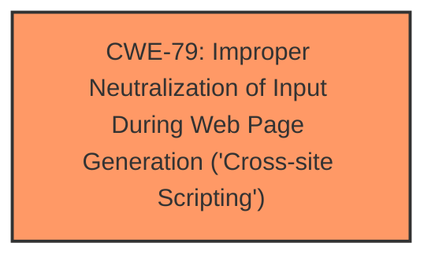

# Analysis for CVE-2024-12874

```markdown
# Summary
| CWE ID | CWE Name | Confidence | CWE Abstraction Level | CWE Vulnerability Mapping Label | CWE-Vulnerability Mapping Notes |
|---|---|---|---|---|---|
| CWE-79 | Improper Neutralization of Input During Web Page Generation ('Cross-site Scripting') | 1.0 | Base | Primary CWE | Allowed |

## Evidence and Confidence

*   **Confidence Score:** 1.0
*   **Evidence Strength:** HIGH

## Relationship Analysis
The primary relationship influencing the decision is that CWE-79 is a base-level CWE that accurately describes the **root cause** of the vulnerability: **improper sanitization and escaping of settings**, leading to Stored Cross-Site Scripting. Several other CWEs were considered, but they were either too high-level (e.g., CWE-285, CWE-863) or focused on related but distinct issues (e.g., CWE-352, CWE-89). The parent-child relationships of CWE-79 were considered to ensure that a more specific child CWE wasn't a better fit, but none were.



## Vulnerability Chain
The vulnerability chain begins with the **improper sanitization and escaping** of settings (CWE-79). This **root cause** allows an attacker with high privileges to inject malicious scripts into the plugin settings. These scripts are then stored and executed when other users view posts with approved comments, resulting in a Stored Cross-Site Scripting attack.

## Summary of Analysis
The analysis is based on the provided vulnerability description and the CVE Reference Links Content Summary. The key evidence is the statement that the plugin "**does not sanitise and escape some of its settings**", which directly aligns with the description of CWE-79. The impact of this **weakness** is Stored Cross-Site Scripting, further supporting the selection of CWE-79.

The retriever results also list CWE-79 as a potentially relevant CWE. While other CWEs like CWE-352 (Cross-Site Request Forgery) and CWE-89 (SQL Injection) were considered, they did not accurately represent the **root cause** of the vulnerability. CWE-79 is the most specific and accurate representation of the **weakness**, which is **improper neutralization of input** leading to XSS. The selection of CWE-79 is at the optimal level of specificity (Base).

Relevant CWE Information:

# Enhanced Context (25 CWEs)
The following CWEs were identified as potentially relevant to this vulnerability:

## CWE-472: External Control of Assumed-Immutable Web Parameter
**Abstraction Level**: Base
**Similarity Score**: 0.80
**Source**: dense

**Description**:
The web application does not sufficiently verify inputs that are assumed to be immutable but are actually externally controllable, such as hidden form fields.

**Mapping Guidance**:
- Usage: Allowed
- Rationale: This CWE entry is at the Base level of abstraction, which is a preferred level of abstraction for mapping to the root causes of vulnerabilities.
- *Not Used:* This CWE is too specific, focusing on immutable web parameters, while the vulnerability description broadly states "some of its settings". The weakness is the lack of proper sanitization, not specifically related to immutable data.

## CWE-266: Incorrect Privilege Assignment
**Abstraction Level**: Base
**Similarity Score**: 0.79
**Source**: dense

**Description**:
A product incorrectly assigns a privilege to a particular actor, creating an unintended sphere of control for that actor.

**Mapping Guidance**:
- Usage: Allowed
- Rationale: This CWE entry is at the Base level of abstraction, which is a preferred level of abstraction for mapping to the root causes of vulnerabilities.
- *Not Used:* Although the vulnerability is exploited by high privilege users, the **root cause** is not related to privilege assignment, but rather **improper input handling**. Therefore, this CWE is not suitable.

## CWE-267: Privilege Defined With Unsafe Actions
**Abstraction Level**: Base
**Similarity Score**: 0.79
**Source**: dense

**Description**:
A particular privilege, role, capability, or right can be used to perform unsafe actions that were not intended, even when it is assigned to the correct entity.

**Mapping Guidance**:
- Usage: Allowed
- Rationale: This CWE entry is at the Base level of abstraction, which is a preferred level of abstraction for mapping to the root causes of vulnerabilities.
- *Not Used:* Similar to CWE-266, this CWE focuses on the abuse of privileges, not the input handling issue at the **root cause**.

## CWE-425: Direct Request ('Forced Browsing')
**Abstraction Level**: Base
**Similarity Score**: 0.78
**Source**: dense

**Description**:
The web application does not adequately enforce appropriate authorization on all restricted URLs, scripts, or files.

**Mapping Guidance**:
- Usage: Allowed
- Rationale: This CWE entry is at the Base level of abstraction, which is a preferred level of abstraction for mapping to the root causes of vulnerabilities.
- *Not Used:* This CWE relates to missing authorization checks. While authorization might play a role in who can modify the settings, the **root cause** is still the **improper sanitization**.

## CWE-74: Improper Neutralization of Special Elements in Output Used by a Downstream Component ('Injection')
**Abstraction Level**: Class
**Similarity Score**: 0.77
**Source**: dense

**Description**:
The product constructs all or part of a command, data structure, or record using externally-influenced input from an upstream component, but it does not neutralize or incorrectly neutralizes special elements that could modify how it is parsed or interpreted when it is sent to a downstream component.

**Mapping Guidance**:
- Usage: Discouraged
- Rationale: CWE-74 is high-level and often misused when lower-level weaknesses are more appropriate.
- *Not Used:* This is a Class level CWE. A more specific CWE-79 applies.

## CWE-639: Authorization Bypass Through User-Controlled Key
**Abstraction Level**: Base
**Similarity Score**: 0.77
**Source**: dense

**Description**:
The system's authorization functionality does not prevent one user from gaining access to another user's data or record by modifying the key value identifying the data.

**Mapping Guidance**:
- Usage: Allowed
- Rationale: This CWE entry is at the Base level of abstraction, which is a preferred level of abstraction for mapping to the root causes of vulnerabilities.
- *Not Used:* This CWE describes an authorization bypass, which is not the primary **root cause** here. The vulnerability is about **improper sanitization** that allows an attacker to inject malicious code.

## CWE-116: Improper Encoding or Escaping of Output
**Abstraction Level**: Class
**Similarity Score**: 0.77
**Source**: dense

**Description**:
The product prepares a structured message for communication with another component, but encoding or escaping of the data is either missing or done incorrectly. As a result, the intended structure of the message is not preserved.

**Mapping Guidance**:
- Usage: Allowed-with-Review
- Rationale: This CWE entry is a Class and might have Base-level children that would be more appropriate
- *Not Used:* CWE-116 is too general. CWE-79 specifically addresses the context of web page generation, making it a more precise fit.

## CWE-41: Improper Resolution of Path Equivalence
**Abstraction Level**: Base
**Similarity Score**: 0.77
**Source**: dense

**Description**:
The product is vulnerable to file system contents disclosure through path equivalence. Path equivalence involves the use of special characters in file and directory names. The associated manipulations are intended to generate multiple names for the same object.

**Mapping Guidance**:
- Usage: Allowed
- Rationale: This CWE entry is at the Base level of abstraction, which is a preferred level of abstraction for mapping to the root causes of vulnerabilities.
- *Not Used:* This CWE is specific to file system path equivalence issues, which is not relevant to the described vulnerability.

## CWE-80: Improper Neutralization of Script-Related HTML Tags in a Web Page (Basic XSS)
**Abstraction Level**: Variant
**Similarity Score**: 0.77
**Source**: dense

**Description**:
The product receives input from an upstream component, but it does not neutralize or incorrectly neutralizes special characters such as "<", ">", and "&" that could be interpreted as web-scripting elements when they are sent to a downstream component that processes web pages.

**Mapping Guidance**:
- Usage: Allowed
- Rationale: This CWE entry is at the Variant level of abstraction, which is a preferred level of abstraction for mapping to the root causes of vulnerabilities.
- *Not Used:* While closely related to CWE-79, CWE-80 focuses on script-related HTML tags, making it too specific. CWE-79 is more general and describes the overall issue of **improper neutralization** in web page generation.

## CWE-1289: Improper Validation of Unsafe Equivalence in Input
**