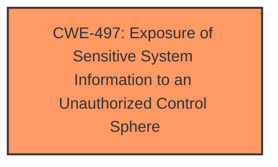

# Analysis Report for CVE-2024-12896

# Vulnerability Analysis Report: CVE-2024-12896

## Description

A vulnerability was found in Intelbras VIP S3020 G2, VIP S4020 G2, VIP S4020 G3 and VIP S4320 G2 up to 20241222 and classified as problematic. Affected by this issue is some unknown functionality of the file /web_caps/webCapsConfig of the component Web Interface. The manipulation leads to information disclosure. The attack may be launched remotely. The exploit has been disclosed to the public and may be used. The vendor assesses that the information disclosed in the URL is not sensitive or poses any risk to the user.

## Vulnerability Description Key Phrases

- **Component:** /web_caps/webCapsConfig of the component Web Interface
- **Vector:** unknown manipulation
- **Product:** Intelbras VIP S3020 G2, VIP S4020 G2, VIP S4020 G3 and VIP S4320 G2
- **Impact:** information disclosure, remote information disclosure
- **Version:** up to 20241222

## Analysis (with Relationship Data)

# Summary
| CWE ID | CWE Name | Confidence | CWE Abstraction Level | CWE Vulnerability Mapping Label | CWE-Vulnerability Mapping Notes |
|---|---|---|---|---|---|
| CWE-497 | Exposure of Sensitive System Information to an Unauthorized Control Sphere | 0.8 | Base | Allowed | Primary CWE |

## Evidence and Confidence

*   **Confidence Score:** 0.8
*   **Evidence Strength:** MEDIUM

## Relationship Analysis
The primary CWE selected is CWE-497, which is a Base level CWE. Many of the retriever results suggested input validation or injection-related CWEs, but those are not the root cause in this case. The root cause is that sensitive information is being exposed without proper authorization. CWE-497 is the most accurate representation of this **weakness**.



## Vulnerability Chain
The vulnerability chain starts with an unknown manipulation of the `/web_caps/webCapsConfig` endpoint, leading to **information disclosure**. The root cause is the **exposure of sensitive system information** due to the application **not properly preventing unauthorized access**. The chain is:

1.  Manipulation of `/web_caps/webCapsConfig` (unknown weakness)
2.  CWE-497: Exposure of Sensitive System Information to an Unauthorized Control Sphere (Root Cause)
3.  Information Disclosure (Impact)

## Summary of Analysis
The initial analysis considered various CWEs suggested by the retriever results, particularly those related to input validation and injection. However, the vulnerability description focuses on **information disclosure** resulting from an unknown manipulation of a specific file. The key aspect is the **exposure of sensitive system information** to unauthorized actors.

The vendor's assessment that the disclosed information is not sensitive was considered, but it does not negate the fact that **information disclosure** occurred. Therefore, CWE-497 is the most accurate representation of the underlying **weakness**.

The decision to select CWE-497 is primarily based on the vulnerability description's emphasis on **information disclosure** and the **lack of proper access control**. The retriever results provided additional context, but the final decision was based on the core **weakness** described in the vulnerability.

Relevant CWE Information:

# Enhanced Context (25 CWEs)
The following CWEs were identified as potentially relevant to this vulnerability:

## CWE-497: Exposure of Sensitive System Information to an Unauthorized Control Sphere
**Abstraction Level**: Base
**Similarity Score**: 0.79
**Source**: dense

**Description**:
The product does not properly prevent sensitive system-level information from being accessed by unauthorized actors who do not have the same level of access to the underlying system as the product does.

**Mapping Guidance**:
- Usage: Allowed
- Rationale: This CWE entry is at the Base level of abstraction, which is a preferred level of abstraction for mapping to the root causes of vulnerabilities.

**CWE-78: Improper Neutralization of Special Elements used in an OS Command ('OS Command Injection')** was considered because it had the highest dense retriever score. However, the vulnerability description does not indicate any command injection. Thus, this was not selected.

**CWE-79: Improper Neutralization of Input During Web Page Generation ('Cross-site Scripting')** and **CWE-89: Improper Neutralization of Special Elements used in an SQL Command ('SQL Injection')** were considered, but the vulnerability description does not explicitly mention improper neutralization of input or SQL commands. Therefore, these were not selected.

**CWE-306: Missing Authentication for Critical Function** was considered, however the description doesn't state that a critical function is missing authentication. It is just disclosing information to someone without the privileges to see it.

**CWE-425: Direct Request ('Forced Browsing')** was considered because it involves unauthorized access. However, CWE-497 is more specific to the issue of exposing sensitive system information.


## CWE Relationship Analysis

Current CWEs represent these abstraction levels: .


### Vulnerability Chain Analysis

**Chain starting from CWE-89:**
- 89 (Improper Neutralization of Special Elements used in an SQL Command ('SQL Injection')) - ROOT


**Chain starting from CWE-79:**
- 79 (Improper Neutralization of Input During Web Page Generation ('Cross-site Scripting')) - ROOT


### CWE Relationship Diagram

```mermaid
graph TD
    classDef primary fill:#f96,stroke:#333,stroke-width:2px
    classDef secondary fill:#69f,stroke:#333
    classDef tertiary fill:#9e9,stroke:#333
```


*Report generated on 2025-07-13 03:19:00*
