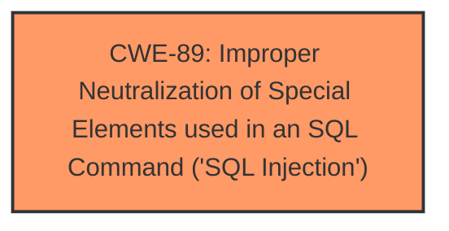

# Analysis Report for CVE-2024-12899

# Vulnerability Analysis Report: CVE-2024-12899

## Description

A vulnerability was found in 1000 Projects Attendance Tracking Management System 1.0. It has been rated as critical. This issue affects some unknown processing of the file /admin/course_action.php. The manipulation of the argument course_code leads to **sql injection**. The attack may be initiated remotely. The exploit has been disclosed to the public and may be used.

## Vulnerability Description Key Phrases

- **Weakness:** sql injection
- **Vector:** manipulation of course_code argument
- **Product:** 1000 Projects Attendance Tracking Management System
- **Version:** 1.0
- **Component:** /admin/course_action.php

## Analysis (with Relationship Data)

# Summary
| CWE ID | CWE Name | Confidence | CWE Abstraction Level | CWE Vulnerability Mapping Label | CWE-Vulnerability Mapping Notes |
|---|---|---|---|---|---|
| CWE-89 | Improper Neutralization of Special Elements used in an SQL Command ('SQL Injection') | 1.0 | Base | Allowed | Primary CWE. The **SQL injection** is directly caused by improper neutralization of special elements used in an SQL command. |

## Evidence and Confidence

*   **Confidence Score:** 1.0
*   **Evidence Strength:** HIGH

## Relationship Analysis
The primary relationship influencing the CWE selection is the direct match between the vulnerability description and the CWE-89 definition. CWE-89 is a Base level CWE, providing the right level of specificity.



## Vulnerability Chain
The vulnerability chain consists of the following:
1.  **Root Cause:** Improper neutralization of special elements in SQL commands (CWE-89).
2.  **Impact:** Unauthorized database access, sensitive data leakage, data tampering, and potentially comprehensive system control.

The primary weakness is the **SQL injection** vulnerability, which leads to several potential impacts.

## Summary of Analysis
The analysis is strongly based on the provided evidence, particularly the vulnerability description and the CVE reference links content summary. The description clearly states that the vulnerability is an **SQL injection** due to the manipulation of the `course_code` argument, directly aligning with CWE-89.

The evidence from the CVE reference links content summary explicitly points to the **lack of proper sanitization** and validation of the `course_code` parameter before its use in SQL queries, confirming CWE-89 as the root cause.

The selection of CWE-89 is at the optimal level of specificity because it directly represents the **root cause** of the vulnerability as an **SQL injection** due to the **improper neutralization** of special elements used in an SQL command.

Relevant CWE Information:

# Enhanced Context (25 CWEs)
The following CWEs were identified as potentially relevant to this vulnerability:

## CWE-89: Improper Neutralization of Special Elements used in an SQL Command ('SQL Injection')
**Abstraction Level**: Base
**Similarity Score**: 0.78
**Source**: dense

**Description**:
The product constructs all or part of an SQL command using externally-influenced input from an upstream component, but it does not neutralize or incorrectly neutralizes special elements that could modify the intended SQL command when it is sent to a downstream component. Without sufficient removal or quoting of SQL syntax in user-controllable inputs, the generated SQL query can cause those inputs to be interpreted as SQL instead of ordinary user data.

**Mapping Guidance**:
- Usage: Allowed
- Rationale: This CWE entry is at the Base level of abstraction, which is a preferred level of abstraction for mapping to the root causes of vulnerabilities.

## CWE-79: Improper Neutralization of Input During Web Page Generation ('Cross-site Scripting')
**Abstraction Level**: Base
**Similarity Score**: 0.74
**Source**: graph

**Description**:
The product does not neutralize or incorrectly neutralizes user-controllable input before it is placed in output that is used as a web page that is served to other users.

**Mapping Guidance**:
- Usage: Allowed
- Rationale: This CWE entry is at the Base level of abstraction, which is a preferred level of abstraction for mapping to the root causes of vulnerabilities.

### Other CWEs Considered but Not Used:

*   CWE-79: Improper Neutralization of Input During Web Page Generation ('Cross-site Scripting') was considered but not used because the vulnerability is specifically related to **SQL injection**, not cross-site scripting.
*   CWE-117: Improper Output Neutralization for Logs, CWE-1336: Improper Neutralization of Special Elements Used in a Template Engine, CWE-434: Unrestricted Upload of File with Dangerous Type, CWE-99: Improper Control of Resource Identifiers ('Resource Injection'), CWE-116: Improper Encoding or Escaping of Output, CWE-266: Incorrect Privilege Assignment, CWE-472: External Control of Assumed-Immutable Web Parameter and CWE-184: Incomplete List of Disallowed Inputs were not used because they do not directly relate to the **SQL injection** vulnerability.


## CWE Relationship Analysis

Current CWEs represent these abstraction levels: .


### Vulnerability Chain Analysis

**Chain starting from CWE-89:**
- 89 (Improper Neutralization of Special Elements used in an SQL Command ('SQL Injection')) - ROOT


**Chain starting from CWE-99:**
- 99 (Improper Control of Resource Identifiers ('Resource Injection')) - ROOT


### CWE Relationship Diagram

```mermaid
graph TD
    classDef primary fill:#f96,stroke:#333,stroke-width:2px
    classDef secondary fill:#69f,stroke:#333
    classDef tertiary fill:#9e9,stroke:#333
```


*Report generated on 2025-07-13 03:19:28*
