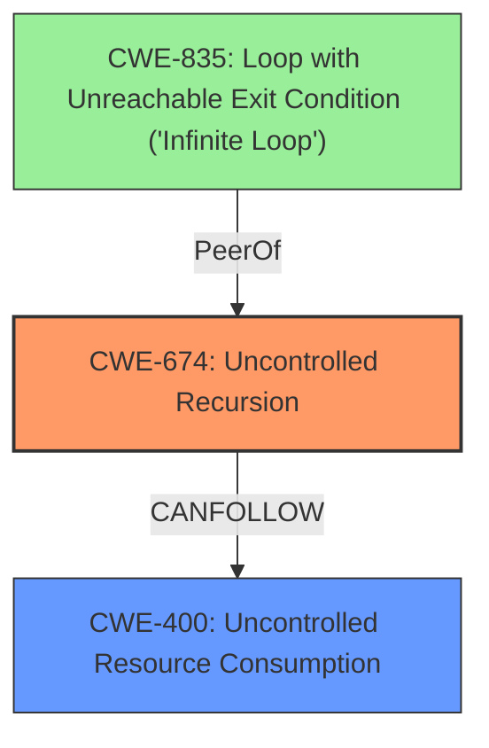

# Enhanced Analysis for CVE-2024-12910

# Summary
| CWE ID | CWE Name | Confidence | CWE Abstraction Level | CWE Vulnerability Mapping Label | CWE-Vulnerability Mapping Notes |
|---|---|---|---|---|---|
| CWE-674 | Uncontrolled Recursion | 0.9 | Class | Primary | Allowed-with-Review |
| CWE-400 | Uncontrolled Resource Consumption | 0.7 | Class | Secondary | Discouraged |

## Evidence and Confidence

*   **Confidence Score:** 0.8
*   **Evidence Strength:** MEDIUM

## Relationship Analysis
The primary relationship influencing the selection is the hierarchical relationship between CWE-674 and its potential child CWEs, and its peer relationship with CWE-835. CWE-674 represents the **uncontrolled recursion** directly described in the vulnerability, which leads to the impact described by CWE-400, **uncontrolled resource consumption**. While CWE-835 (Loop with Unreachable Exit Condition) was considered due to the infinite loop behavior, CWE-674 is more specific to the recursive nature of the vulnerability. The Class level of CWE-674 is appropriate because more specific Base-level children aren't available that describe the uncontrolled recursion within the context of the described vulnerability.



## Vulnerability Chain
The vulnerability chain starts with the **missing `max_depth` parameter** in the `get_article_urls` function which results in **CWE-674: Uncontrolled Recursion** and leads to **CWE-400: Uncontrolled Resource Consumption**, ultimately causing a Denial of Service (DoS).

## Summary of Analysis
The analysis is based on the vulnerability description and the provided CVE reference content. The description clearly states that the vulnerability leads to infinite recursive calls, which aligns directly with CWE-674. The CVE reference content confirms this, stating the root cause is a missing `max_depth` parameter in the `get_article_urls` function, leading to potentially infinite recursion. The retriever results also list CWE-674 as a potentially relevant CWE.

The selection of CWE-674 is justified by the direct evidence of uncontrolled recursion within the vulnerability description: "This leads to infinite recursive calls to the `get_article_urls` method." The relationship graph and the retriever results support this choice. CWE-674 is chosen despite being a Class, as no more specific Base or Variant CWEs adequately capture the recursive nature of the vulnerability.

CWE-400 is included as a secondary CWE because the uncontrolled recursion leads to uncontrolled resource consumption, which is the definition of CWE-400. While the primary issue is the recursion itself, the resource consumption is a direct consequence and contributes to the Denial of Service.

**CWEs Considered But Not Used:**

*   **CWE-835: Loop with Unreachable Exit Condition ('Infinite Loop')**: While the vulnerability results in an infinite loop, the root cause is specifically due to recursion rather than a general loop condition. Therefore, CWE-674 is more precise.
*   **CWE-770: Allocation of Resources Without Limits or Throttling**: This CWE was considered because the recursion leads to resource allocation without limits. However, CWE-400 more broadly captures the uncontrolled resource consumption, making it a better fit as a secondary CWE.
*   **CWE-789: Memory Allocation with Excessive Size Value**: This CWE is related to excessive memory allocation, but the primary issue is the uncontrolled recursion itself, not necessarily the size of individual memory allocations.
*   **CWE-20: Improper Input Validation**: While input validation could have prevented the vulnerability by limiting the URL or recursion depth, the core issue is the lack of control over the recursion itself.
*   **CWE-1333: Inefficient Regular Expression Complexity**: This CWE is not relevant as the vulnerability does not involve regular expressions.

Relevant CWE Information:

# Enhanced Context (25 CWEs)
The following CWEs were identified as potentially relevant to this vulnerability:

## CWE-674: Uncontrolled Recursion
**Abstraction Level**: Class
**Similarity Score**: 0.69
**Source**: dense

**Description**:
The product does not properly control the amount of recursion that takes place,  consuming excessive resources, such as allocated memory or the program stack.

**Mapping Guidance**:
- Usage: Allowed-with-Review
- Rationale: This CWE entry is a Class and might have Base-level children that would be more appropriate


## CWE-835: Loop with Unreachable Exit Condition ('Infinite Loop')
**Abstraction Level**: Base
**Similarity Score**: 0.69
**Source**: dense

**Description**:
The product contains an iteration or loop with an exit condition that cannot be reached, i.e., an infinite loop.

**Mapping Guidance**:
- Usage: Allowed
- Rationale: This CWE entry is at the Base level of abstraction, which is a preferred level of abstraction for mapping to the root causes of vulnerabilities.


## CWE-407: Inefficient Algorithmic Complexity
**Abstraction Level**: Class
**Similarity Score**: 0.68
**Source**: dense

**Description**:
An algorithm in a product has an inefficient worst-case computational complexity that may be detrimental to system performance and can be triggered by an attacker, typically using crafted manipulations that ensure that the worst case is being reached.

**Mapping Guidance**:
- Usage: Allowed-with-Review
- Rationale: This CWE entry is a Class and might have Base-level children that would be more appropriate


## CWE-639: Authorization Bypass Through User-Controlled Key
**Abstraction Level**: Base
**Similarity Score**: 0.67
**Source**: dense

**Description**:
The system's authorization functionality does not prevent one user from gaining access to another user's data or record by modifying the key value identifying the data.

**Mapping Guidance**:
- Usage: Allowed
- Rationale: This CWE entry is at the Base level of abstraction, which is a preferred level of abstraction for mapping to the root causes of vulnerabilities.


## CWE-472: External Control of Assumed-Immutable Web Parameter
**Abstraction Level**: Base
**Similarity Score**: 0.67
**Source**: dense

**Description**:
The web application does not sufficiently verify inputs that are assumed to be immutable but are actually externally controllable, such as hidden form fields.

**Mapping Guidance**:
- Usage: Allowed
- Rationale: This CWE entry is at the Base level of abstraction, which is a preferred level of abstraction for mapping to the root causes of vulnerabilities.


## CWE-789: Memory Allocation with Excessive Size Value
**Abstraction Level**: Variant
**Similarity Score**: 0.67
**Source**: dense

**Description**:
The product allocates memory based on an untrusted, large size value, but it does not ensure that the size is within expected limits, allowing arbitrary amounts of memory to be allocated.

**Mapping Guidance**:
- Usage: Allowed
- Rationale: This CWE entry is at the Variant level of abstraction, which is a preferred level of abstraction for mapping to the root causes of vulnerabilities.


## CWE-923: Improper Restriction of Communication Channel to Intended Endpoints
**Abstraction Level**: Class
**Similarity Score**: 0.66
**Source**: dense

**Description**:
The product establishes a communication channel to (or from) an endpoint for privileged or protected operations, but it does not properly ensure that it is communicating with the correct endpoint.

**Mapping Guidance**:
- Usage: Allowed-with-Review
- Rationale: This CWE entry is a Class and might have Base-level children that would be more appropriate


## CWE-425: Direct Request ('Forced Browsing')
**Abstraction Level**: Base
**Similarity Score**: 0.66
**Source**: dense

**Description**:
The web application does not adequately enforce appropriate authorization on all restricted URLs, scripts, or files.

**Mapping Guidance**:
- Usage: Allowed
- Rationale: This CWE entry is at the Base level of abstraction, which is a preferred level of abstraction for mapping to the root causes of vulnerabilities.


## CWE-434: Unrestricted Upload of File with Dangerous Type
**Abstraction Level**: Base
**Similarity Score**: 0.66
**Source**: dense

**Description**:
The product allows the upload or transfer of dangerous file types that are automatically processed within its environment.

**Mapping Guidance**:
- Usage: Allowed
- Rationale: This CWE entry is at the Base level of abstraction, which is a preferred level of abstraction for mapping to the root causes of vulnerabilities.


## CWE-201


## CWE Relationship Analysis

Current CWEs represent these abstraction levels: .


### Vulnerability Chain Analysis

**Chain starting from CWE-400:**
- 400 (Uncontrolled Resource Consumption) - ROOT


**Chain starting from CWE-407:**
- 407 (Inefficient Algorithmic Complexity) - ROOT


### CWE Relationship Diagram

```mermaid
graph TD
    classDef primary fill:#f96,stroke:#333,stroke-width:2px
    classDef secondary fill:#69f,stroke:#333
    classDef tertiary fill:#9e9,stroke:#333
```