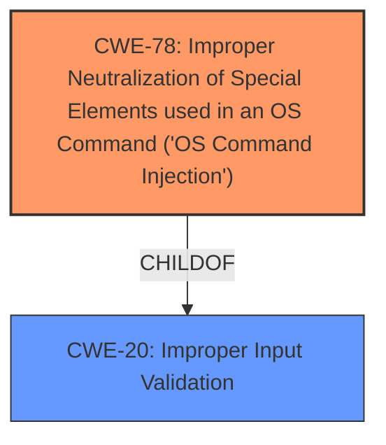

# Analysis Report for CVE-2024-12912

# Vulnerability Analysis Report: CVE-2024-12912

## Description

An ****improper input insertion vulnerability**** in AiCloud on certain router models may lead to arbitrary command execution. Refer to the 01/02/2025 ASUS Router AiCloud vulnerability section on the ASUS Security Advisory for more information.

## Vulnerability Description Key Phrases

- **Rootcause:** improper input insertion vulnerability
- **Weakness:** improper input insertion vulnerability
- **Impact:** arbitrary command execution
- **Product:** ASUS Router AiCloud

## Analysis (with Relationship Data)

# Summary

| CWE ID | CWE Name | Confidence | CWE Abstraction Level | CWE Vulnerability Mapping Label | CWE-Vulnerability Mapping Notes |
|---|---|---|---|---|---|
| CWE-78 | Improper Neutralization of Special Elements used in an OS Command ('OS Command Injection') | 0.9 | Base | Allowed | Primary CWE. The vulnerability description and CVE summary both indicate command injection as the root cause. |
| CWE-20 | Improper Input Validation | 0.7 | Class | Discouraged | Secondary CWE. While input validation is a general issue, the specific context points to command injection. |

## Evidence and Confidence

*   **Confidence Score:** 0.8
*   **Evidence Strength:** HIGH

## Relationship Analysis
The primary relationship that influenced the decision was the parent-child relationship between CWE-20 (Improper Input Validation) and CWE-78 (Improper Neutralization of Special Elements used in an OS Command ('OS Command Injection')). While CWE-20 is a broader category, the vulnerability description and CVE summary point specifically to command injection, making CWE-78 a more precise and appropriate classification.



## Vulnerability Chain
The vulnerability chain starts with **improper input insertion** (which can be seen as missing input validation or sanitization), leading to OS command injection, and ultimately resulting in arbitrary command execution.
  - **Root Cause:** **Improper input insertion vulnerability** (leading to CWE-78)
  - **Weakness:** OS Command Injection (CWE-78)
  - **Impact:** Arbitrary command execution

## Summary of Analysis
The initial analysis focused on identifying the root cause of the vulnerability. The vulnerability description and CVE reference summary explicitly mention "injection vulnerabilities" and "command execution," strongly suggesting a command injection vulnerability.

The primary CWE selected is CWE-78 (Improper Neutralization of Special Elements used in an OS Command ('OS Command Injection')), because the **rootcause** is an **improper input insertion vulnerability** that leads to command injection. The CVE Reference Links Content Summary confirms this with the phrases "Injection and execution vulnerabilities in ASUS router AiCloud" and the weaknesses listed as "Command injection"

CWE-20 (Improper Input Validation) was considered as a broader classification. However, the presence of command injection as a specific weakness in the CVE details makes CWE-78 a more precise and suitable choice. CWE-20 could be considered a secondary weakness, as the **improper input insertion** is a failure of input validation.

The selected CWEs are at the optimal level of specificity because they directly address the **rootcause** and the nature of the vulnerability (command injection).

Relevant CWE Information:

# Enhanced Context (25 CWEs)
The following CWEs were identified as potentially relevant to this vulnerability:

## CWE-78: Improper Neutralization of Special Elements used in an OS Command ('OS Command Injection')
**Abstraction Level**: Base
**Similarity Score**: 0.71
**Source**: dense

**Description**:
The product constructs all or part of an OS command using externally-influenced input from an upstream component, but it does not neutralize or incorrectly neutralizes special elements that could modify the intended OS command when it is sent to a downstream component.

**Mapping Guidance**:
- Usage: Allowed
- Rationale: This CWE entry is at the Base level of abstraction, which is a preferred level of abstraction for mapping to the root causes of vulnerabilities.

## CWE-20: Improper Input Validation
**Abstraction Level**: Class
**Similarity Score**: 0.70
**Source**: dense

**Description**:
The product receives input or data, but it does
        not validate or incorrectly validates that the input has the
        properties that are required to process the data safely and
        correctly.

**Mapping Guidance**:
- Usage: Discouraged
- Rationale: CWE-20 is commonly misused in low-information vulnerability reports when lower-level CWEs could be used instead, or when more details about the vulnerability are available [REF-1287]. It is not useful for trend analysis. It is also a level-1 Class (i.e., a child of a Pillar).


## CWE Relationship Analysis

Current CWEs represent these abstraction levels: .


### Vulnerability Chain Analysis

**Chain starting from CWE-78:**
- 78 (Improper Neutralization of Special Elements used in an OS Command ('OS Command Injection')) - ROOT


**Chain starting from CWE-20:**
- 20 (Improper Input Validation) - ROOT


### CWE Relationship Diagram

```mermaid
graph TD
    classDef primary fill:#f96,stroke:#333,stroke-width:2px
    classDef secondary fill:#69f,stroke:#333
    classDef tertiary fill:#9e9,stroke:#333
```


*Report generated on 2025-07-13 03:21:03*
