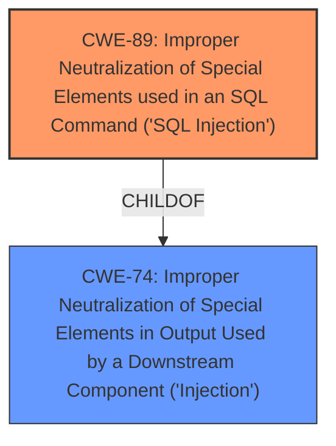

# Analysis for CVE-2024-12942

# Summary
| CWE ID | CWE Name | Confidence | CWE Abstraction Level | CWE Vulnerability Mapping Label | CWE-Vulnerability Mapping Notes |
|---|---|---|---|---|---|
| CWE-89 | Improper Neutralization of Special Elements used in an SQL Command ('SQL Injection') | 1.0 | Base | Allowed | Primary CWE. The vulnerability description clearly states that the manipulation of the username/password argument leads to SQL injection. The CVE reference links confirm this, stating that the application fails to sanitize user input before using it in SQL queries. |

## Evidence and Confidence

*   **Confidence Score:** 1.0
*   **Evidence Strength:** HIGH

## Relationship Analysis
The primary relationship considered was the parent-child relationship. While CWE-74 (Improper Neutralization of Special Elements in Output Used by a Downstream Component ('Injection')) is a parent of CWE-89, CWE-89 is a more specific and accurate representation of the vulnerability. Therefore, CWE-89 was chosen.

## Vulnerability Chain
The vulnerability chain is simple:

1.  **Root Cause:** Improper input validation in `/admin/admin_login.php` allows malicious SQL code injection.
2.  **Weakness:** SQL Injection (CWE-89)
3.  **Impact:** Unauthorized database access, sensitive data leakage, data tampering, system control, or service interruption.

## Summary of Analysis
The analysis is based on the provided vulnerability description and CVE reference links content summary. The description explicitly states the presence of **SQL injection** due to the manipulation of username/password. The CVE reference links content summary confirms the **root cause** as the application's failure to sanitize user input before using it in SQL queries. The `sqlmap` tool was used to validate the **SQL injection** vulnerability.

The selection of CWE-89 is based on its direct match to the vulnerability description and the supporting evidence from the CVE reference links. CWE-89 is at the optimal level of specificity, as it directly addresses the **SQL injection** vulnerability.

Relevant CWE Information:

# Enhanced Context (25 CWEs)
The following CWEs were identified as potentially relevant to this vulnerability:

## CWE-89: Improper Neutralization of Special Elements used in an SQL Command ('SQL Injection')
**Abstraction Level**: Base
**Similarity Score**: 0.79
**Source**: dense

**Description**:
The product constructs all or part of an SQL command using externally-influenced input from an upstream component, but it does not neutralize or incorrectly neutralizes special elements that could modify the intended SQL command when it is sent to a downstream component. Without sufficient removal or quoting of SQL syntax in user-controllable inputs, the generated SQL query can cause those inputs to be interpreted as SQL instead of ordinary user data.

**Mapping Guidance**:
- Usage: Allowed
- Rationale: This CWE entry is at the Base level of abstraction, which is a preferred level of abstraction for mapping to the root causes of vulnerabilities.
## CWE-89: Improper Neutralization of Special Elements used in an SQL Command ('SQL Injection')
**Abstraction Level**: Base
**Similarity Score**: 1437.94
**Source**: sparse

**Description**:
The product constructs all or part of an SQL command using externally-influenced input from an upstream component, but it does not neutralize or incorrectly neutralizes special elements that could modify the intended SQL command when it is sent to a downstream component. Without sufficient removal or quoting of SQL syntax in user-controllable inputs, the generated SQL query can cause those inputs to be interpreted as SQL instead of ordinary user data.

**Mapping Guidance**:
- Usage: Allowed
- Rationale: This CWE entry is at the Base level of abstraction, which is a preferred level of abstraction for mapping to the root causes of vulnerabilities.

**CWEs Considered but Not Used:**

*   **CWE-79: Improper Neutralization of Input During Web Page Generation ('Cross-site Scripting')**: While improper neutralization is a theme, this vulnerability is specifically about **SQL injection**, not XSS.
*   **CWE-434: Unrestricted Upload of File with Dangerous Type**: This is irrelevant as the vulnerability is about **SQL injection** via username/password fields.
*   **CWE-1336: Improper Neutralization of Special Elements Used in a Template Engine**: This is irrelevant as the vulnerability is about **SQL injection** via username/password fields.
*   **CWE-74: Improper Neutralization of Special Elements in Output Used by a Downstream Component ('Injection')**: This is a broader category that includes **SQL injection**, but CWE-89 is more specific and therefore more appropriate.
*   **CWE-352: Cross-Site Request Forgery (CSRF)**: This is irrelevant as the vulnerability is about **SQL injection** via username/password fields.
*   **CWE-1391: Use of Weak Credentials**: This is irrelevant as the vulnerability is about **SQL injection**, not weak credentials.
*   **CWE-425: Direct Request ('Forced Browsing')**: This is irrelevant as the vulnerability is about **SQL injection** via username/password fields.
*   **CWE-472: External Control of Assumed-Immutable Web Parameter**: This is irrelevant as the vulnerability is about **SQL injection** via username/password fields.
*   **CWE-303: Incorrect Implementation of Authentication Algorithm**: This is irrelevant as the vulnerability is about **SQL injection**, not the authentication algorithm itself.
*   **CWE-639: Authorization Bypass Through User-Controlled Key**: This is irrelevant as the vulnerability is about **SQL injection**, not authorization bypass through key manipulation.
*   **CWE-96: Improper Neutralization of Directives in Statically Saved Code ('Static Code Injection')**: This is irrelevant as the vulnerability is about **SQL injection**, not static code injection.
*   **CWE-116: Improper Encoding or Escaping of Output**: This is irrelevant as the vulnerability is about **SQL injection**, not encoding/escaping issues.
*   **CWE-138: Improper Neutralization of Special Elements**: This is too broad; CWE-89 is much more specific.
*   **CWE-471: Modification of Assumed-Immutable Data (MAID)**: This is not relevant to **SQL injection**.
*   **CWE-73: External Control of File Name or Path**: This is not relevant to **SQL injection**.
*   **CWE-113: Improper Neutralization of CRLF Sequences in HTTP Headers ('HTTP Request/Response Splitting')**: This is not relevant to **SQL injection**.
*   **CWE-621: Variable Extraction Error**: This is not relevant to **SQL injection**.
*   **CWE-94: Improper Control of Generation of Code ('Code Injection')**: While **SQL injection** *can* lead to code execution, the immediate weakness is the improper neutralization.
*   **CWE-78: Improper Neutralization of Special Elements used in an OS Command ('OS Command Injection')**: This is not relevant to **SQL injection**.