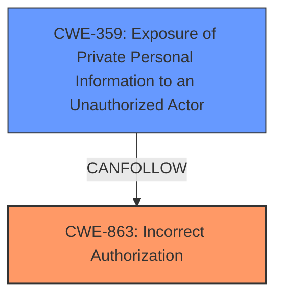

# Enhanced Analysis for CVE-2024-1295

# Summary
| CWE ID | CWE Name | Confidence | CWE Abstraction Level | CWE Vulnerability Mapping Label | CWE-Vulnerability Mapping Notes |
|---|---|---|---|---|---|
| CWE-863 | Incorrect Authorization | 1.0 | Class | Primary CWE | Allowed-with-Review |
| CWE-359 | Exposure of Private Personal Information to an Unauthorized Actor | 0.7 | Base | Secondary Candidate | Allowed |

## Evidence and Confidence

*   **Confidence Score:** 0.85
*   **Evidence Strength:** HIGH

## Relationship Analysis
The primary relationship impacting the decision is the hierarchical structure within the CWE framework. CWE-863 (Incorrect Authorization) is a Class-level CWE, which has potential Base-level children that might be more appropriate, however, given the available information, it is the best fit. CWE-359 (Exposure of Private Personal Information to an Unauthorized Actor) can follow from an authorization bypass.



## Vulnerability Chain
The vulnerability chain starts with **improper access control**, leading to the exposure of sensitive information. Users with the contributor role can bypass intended restrictions and access details about events they shouldn't have access to, such as password-protected events and drafts. This results in information leakage.

## Summary of Analysis
Based on the vulnerability description and the provided information, the primary weakness is **incorrect authorization**. The vulnerability allows users with the contributor role to access event details that they should not have access to, such as password-protected events and drafts. This aligns with the definition of CWE-863 (Incorrect Authorization), where the product performs an authorization check, but does not correctly perform the check. The **impact** is that it leads to CWE-359 (Exposure of Private Personal Information to an Unauthorized Actor).
The selection of CWE-863 is based on the **rootcause** evidence from "Vulnerability Description Key Phrases" and "CVE Reference Links Content Summary", specifically "**improper access control**" and "failure to enforce access restrictions". The "Retriever Results" also lists CWE-863 as the top candidate.

Relevant CWE Information:

# Enhanced Context (25 CWEs)
The following CWEs were identified as potentially relevant to this vulnerability:

## CWE-863: Incorrect Authorization
**Description**:
The product performs an authorization check when an actor attempts to access a resource or perform an action, but it does not correctly perform the check.

## CWE-359: Exposure of Private Personal Information to an Unauthorized Actor
**Description**:
The product exposes private personal information to an actor who is not authorized to receive it.

# Complete CWE Specifications

CWE-863: Incorrect Authorization
CWE-359: Exposure of Private Personal Information to an Unauthorized Actor


## CWE Relationship Analysis

Current CWEs represent these abstraction levels: .


### Vulnerability Chain Analysis

**Chain starting from CWE-863:**
- 863 (Incorrect Authorization) - ROOT


**Chain starting from CWE-359:**
- 359 (Exposure of Private Personal Information to an Unauthorized Actor) - ROOT


### CWE Relationship Diagram

```mermaid
graph TD
    classDef primary fill:#f96,stroke:#333,stroke-width:2px
    classDef secondary fill:#69f,stroke:#333
    classDef tertiary fill:#9e9,stroke:#333
```