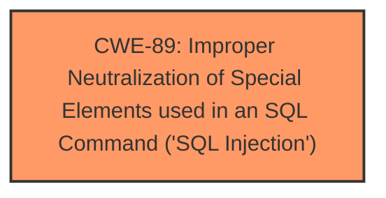

# Raw Analyzer Response for CVE-2024-12961

# Summary
| CWE ID | CWE Name | Confidence | CWE Abstraction Level | CWE Vulnerability Mapping Label | CWE-Vulnerability Mapping Notes |
|---|---|---|---|---|---|
| CWE-89 | Improper Neutralization of Special Elements used in an SQL Command ('SQL Injection') | 1.0 | Base | Allowed | Primary CWE |

## Evidence and Confidence

*   **Confidence Score:** 1.0
*   **Evidence Strength:** HIGH

## Relationship Analysis
The primary relationship that influenced my decision was the direct match of the vulnerability description to the definition of CWE-89. There are no relevant parent-child or chain relationships to consider in this specific case, as the description clearly points to SQL Injection as the root cause.

## Vulnerability Chain
The vulnerability chain is straightforward:
1.  **Root Cause:** **Improper neutralization of special elements in SQL commands (CWE-89)** due to the manipulation of the 'q' argument in `/update_ach_details.php`.
2.  **Impact:** Remote attacker can inject SQL commands, potentially leading to unauthorized data access, modification, or deletion.

## Summary of Analysis
The vulnerability description explicitly states that the manipulation of the argument 'q' in the `/update_ach_details.php` file leads to **SQL injection**. This directly aligns with the definition of CWE-89, "Improper Neutralization of Special Elements used in an SQL Command ('SQL Injection')". The CVE Reference Links Content Summary is irrelevant as it does not contain any vulnerability-related information. The retriever results confirm that CWE-89 is the top candidate, with a score of 1.0, due to the presence of the term "sql injection". The confidence in this assessment is high (1.0) due to the clear and direct evidence in the vulnerability description.

Relevant CWE Information:

# Enhanced Context (25 CWEs)
The following CWEs were identified as potentially relevant to this vulnerability:

## CWE-89: Improper Neutralization of Special Elements used in an SQL Command ('SQL Injection')
**Abstraction Level**: Base
**Similarity Score**: 0.78
**Source**: dense

**Description**:
The product constructs all or part of an SQL command using externally-influenced input from an upstream component, but it does not neutralize or incorrectly neutralizes special elements that could modify the intended SQL command when it is sent to a downstream component. Without sufficient removal or quoting of SQL syntax in user-controllable inputs, the generated SQL query can cause those inputs to be interpreted as SQL instead of ordinary user data.

**Mapping Guidance**:
- Usage: Allowed
- Rationale: This CWE entry is at the Base level of abstraction, which is a preferred level of abstraction for mapping to the root causes of vulnerabilities.
## CWE-89: Improper Neutralization of Special Elements used in an SQL Command ('SQL Injection')
**Abstraction Level**: Base
**Similarity Score**: 639.10
**Source**: sparse

**Description**:
The product constructs all or part of an SQL command using externally-influenced input from an upstream component, but it does not neutralize or incorrectly neutralizes special elements that could modify the intended SQL command when it is sent to a downstream component. Without sufficient removal or quoting of SQL syntax in user-controllable inputs, the generated SQL query can cause those inputs to be interpreted as SQL instead of ordinary user data.

**Mapping Guidance**:
- Usage: Allowed
- Rationale: This CWE entry is at the Base level of abstraction, which is a preferred level of abstraction for mapping to the root causes of vulnerabilities.

All the other CWEs from the Retriever Results like CWE-79, CWE-434, CWE-1336, CWE-96, CWE-73 were considered but deemed not applicable as the vulnerability description explicitly mentions "**sql injection**" and the root cause is directly related to **improper neutralization** of SQL special elements.