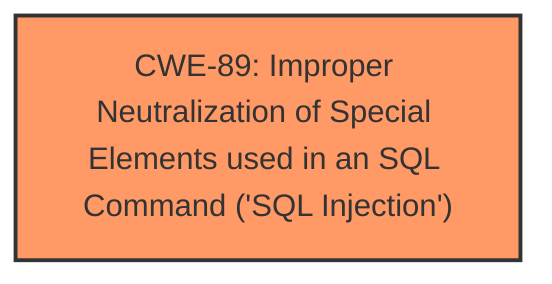

# Enhanced Analysis for CVE-2024-12964

# Summary
| CWE ID | CWE Name | Confidence | CWE Abstraction Level | CWE Vulnerability Mapping Label | CWE-Vulnerability Mapping Notes |
|---|---|---|---|---|---|
| CWE-89 | Improper Neutralization of Special Elements used in an SQL Command ('SQL Injection') | 1.0 | Base | Primary | Allowed |

## Evidence and Confidence

*   **Confidence Score:** 1.0
*   **Evidence Strength:** HIGH

## Relationship Analysis
The primary relationship that influenced the decision was the direct match of the vulnerability description to the CWE-89 description. There are no significant parent-child or chain relationships to consider in this specific instance, as the description clearly points to a SQL Injection vulnerability.



## Vulnerability Chain
The vulnerability chain consists of a single element:

1.  **Root Cause:** **Improper Neutralization of Special Elements used in an SQL Command ('SQL Injection')** (CWE-89) due to the lack of input sanitization.
    - The 'user' parameter in the `/login.php` file is directly incorporated into SQL queries without proper sanitization.
    - This allows an attacker to inject malicious SQL code.
    - The final impact is unauthorized database access, sensitive data leakage, data tampering, or even system control.

## Summary of Analysis
The analysis is based on the vulnerability description and CVE reference links content summary, which clearly states that the **root cause** is **SQL Injection** due to **improper handling of the 'user' parameter**. The provided payload examples further confirm this.

The selection of CWE-89 is based on the following evidence:

*   The **Vulnerability Description Key Phrases** section mentions "**sql injection**" as the **weakness**.
*   The **CVE Reference Links Content Summary** explicitly states "**SQL Injection**" as the primary vulnerability. It details the lack of proper sanitization and validation of the 'user' parameter, leading to the vulnerability.
*   The **Technical Details** section provides payload examples that demonstrate how an attacker can inject malicious SQL code via the 'user' parameter in `/login.php`.

The retriever results also strongly suggest CWE-89 as the primary candidate, with a score of 1.0. The provided information is sufficient to confidently classify this vulnerability as CWE-89.

Other CWEs were considered but ultimately deemed less appropriate:

*   CWE-79 (Improper Neutralization of Input During Web Page Generation ('Cross-site Scripting')): While input neutralization is a general concern, the specific vulnerability is about crafting SQL queries, not generating web pages.
*   CWE-434 (Unrestricted Upload of File with Dangerous Type): This is not relevant as the vulnerability does not involve file uploads.
*   CWE-73 (External Control of File Name or Path): This is also not relevant as there is no file path manipulation involved.
*   CWE-425 (Direct Request ('Forced Browsing')): This is not relevant because the issue is not about bypassing authorization, but exploiting a flaw in the SQL query construction.
*   CWE-94 (Improper Control of Generation of Code ('Code Injection')): Although SQL injection can sometimes lead to code execution, the primary weakness is the **improper neutralization** of SQL special elements.

The selected CWE is at the optimal level of specificity because it directly addresses the **root cause** of the vulnerability - the **improper neutralization** of SQL special elements in the 'user' parameter, leading to **SQL injection**.


## CWE Relationship Analysis

Current CWEs represent these abstraction levels: .


### Vulnerability Chain Analysis

**Chain starting from CWE-89:**
- 89 (Improper Neutralization of Special Elements used in an SQL Command ('SQL Injection')) - ROOT


**Chain starting from CWE-94:**
- 94 (Improper Control of Generation of Code ('Code Injection')) - ROOT


### CWE Relationship Diagram

```mermaid
graph TD
    classDef primary fill:#f96,stroke:#333,stroke-width:2px
    classDef secondary fill:#69f,stroke:#333
    classDef tertiary fill:#9e9,stroke:#333
```