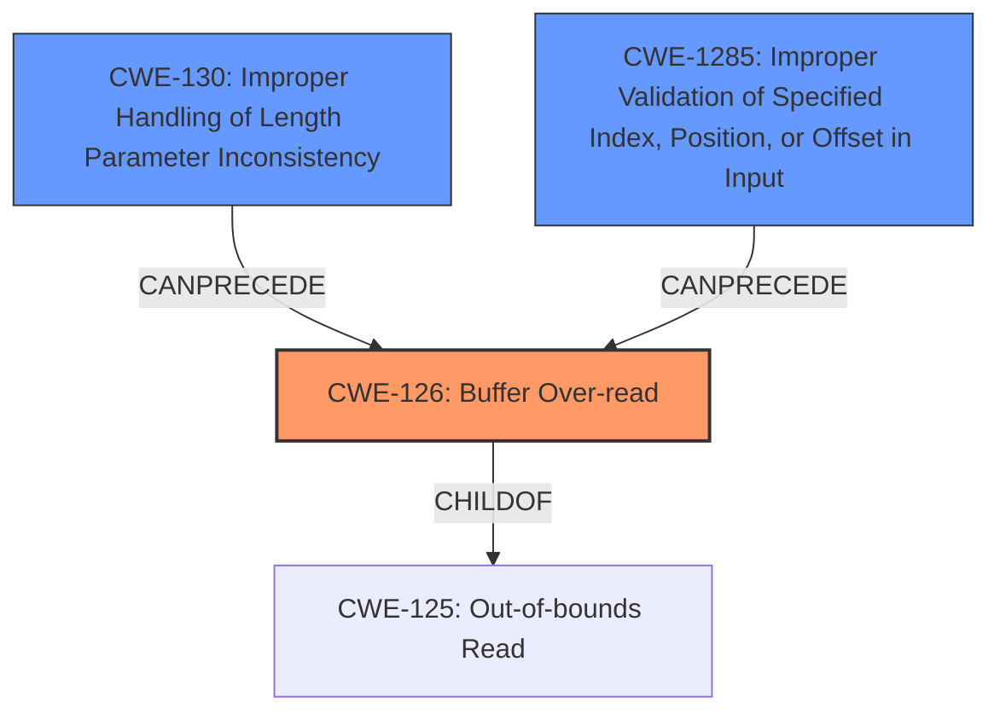

# Raw Analyzer Response for CVE-2024-12975

# Summary
| CWE ID | CWE Name | Confidence | CWE Abstraction Level | CWE Vulnerability Mapping Label | CWE-Vulnerability Mapping Notes |
|---|---|---|---|---|---|
| CWE-126 | Buffer Over-read | 0.9 | Variant | Allowed | Primary CWE |
| CWE-130 | Improper Handling of Length Parameter Inconsistency | 0.6 | Base | Allowed | Secondary Candidate |
| CWE-1285 | Improper Validation of Specified Index, Position, or Offset in Input | 0.5 | Base | Allowed | Secondary Candidate |

## Evidence and Confidence

*   **Confidence Score:** 0.9
*   **Evidence Strength:** HIGH

## Relationship Analysis
The primary CWE is CWE-126, a variant of the more general CWE-125 (Out-of-bounds Read). CWE-126 is selected because it specifically describes a **buffer overread**, which is explicitly mentioned in the vulnerability description. CWE-130, CWE-1285 are considered as they might relate to the root cause of the **buffer overread**, potentially involving incorrect length parameter handling or improper validation of indices. These are at the Base level, providing more detail than a Class-level CWE like CWE-119.

## Vulnerability Chain
The vulnerability chain starts with receiving an invalid packet over the SPI interface. This leads to a **buffer overread** in the CPC application. The root cause could be due to **improper handling of length parameters** or **improper validation of indices**, leading to the overread.

Invalid Packet -> **Improper Length Handling/Index Validation** (Potential Root Cause) -> **Buffer Overread** (CWE-126)

## Summary of Analysis
The analysis is based on the provided vulnerability description and supporting evidence from the release notes. The vulnerability description explicitly mentions a "**buffer overread**" which directly aligns with CWE-126 (Buffer Over-read). The retriever results also support this choice, with CWE-126 having the highest score. The relationship analysis helps to understand how other CWEs like CWE-130 and CWE-1285 could be related as potential root causes. The selection of CWE-126 is at the optimal level of specificity as it directly describes the weakness. I am fairly confident in this assessment due to the explicit mention of the term in the Vulnerability Description.

Relevant CWE Information:

# Enhanced Context (25 CWEs)
The following CWEs were identified as potentially relevant to this vulnerability:

## CWE-131: Incorrect Calculation of Buffer Size
**Abstraction Level**: Base
**Similarity Score**: 0.76
**Source**: dense

**Description**:
The product does not correctly calculate the size to be used when allocating a buffer, which could lead to a buffer overflow.

**Mapping Guidance**:
- Usage: Allowed
- Rationale: This CWE entry is at the Base level of abstraction, which is a preferred level of abstraction for mapping to the root causes of vulnerabilities.

## CWE-126: Buffer Over-read
**Abstraction Level**: Variant
**Similarity Score**: 0.75
**Source**: dense

**Description**:
The product reads from a buffer using buffer access mechanisms such as indexes or pointers that reference memory locations after the targeted buffer.

**Mapping Guidance**:
- Usage: Allowed
- Rationale: This CWE entry is at the Variant level of abstraction, which is a preferred level of abstraction for mapping to the root causes of vulnerabilities.

**Technical Explanation**: CWE-126 describes the scenario where a program reads data beyond the intended boundaries of a buffer. This can occur when the program uses an incorrect index or pointer, or when it doesn't properly validate the size or length of the data being read.
**Security Implications**: This can lead to information disclosure, where sensitive data from other parts of memory is exposed. In some cases, it can also lead to a denial-of-service (DoS) if the program attempts to access invalid memory locations.
**Relationship Analysis**: CWE-126 is a variant of CWE-125 (Out-of-bounds Read), meaning it's a more specific type of out-of-bounds read. It can also be related to other CWEs such as CWE-130 (Improper Handling of Length Parameter Inconsistency) if the root cause involves incorrect length calculations.
**Mapping Guidance**: The MITRE mapping guidance allows for the use of CWE-126.
**Vulnerability Mapping**: Directly maps to the vulnerability description stating "**buffer overread**". This is the most precise match.
**Confidence**: 0.9

## CWE-824: Access of Uninitialized Pointer
**Abstraction Level**: Base
**Similarity Score**: 0.74
**Source**: dense

**Description**:
The product accesses or uses a pointer that has not been initialized.

**Mapping Guidance**:
- Usage: Allowed
- Rationale: This CWE entry is at the Base level of abstraction, which is a preferred level of abstraction for mapping to the root causes of vulnerabilities.

## CWE-125: Out-of-bounds Read
**Abstraction Level**: Base
**Similarity Score**: 0.74
**Source**: dense

**Description**:
The product reads data past the end, or before the beginning, of the intended buffer.

**Mapping Guidance**:
- Usage: Allowed
- Rationale: This CWE entry is at the Base level of abstraction, which is a preferred level of abstraction for mapping to the root causes of vulnerabilities.

## CWE-805: Buffer Access with Incorrect Length Value
**Abstraction Level**: Base
**Similarity Score**: 0.73
**Source**: dense

**Description**:
The product uses a sequential operation to read or write a buffer, but it uses an incorrect length value that causes it to access memory that is outside of the bounds of the buffer.

**Mapping Guidance**:
- Usage: Allowed
- Rationale: This CWE entry is at the Base level of abstraction, which is a preferred level of abstraction for mapping to the root causes of vulnerabilities.

## CWE-130: Improper Handling of Length Parameter Inconsistency
**Abstraction Level**: Base
**Similarity Score**: 0.73
**Source**: dense

**Description**:
The product parses a formatted message or structure, but it does not handle or incorrectly handles a length field that is inconsistent with the actual length of the associated data.

**Mapping Guidance**:
- Usage: Allowed
- Rationale: This CWE entry is at the Base level of abstraction, which is a preferred level of abstraction for mapping to the root causes of vulnerabilities.

**Technical Explanation**: CWE-130 describes a situation where the length parameter in a message or data structure is inconsistent with the actual length of the data, and the software doesn't handle this inconsistency properly. This could lead to **buffer overreads** or other memory corruption issues.
**Security Implications**: If the length parameter is shorter than the actual data length, the program might not process all the data, leading to incomplete operations or security checks. If the length parameter is longer, it could lead to **buffer overreads** when the program attempts to read beyond the end of the actual data.
**Relationship Analysis**: CWE-130 can be a root cause of CWE-126 (Buffer Over-read). If the length parameter is improperly handled, it can cause the program to read beyond the intended boundaries of a buffer.
**Mapping Guidance**: The MITRE mapping guidance allows for the use of CWE-130.
**Vulnerability Mapping**: The vulnerability description mentions receiving an invalid packet. This could imply the packet has an inconsistent length parameter.
**Confidence**: 0.6

## CWE-119: Improper Restriction of Operations within the Bounds of a Memory Buffer
**Abstraction Level**: Class
**Similarity Score**: 0.73
**Source**: dense

**Description**:
The product performs operations on a memory buffer, but it reads from or writes to a memory location outside the buffer's intended boundary. This may result in read or write operations on unexpected memory locations that could be linked to other variables, data structures, or internal program data.

**Mapping Guidance**:
- Usage: Discouraged
- Rationale: CWE-119 is commonly misused in low-information vulnerability reports when lower-level CWEs could be used instead, or when more details about the vulnerability are available.

## CWE-124: Buffer Underwrite ('Buffer