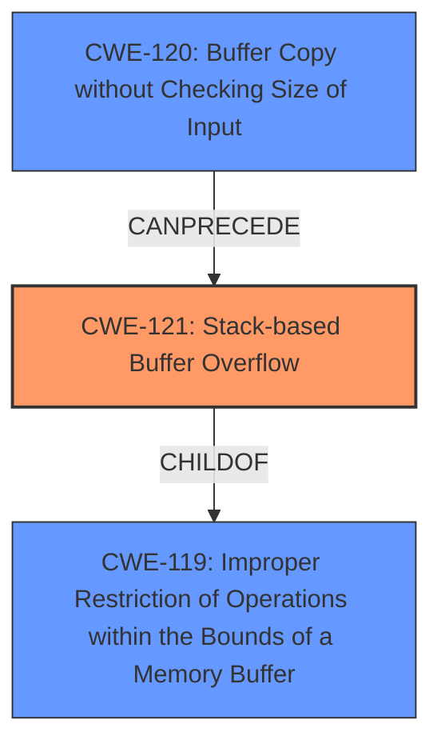

# Raw Analyzer Response for CVE-2024-12988

# Summary
| CWE ID | CWE Name | Confidence | CWE Abstraction Level | CWE Vulnerability Mapping Label | CWE-Vulnerability Mapping Notes |
|---|---|---|---|---|---|
| CWE-121 | Stack-based Buffer Overflow | 1.0 | Variant |  Primary CWE | Allowed |
| CWE-119 | Improper Restriction of Operations within the Bounds of a Memory Buffer | 0.7 | Class | Secondary Candidate | Discouraged |
| CWE-120 | Buffer Copy without Checking Size of Input ('Classic Buffer Overflow') | 0.6 | Base | Secondary Candidate | Allowed-with-Review |

## Evidence and Confidence

*   **Confidence Score:** 0.9
*   **Evidence Strength:** HIGH

## Relationship Analysis
The primary CWE is CWE-121, which is a variant of CWE-119. CWE-120 can precede CWE-787 (Out-of-bounds Write, which is a child of CWE-119), forming a vulnerability chain. The abstraction levels influenced the choice, favoring the more specific variant (CWE-121) over the broader class (CWE-119).

## Vulnerability Chain
The vulnerability chain starts with **lack of input validation** on the `Host` header, leading to a **stack-based buffer overflow (CWE-121)**. This overflow allows for overwriting the return address, potentially leading to remote code execution.

## Summary of Analysis
The analysis strongly suggests that the primary vulnerability is CWE-121 (**Stack-based Buffer Overflow**). This is supported by the description stating that the manipulation of the `Host` argument leads to a **buffer overflow** and the CVE reference links content summary detailing how the unchecked use of `sscanf` causes a stack buffer overflow by overwriting the return address. The high retriever score for CWE-121 further supports this conclusion. CWE-119 (**Improper Restriction of Operations within the Bounds of a Memory Buffer**) is a more general class, and while relevant, CWE-121 provides a more specific and accurate classification. CWE-120 (**Buffer Copy without Checking Size of Input ('Classic Buffer Overflow')**) is a possible contributing factor but less directly supported by the evidence as the root cause. The selection of CWE-121 is at the optimal level of specificity, providing a clear and actionable description of the vulnerability.

Relevant CWE Information:

# Enhanced Context (25 CWEs)
The following CWEs were identified as potentially relevant to this vulnerability:

## CWE-121: Stack-based Buffer Overflow
**Abstraction Level**: Variant
**Similarity Score**: 0.74
**Source**: dense

**Description**:
A stack-based buffer overflow condition is a condition where the buffer being overwritten is allocated on the stack (i.e., is a local variable or, rarely, a parameter to a function).

**Mapping Guidance**:
- Usage: Allowed
- Rationale: This CWE entry is at the Variant level of abstraction, which is a preferred level of abstraction for mapping to the root causes of vulnerabilities.

## CWE-119: Improper Restriction of Operations within the Bounds of a Memory Buffer
**Abstraction Level**: Class
**Similarity Score**: 0.73
**Source**: dense

**Description**:
The product performs operations on a memory buffer, but it reads from or writes to a memory location outside the buffer's intended boundary. This may result in read or write operations on unexpected memory locations that could be linked to other variables, data structures, or internal program data.

**Mapping Guidance**:
- Usage: Discouraged
- Rationale: CWE-119 is commonly misused in low-information vulnerability reports when lower-level CWEs could be used instead, or when more details about the vulnerability are available.

## CWE-120: Buffer Copy without Checking Size of Input ('Classic Buffer Overflow')
**Abstraction Level**: Base
**Similarity Score**: 3.65
**Source**: graph

**Description**:
CWE-120: Buffer Copy without Checking Size of Input ('Classic Buffer Overflow')

**Mapping Guidance**:
- Usage: Allowed-with-Review
- Rationale: There are some indications that this CWE ID might be misused and selected simply because it mentions "buffer overflow" - an increasingly vague term. This CWE entry is only appropriate for "Buffer Copy" operations (not buffer reads), in which where there is no "Checking [the] Size of Input", and (by implication of the copy) writing past the end of the buffer.