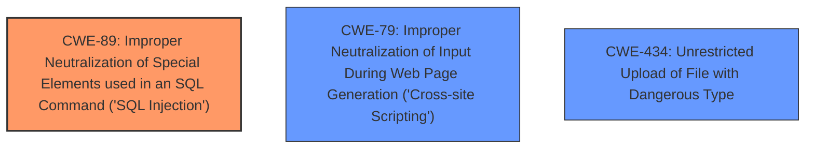

# Raw Analyzer Response for CVE-2024-13024

# Summary
| CWE ID | CWE Name | Confidence | CWE Abstraction Level | CWE Vulnerability Mapping Label | CWE-Vulnerability Mapping Notes |
|---|---|---|---|---|---|
| CWE-89 | Improper Neutralization of Special Elements used in an SQL Command ('SQL Injection') | 1.0 | Base | Primary CWE | Allowed |

## Evidence and Confidence

*   **Confidence Score:** 1.0
*   **Evidence Strength:** HIGH

## Relationship Analysis
The primary relationship that influenced the decision was the direct match of the vulnerability to the description of CWE-89. While other CWEs like CWE-79 (Cross-Site Scripting) and CWE-434 (Unrestricted Upload of File with Dangerous Type) were considered due to their presence in the Retriever Results, they did not align as closely with the root cause of the vulnerability, which is the **improper neutralization of special elements in an SQL command**.

## Vulnerability Chain
The vulnerability chain consists of a single step:

1.  **Root Cause:** **Improper neutralization of special elements** in the `cname` parameter leads to **SQL injection** (CWE-89).

## Summary of Analysis
The analysis focused on identifying the root cause of the vulnerability based on the provided description and CVE reference summary. The vulnerability description explicitly mentions **SQL injection** due to manipulation of the `cname` argument, and the CVE reference summary confirms that the `/campaign.php` script directly incorporates user input into SQL queries without proper sanitization. This directly corresponds to CWE-89, which describes the **improper neutralization of special elements used in an SQL command**.

The evidence from the vulnerability description is: "The manipulation of the argument cname leads to **sql injection**." The CVE Reference Links Content Summary states: "The `/campaign.php` script directly incorporates user input from the `cname` parameter into SQL queries without proper sanitization or validation. This allows for the injection of malicious SQL code."

The selection of CWE-89 is at the optimal level of specificity because it directly addresses the root cause (SQL injection) at the base level of abstraction. While other CWEs were considered, they represent different types of vulnerabilities or higher levels of abstraction that do not precisely capture the essence of this vulnerability.

Relevant CWE Information:
*   CWE-89: Improper Neutralization of Special Elements used in an SQL Command ('SQL Injection')
    *   The product constructs an SQL command using externally-influenced input, but it does not neutralize special elements that could modify the intended SQL command. This perfectly matches the vulnerability description where the `cname` parameter is used without sanitization, leading to SQL injection.
    *   Security Implications: Allows attackers to execute arbitrary SQL commands, potentially leading to unauthorized data access, data modification, or even complete system compromise.
    *   Abstraction Level: Base
    *   Mapping Guidance: Allowed