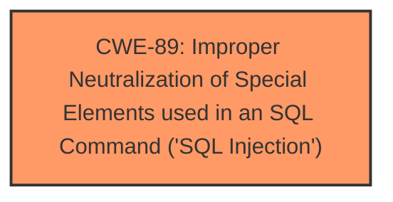

# Raw Analyzer Response for CVE-2024-13039

# Summary

| CWE ID | CWE Name | Confidence | CWE Abstraction Level | CWE Vulnerability Mapping Label | CWE-Vulnerability Mapping Notes |
|---|---|---|---|---|---|
| CWE-89 | Improper Neutralization of Special Elements used in an SQL Command ('SQL Injection') | 1.0 | Base | Allowed | Primary CWE |

## Evidence and Confidence

*   **Confidence Score:** 1.0
*   **Evidence Strength:** HIGH

## Relationship Analysis
The primary relationship to consider is the direct match of the vulnerability description to the definition and examples provided for CWE-89. The retriever results also strongly suggest CWE-89 as the primary mapping, with a score of 1.0. The base level of abstraction is appropriate as it directly represents the **root cause** of the vulnerability.

## Vulnerability Chain
The vulnerability chain starts with the **improper neutralization** of special elements used in an SQL command which is **CWE-89**, leading to a SQL injection. The sequence can be summarized as: User Input -> Lack of Neutralization -> SQL Injection.

## Summary of Analysis
The vulnerability description explicitly mentions **SQL injection** as the **weakness**, with the manipulation of name/email/password/number arguments as the attack vector. The CVE Reference Links Content Summary confirms that the root cause is due to the lack of proper sanitization or validation of the `name` parameter, which is directly used in SQL queries. This aligns perfectly with the definition of CWE-89. The retriever results also strongly suggest CWE-89.

The other CWEs were considered but deemed less appropriate:

*   CWE-79 (Improper Neutralization of Input During Web Page Generation ('Cross-site Scripting')): While input neutralization is a general theme, this vulnerability specifically involves SQL commands, not web page generation.
*   CWE-117 (Improper Output Neutralization for Logs): This is specific to log outputs, which is not the case here.
*   CWE-1336 (Improper Neutralization of Special Elements Used in a Template Engine): The vulnerability doesn't explicitly involve a template engine.
*   CWE-434 (Unrestricted Upload of File with Dangerous Type): This is related to file uploads, which is not relevant here.
*   CWE-352 (Cross-Site Request Forgery (CSRF)): This is a different type of web vulnerability that is not present here.
*   CWE-73 (External Control of File Name or Path): This is related to file path manipulation, which is not relevant here.

Therefore, based on the evidence and the nature of the vulnerability, CWE-89 is the most appropriate and specific classification.