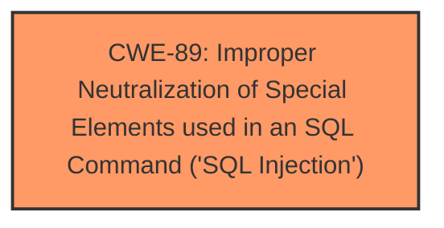

# Analysis Report for CVE-2024-13039

# Vulnerability Analysis Report: CVE-2024-13039

## Description

A vulnerability was found in code-projects Simple Chat System 1.0. It has been rated as critical. Affected by this issue is some unknown functionality of the file /add_user.php. The manipulation of the argument name/email/password/number leads to **sql injection**. The attack may be launched remotely. The exploit has been disclosed to the public and may be used.

## Vulnerability Description Key Phrases

- **Weakness:** sql injection
- **Vector:** manipulation of name/email/password/number argument
- **Product:** code-projects Simple Chat System
- **Version:** 1
- **Component:** /add_user.php

## Analysis (with Relationship Data)

# Summary

| CWE ID | CWE Name | Confidence | CWE Abstraction Level | CWE Vulnerability Mapping Label | CWE-Vulnerability Mapping Notes |
|---|---|---|---|---|---|
| CWE-89 | Improper Neutralization of Special Elements used in an SQL Command ('SQL Injection') | 1.0 | Base | Allowed | Primary CWE |

## Evidence and Confidence

*   **Confidence Score:** 1.0
*   **Evidence Strength:** HIGH

## Relationship Analysis
The primary relationship to consider is the direct match of the vulnerability description to the definition and examples provided for CWE-89. The retriever results also strongly suggest CWE-89 as the primary mapping, with a score of 1.0. The base level of abstraction is appropriate as it directly represents the **root cause** of the vulnerability.



## Vulnerability Chain
The vulnerability chain starts with the **improper neutralization** of special elements used in an SQL command which is **CWE-89**, leading to a SQL injection. The sequence can be summarized as: User Input -> Lack of Neutralization -> SQL Injection.

## Summary of Analysis
The vulnerability description explicitly mentions **SQL injection** as the **weakness**, with the manipulation of name/email/password/number arguments as the attack vector. The CVE Reference Links Content Summary confirms that the root cause is due to the lack of proper sanitization or validation of the `name` parameter, which is directly used in SQL queries. This aligns perfectly with the definition of CWE-89. The retriever results also strongly suggest CWE-89.

The other CWEs were considered but deemed less appropriate:

*   CWE-79 (Improper Neutralization of Input During Web Page Generation ('Cross-site Scripting')): While input neutralization is a general theme, this vulnerability specifically involves SQL commands, not web page generation.
*   CWE-117 (Improper Output Neutralization for Logs): This is specific to log outputs, which is not the case here.
*   CWE-1336 (Improper Neutralization of Special Elements Used in a Template Engine): The vulnerability doesn't explicitly involve a template engine.
*   CWE-434 (Unrestricted Upload of File with Dangerous Type): This is related to file uploads, which is not relevant here.
*   CWE-352 (Cross-Site Request Forgery (CSRF)): This is a different type of web vulnerability that is not present here.
*   CWE-73 (External Control of File Name or Path): This is related to file path manipulation, which is not relevant here.

Therefore, based on the evidence and the nature of the vulnerability, CWE-89 is the most appropriate and specific classification.


## CWE Relationship Analysis

Current CWEs represent these abstraction levels: .


### Vulnerability Chain Analysis

**Chain starting from CWE-89:**
- 89 (Improper Neutralization of Special Elements used in an SQL Command ('SQL Injection')) - ROOT


**Chain starting from CWE-79:**
- 79 (Improper Neutralization of Input During Web Page Generation ('Cross-site Scripting')) - ROOT


### CWE Relationship Diagram

```mermaid
graph TD
    classDef primary fill:#f96,stroke:#333,stroke-width:2px
    classDef secondary fill:#69f,stroke:#333
    classDef tertiary fill:#9e9,stroke:#333
```


*Report generated on 2025-07-13 03:44:14*
