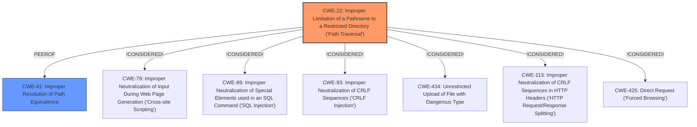

# Analysis for CVE-2024-13042

# Summary

| CWE ID  | CWE Name                                                                          | Confidence | CWE Abstraction Level | CWE Vulnerability Mapping Label | CWE-Vulnerability Mapping Notes |
| :-------- | :---------------------------------------------------------------------------------- | :--------- | :---------------------- | :------------------------------ | :------------------------------ |
| CWE-22    | Improper Limitation of a Pathname to a Restricted Directory ('Path Traversal') | 0.75       | Base                    | Allowed                         | Primary CWE                     |

## Evidence and Confidence

*   **Confidence Score:** 0.75
*   **Evidence Strength:** MEDIUM

## Relationship Analysis

The primary CWE is CWE-22, which relates to path traversal vulnerabilities. While several other CWEs were considered based on the retriever results, none directly address the **manipulation of the path** argument leading to information disclosure as precisely as CWE-22. The other CWEs are either too broad (e.g., CWE-79, CWE-89) or focus on different attack vectors (e.g., CWE-434, CWE-93).

## Vulnerability Chain

The vulnerability chain starts with the **improper handling of the path** argument in the `download` function. This allows an attacker to **manipulate the path** to access files outside the intended directory, leading to information disclosure.

1.  **Root Cause:** **Improper Limitation of a Pathname to a Restricted Directory ('Path Traversal') (CWE-22)** due to **lack of proper input validation** of the `path` argument.
2.  **Impact:** Information Disclosure.

## Summary of Analysis

The primary focus is on the **manipulation of the path** argument in the `download` function, which directly leads to the ability to access unauthorized files.

The evidence supporting CWE-22 is:

*   "Affected is the function download of the file /Searchnew/Subject/download.html. The **manipulation of the argument path** leads to information disclosure."

CWE-22 accurately describes this scenario:

*   From CWE-22 Definition: "The program uses external input to construct a pathname that is intended to refer to a file or directory that is located within a restricted directory. However, the program does not sufficiently neutralize special elements within the pathname such as ".." that can cause the pathname to resolve to a location that is outside of the restricted directory."

Other CWEs Considered and Rejected:

*   CWE-434 (Unrestricted Upload of File with Dangerous Type): This CWE relates to uploading files, which is not the case here.
*   CWE-79 (Improper Neutralization of Input During Web Page Generation ('Cross-site Scripting')): This CWE relates to Cross-Site Scripting, which is not the primary issue described.
*   CWE-89 (Improper Neutralization of Special Elements used in an SQL Command ('SQL Injection')): This CWE relates to SQL Injection, which is not the primary issue described.
*   CWE-93 (Improper Neutralization of CRLF Sequences ('CRLF Injection')): This CWE relates to CRLF Injection, which is not the primary issue described.
*   CWE-113 (Improper Neutralization of CRLF Sequences in HTTP Headers ('HTTP Request/Response Splitting')): This CWE relates to HTTP Request/Response Splitting, which is not the primary issue described.
*   CWE-425 (Direct Request ('Forced Browsing')): This CWE relates to missing authorization checks, but path traversal is more specific.
*   CWE-41 (Improper Resolution of Path Equivalence): While related to path manipulation, CWE-22 is a more direct fit for the "path traversal" scenario.