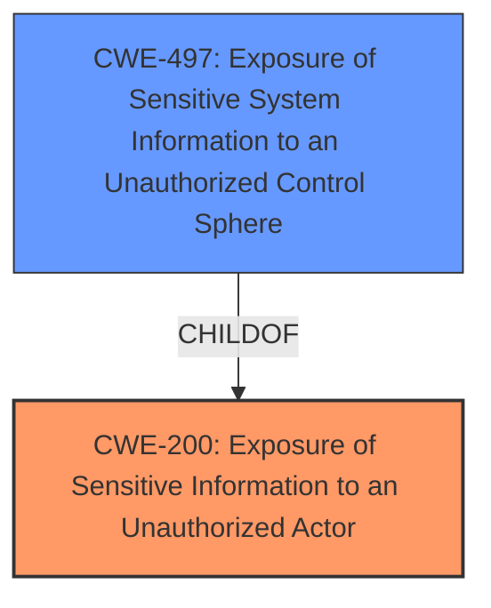

# Raw Analyzer Response for CVE-2024-13086

# Summary
| CWE ID | CWE Name | Confidence | CWE Abstraction Level | CWE Vulnerability Mapping Label | CWE-Vulnerability Mapping Notes |
|---|---|---|---|---|---|
| CWE-200 | Exposure of Sensitive Information to an Unauthorized Actor | 0.9 | Class | Primary | Discouraged, but chosen because it directly reflects the stated vulnerability. |
| CWE-497 | Exposure of Sensitive System Information to an Unauthorized Control Sphere | 0.7 | Base | Secondary | Allowed, considered as a more specific alternative to CWE-200. |

## Evidence and Confidence

*   **Confidence Score:** 0.8
*   **Evidence Strength:** MEDIUM

## Relationship Analysis
The primary relationship considered was between CWE-200 and its potential specializations. While CWE-497 is more specific, the available evidence doesn't explicitly detail system-level information exposure, making CWE-200 a more conservative choice. There are no direct chain relationships apparent in the description. The abstraction level influenced the decision to lean towards the Class level (CWE-200) due to lack of specific details that would warrant a Base level mapping.

## Vulnerability Chain
The vulnerability chain is relatively simple:
1.  **Root Cause:**  **Exposure of Sensitive Information**
2.  **Impact:** Remote attackers can compromise the security of the system.

The chain is direct, with the **exposure** directly leading to potential compromise.

## Summary of Analysis
The initial analysis focused on identifying the root cause of the vulnerability. The description explicitly states "exposure of sensitive information," leading to the consideration of CWE-200. While CWE-200 is discouraged, the specific vulnerability description aligns directly with its definition. The graph relationships highlight the parent-child relationship between CWE-200 and more specific types of information exposure, such as CWE-497. The selection of CWE-200 is primarily based on the explicit statement of the vulnerability and the lack of detailed context that would warrant a more specific CWE. The analysis relies heavily on the provided evidence and considers the mapping guidance while prioritizing accuracy in representing the described vulnerability.

Relevant CWE Information:

# Enhanced Context (25 CWEs)
The following CWEs were identified as potentially relevant to this vulnerability:

## CWE-497: Exposure of Sensitive System Information to an Unauthorized Control Sphere
**Abstraction Level**: Base
**Similarity Score**: 0.74
**Source**: dense

**Description**:
The product does not properly prevent sensitive system-level information from being accessed by unauthorized actors who do not have the same level of access to the underlying system as the product does.

**Mapping Guidance**:
- Usage: Allowed
- Rationale: This CWE entry is at the Base level of abstraction, which is a preferred level of abstraction for mapping to the root causes of vulnerabilities.

## CWE-200: Exposure of Sensitive Information to an Unauthorized Actor
**Abstraction Level**: Class
**Similarity Score**: 0.73
**Source**: dense

**Description**:
The product exposes sensitive information to an actor that is not explicitly authorized to have access to that information.

**Mapping Guidance**:
- Usage: Discouraged
- Rationale: CWE-200 is commonly misused to represent the loss of confidentiality in a vulnerability, but confidentiality loss is a technical impact - not a root cause error. As of CWE 4.9, over 400 CWE entries can lead to a loss of confidentiality. Other options are often available. [REF-1287].

## CWE-200: Exposure of Sensitive Information to an Unauthorized Actor (Primary CWE)

*   **CWE ID:** CWE-200
*   **CWE Name:** Exposure of Sensitive Information to an Unauthorized Actor
*   **Technical Explanation:** The vulnerability description explicitly states "**Exposure of Sensitive Information**" as the root cause. This aligns directly with the definition of CWE-200, which describes a product exposing sensitive information to an actor not authorized to have it. The advisory indicates remote attackers could compromise the system's security due to this **exposure**.
*   **Security Implications:** Unauthorized access to sensitive information can lead to a variety of attacks, including data theft, identity theft, and further system compromise.
*   **Relationship Analysis:** CWE-200 is a Class-level CWE. While more specific Base-level CWEs exist for different types of information exposure, the available information doesn't provide enough detail to determine the specific type of information being exposed.
*   **Mapping Guidance Analysis:** While the mapping guidance discourages the use of CWE-200 because it is often misused to represent the loss of confidentiality which is an impact, the vulnerability description here uses the explicit words that describe CWE-200. Therefore, it is chosen because the description is clear and direct.
*   **Evidence:** "Root cause of vulnerability: Exposure of sensitive information."
*   **Confidence:** 0.9

## CWE-497: Exposure of Sensitive System Information to an Unauthorized Control Sphere (Secondary CWE)

*   **CWE ID:** CWE-497
*   **CWE Name:** Exposure of Sensitive System Information to an Unauthorized Control Sphere
*   **Technical Explanation:** CWE-497 focuses on the **exposure** of sensitive system-level information. This could be a more specific instance of the **exposure** described in the vulnerability. However, without more detail about the exact nature of the exposed information, it's difficult to confirm that it is system-level.
*   **Security Implications:** Similar to CWE-200, but potentially with more severe consequences due to the sensitive nature of system-level information.
*   **Relationship Analysis:** CWE-497 is a child of CWE-200, representing a specific type of information exposure.
*   **Mapping Guidance Analysis:** The mapping guidance allows the use of CWE-497 as it is at the Base level of abstraction.
*   **Evidence:** "Root cause of vulnerability: Exposure of sensitive information." The "Analysis of CVE-2024-13086 Content" mentions that the advisory states a vulnerability exists that could allow remote attackers to compromise the system's security.
*   **Confidence:** 0.7

## CWEs Considered But Not Used:

*   **CWE-120, CWE-121, CWE-23, CWE-78, CWE-123:** These CWEs relate to buffer overflows, path traversal and command injection. These were not used as the vulnerability is about **exposure of sensitive information**.
*   **CWE-755:** This CWE relates to improper handling of exceptional conditions. This was not used as the vulnerability is about **exposure of sensitive information**.
*   **CWE-212, CWE-201, CWE-226, CWE-1272:** These CWEs relate to sensitive information being present in resources or data. These are not a direct fit as the primary issue is the **exposure** itself.
*   **CWE-416:** This CWE relates to Use After Free. This was not used as the vulnerability is about **exposure of sensitive information**.
*   **CWE-787:** This CWE relates to Out-of-bounds Write. This was not used as the vulnerability is about **exposure of sensitive information**.
*   **CWE-294:** This CWE relates to Authentication Bypass by Capture-replay. This was not used as the vulnerability is about **exposure of sensitive information**.
*   **CWE-345:** This CWE relates to Insufficient Verification of Data Authenticity. This was not used as the vulnerability is about **exposure of sensitive information**.
*   **CWE-824:** This CWE relates to Access of Uninitialized Pointer. This was not used as the vulnerability is about **exposure of sensitive information**.
*   **CWE-203:** This CWE relates to Observable Discrepancy. This was not used as the vulnerability is about **exposure of sensitive information**.
*   **CWE-119:** This CWE relates to Improper Restriction of Operations within the Bounds of a Memory Buffer. This was not used as the vulnerability is about **exposure of sensitive information**.
*   **CWE-20:** This CWE relates to Improper Input Validation. This was not used as the vulnerability is about **exposure of sensitive information**.
*   **CWE-610:** This CWE relates to Externally Controlled Reference to a Resource in Another Sphere. This was not used as the vulnerability is about **exposure of sensitive information**.
*   **CWE-73:** This CWE relates to External Control of File Name or Path. This was not used as the vulnerability is about **exposure of sensitive information**.