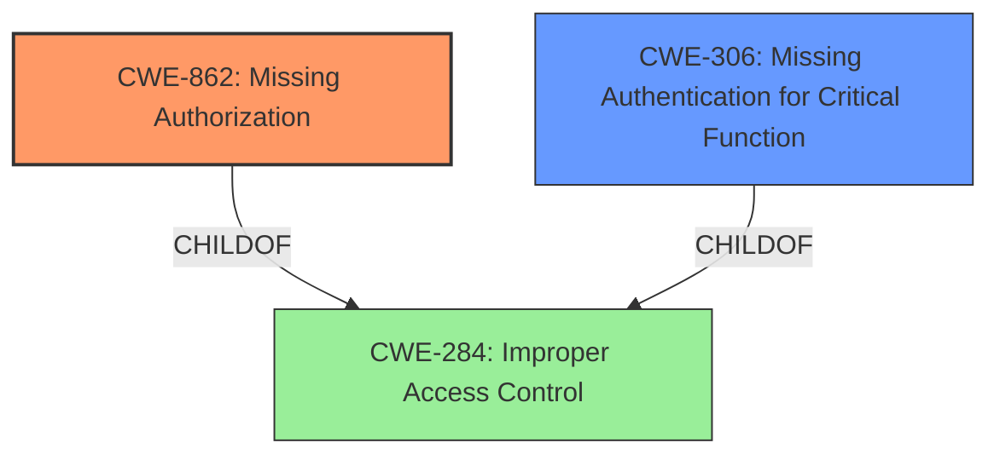

# Analysis for CVE-2024-13109

# Summary

| CWE ID | CWE Name | Confidence | CWE Abstraction Level | CWE Vulnerability Mapping Label | CWE-Vulnerability Mapping Notes |
|---|---|---|---|---|---|
| CWE-862 | Missing Authorization [CWE-862: Missing Authorization] | 0.9 | Base | Allowed | Primary CWE: The application **does not check** whether the user is authorized at all. |
| CWE-306 | Missing Authentication for Critical Function [CWE-306: Missing Authentication for Critical Function] | 0.7 | Base | Allowed | Secondary Candidate: The product **does not perform any authentication** for functionality that requires a provable user identity or consumes a significant amount of resources. |

## Evidence and Confidence

*   **Confidence Score:** 0.8
*   **Evidence Strength:** HIGH

## Relationship Analysis
The primary CWE is CWE-862, which is a Base level CWE. This CWE is appropriate because the vulnerability description and CVE reference summary show that authorization checks are missing. CWE-306 is a secondary candidate because the CVE summary indicates that authentication is also missing. Both CWE-862 and CWE-306 are children of higher-level classes related to access control.

## Vulnerability Chain
The vulnerability chain starts with the **lack of access control** on `/doc.html` and `/v2/api-docs` endpoints, which leads to **unauthorized access**, **information disclosure** and potentially further attacks.
  - The root cause is the **improper authorization** and/or authentication checks.
  - The impact is unauthorized access to sensitive information and potential for further attacks.

## Summary of Analysis
The initial assessment, based on the vulnerability description stating "**improper authorization**," aligns with the CVE reference summary that reveals a **lack of access control** on the `/doc.html` endpoint. This evidence strongly supports CWE-862 [CWE-862: Missing Authorization], as the application **does not check** whether the user is authorized to access the resource. Further the CVE reference summary indicates that authentication is also missing for the `/v2/api-docs` endpoint, suggesting CWE-306 [CWE-306: Missing Authentication for Critical Function] as a secondary weakness because the product **does not perform any authentication**. Both CWEs are at the Base level of abstraction, providing the most specific classification possible based on the available evidence.

The primary evidence supporting CWE-862 [CWE-862: Missing Authorization] is the "**Root cause of vulnerability:** ...the `doc.html` path does not have access permissions set." and "**Weaknesses/vulnerabilities present:** ...lack of access control on the `doc.html` endpoint.". This indicates a clear absence of authorization checks, directly aligning with the CWE description.

The secondary evidence supporting CWE-306 [CWE-306: Missing Authentication for Critical Function] is the exposure of the `/v2/api-docs` endpoint without authentication.

The retriever results also support these findings, with CWE-306 [CWE-306: Missing Authentication for Critical Function] and CWE-425 [CWE-425: Direct Request ('Forced Browsing')] being listed. The guidance on Authentication vs Authorization vs Access Control also helped guide the decision.

Other CWEs considered but not used:

*   CWE-284 [CWE-284: Improper Access Control]: This is a high-level category and less specific than CWE-862 [CWE-862: Missing Authorization].
*   CWE-285 [CWE-285: Improper Authorization]: Similar to CWE-284 [CWE-284: Improper Access Control], this is less specific than CWE-862 [CWE-862: Missing Authorization] as it indicates an incorrect authorization check rather than a missing one.
*   CWE-425 [CWE-425: Direct Request ('Forced Browsing')]: While this could be applicable, it's more of a consequence of the missing authorization rather than the root cause.
*   CWE-863 [CWE-863: Incorrect Authorization]: This would apply if there was an authorization check that was implemented incorrectly.