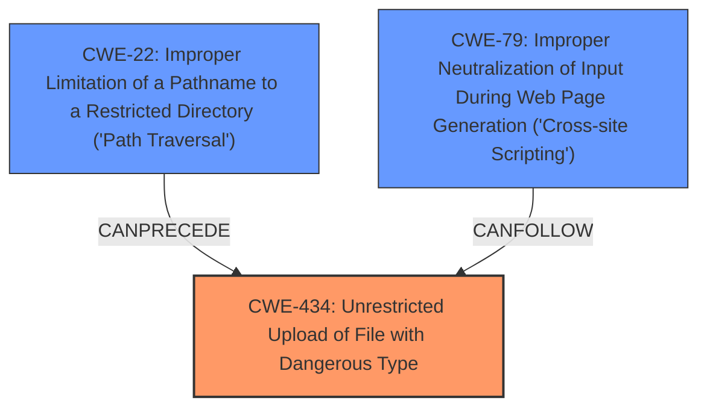

# Raw Analyzer Response for CVE-2024-13134

# Summary
| CWE ID | CWE Name | Confidence | CWE Abstraction Level | CWE Vulnerability Mapping Label | CWE-Vulnerability Mapping Notes |
|---|---|---|---|---|---|
| CWE-434 | Unrestricted Upload of File with Dangerous Type | 1.0 | Base | Allowed | Primary CWE: The application allows uploading of files without validating their type or content. |
| CWE-22 | Improper Limitation of a Pathname to a Restricted Directory ('Path Traversal') | 0.6 | Base | Allowed | Secondary Candidate: An attacker could potentially use path traversal techniques during file upload to place files in unintended directories. |
| CWE-79 | Improper Neutralization of Input During Web Page Generation ('Cross-site Scripting') | 0.6 | Base | Allowed | Secondary Candidate: Uploaded HTML files might contain malicious scripts that could lead to Cross-Site Scripting (XSS) attacks. |

## Evidence and Confidence

*   **Confidence Score:** 0.8
*   **Evidence Strength:** HIGH

## Relationship Analysis
The primary CWE, CWE-434 [Unrestricted Upload of File with Dangerous Type], is a base-level CWE that accurately describes the vulnerability where the application allows the upload of dangerous file types.

CWE-22 [Improper Limitation of a Pathname to a Restricted Directory ('Path Traversal')] and CWE-79 [Improper Neutralization of Input During Web Page Generation ('Cross-site Scripting')] are considered as secondary candidates due to potential attack vectors that may arise from the unrestricted file upload.

## Vulnerability Chain
The vulnerability chain starts with **unrestricted upload** due to **improper input sanitization** (CWE-434). This can lead to the upload of malicious files, potentially resulting in remote code execution or other attacks. The chain could involve path traversal (CWE-22) if an attacker manipulates the file path during upload, or Cross-Site Scripting (CWE-79) if the uploaded files contain malicious scripts.

## Summary of Analysis
The primary classification is CWE-434 [Unrestricted Upload of File with Dangerous Type], which aligns with the vulnerability description stating the **unrestricted upload** of files. The supporting evidence includes the description of the vulnerability in the `addTeacher/editTeacher` functions, and the analysis of CVE-2024-13134 which highlights that the application does not restrict the file extension or content of uploaded files. This aligns directly with the definition of CWE-434.

CWE-22 [Improper Limitation of a Pathname to a Restricted Directory ('Path Traversal')] and CWE-79 [Improper Neutralization of Input During Web Page Generation ('Cross-site Scripting')] were considered as potential secondary weaknesses. CWE-22 could be relevant if the application does not properly handle or sanitize file paths during the upload process, potentially allowing attackers to write files outside the intended directory. CWE-79 could be relevant if the application serves the uploaded files without proper sanitization, leading to potential XSS vulnerabilities. However, they are only potential concerns depending on the specific implementation details.

The chosen CWEs are at the base level, which is appropriate for directly mapping to the root cause of the vulnerability.

Relevant CWE Information:
- **CWE-434: Unrestricted Upload of File with Dangerous Type:** The product allows the upload or transfer of dangerous file types that are automatically processed within its environment. This matches the vulnerability where the application allows uploading files without validating their type or content.
- **CWE-22: Improper Limitation of a Pathname to a Restricted Directory ('Path Traversal'):** The product uses external input to construct a pathname that should be within a restricted directory, but it does not properly neutralize sequences such as ".." that can resolve to a location that is outside of that directory. This could be a secondary vulnerability if the application doesn't properly sanitize file paths during the upload process.
- **CWE-79: Improper Neutralization of Input During Web Page Generation ('Cross-site Scripting'):** The product does not neutralize or incorrectly neutralizes user-controllable input before it is placed in output that is used as a web page that is served to other users. This could be a secondary vulnerability if the application serves the uploaded files without proper sanitization, leading to potential XSS vulnerabilities.