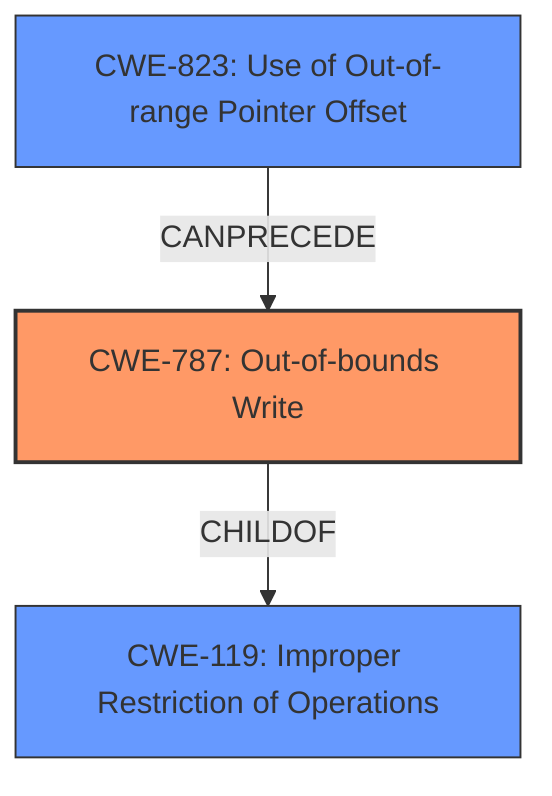

# Enhanced Analysis for CVE-2024-13187

# Summary
| CWE ID | CWE Name | Confidence | CWE Abstraction Level | CWE Vulnerability Mapping Label | CWE-Vulnerability Mapping Notes |
|---|---|---|---|---|---|
| CWE-787 | Out-of-bounds Write | 0.8 | Base | Allowed | Primary CWE |

## Evidence and Confidence

*   **Confidence Score:** 0.8
*   **Evidence Strength:** HIGH

## Relationship Analysis
The primary relationship identified is that CWE-787 (Out-of-bounds Write) is a child of CWE-119 (Improper Restriction of Operations Within the Bounds of a Memory Buffer). The vulnerability involves **code injection**, suggesting a memory corruption issue. The evidence points to the lack of Hardened Runtime allowing for DYLD_INSERT_LIBRARY injection, which implies an out-of-bounds write scenario. The graph shows that CWE-787 can be preceded by CWE-823 (Use of Out-of-range Pointer Offset), which is also related to memory access violations.



## Vulnerability Chain
The vulnerability chain starts with the **missing** Hardened Runtime protection, leading to a vulnerability to DYLD_INSERT_LIBRARY injection. This allows for **code injection**, resulting in potential privacy leakage, intrusion threats, and data security breaches. The chain is as follows:
1.  **Missing** Hardened Runtime (Implicit weakness, not explicitly CWE mapped).
2.  DYLD_INSERT_LIBRARY injection leading to **Out-of-bounds Write** (CWE-787)
3.  **Code Injection** leading to Privacy Leakage, Intrusion Threats, and Data Security Breaches (Impact).

## Summary of Analysis
The initial assessment focused on the **code injection** aspect, considering CWEs related to injection vulnerabilities. However, the root cause analysis, particularly the "Analysis of CVE-2024-13187 Content" section, highlighted the absence of Hardened Runtime, enabling DYLD\_INSERT\_LIBRARY injection. This pointed toward a memory corruption issue, specifically an **out-of-bounds write** (CWE-787). The relationship graph confirms that CWE-787 is related to memory access violations and can be preceded by CWE-823, which involves out-of-range pointer offsets. Given the evidence and the hierarchical relationships, CWE-787 is the most appropriate and specific classification. The "Vulnerability Description Key Phrases" mention "code injection" as the impact, but the "CVE Reference Links Content Summary" points to the root cause as a **lack of** Hardened Runtime protection, which leads to an out-of-bounds write. Therefore, the assessment relies heavily on the "CVE Reference Links Content Summary" section, giving it a higher confidence score.

CWEs like CWE-78 (Improper Neutralization of Special Elements used in an OS Command ('OS Command Injection')), CWE-79 (Improper Neutralization of Input During Web Page Generation ('Cross-site Scripting')), CWE-89 (Improper Neutralization of Special Elements used in an SQL Command ('SQL Injection')), and CWE-74 (Improper Neutralization of Special Elements in Output Used by a Downstream Component ('Injection')) were considered due to the term "code injection." However, these CWEs focus on improper neutralization of inputs, which is not the primary issue here. The primary issue is the lack of Hardened Runtime, leading to memory corruption via out-of-bounds write. Other CWEs like CWE-306 (Missing Authentication for Critical Function) and CWE-285 (Improper Authorization) were also considered but deemed less relevant as the vulnerability's core issue is not related to authentication or authorization.


## CWE Relationship Analysis

Current CWEs represent these abstraction levels: .


### Vulnerability Chain Analysis

**Chain starting from CWE-89:**
- 89 (Improper Neutralization of Special Elements used in an SQL Command ('SQL Injection')) - ROOT


**Chain starting from CWE-823:**
- 823 (Use of Out-of-range Pointer Offset) - ROOT


### CWE Relationship Diagram

```mermaid
graph TD
    classDef primary fill:#f96,stroke:#333,stroke-width:2px
    classDef secondary fill:#69f,stroke:#333
    classDef tertiary fill:#9e9,stroke:#333
```