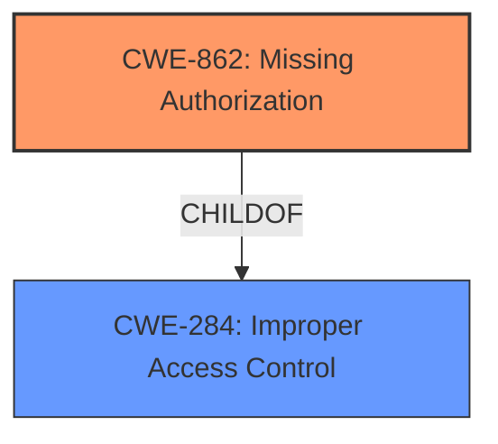

# Enhanced Analysis for CVE-2024-13189

# Summary
| CWE ID | CWE Name | Confidence | CWE Abstraction Level | CWE Vulnerability Mapping Label | CWE-Vulnerability Mapping Notes |
|---|---|---|---|---|---|
| CWE-862 | Missing Authorization | 0.9 | Base | Primary | Allowed |
| CWE-284 | Improper Access Control | 0.6 | Class | Secondary | Discouraged |

## Evidence and Confidence

*   **Confidence Score:** 0.8
*   **Evidence Strength:** HIGH

## Relationship Analysis
The primary relationship influencing the CWE selection is the hierarchical relationship, where CWE-862 Missing Authorization is a more specific type of CWE-284 Improper Access Control. Since the vulnerability description explicitly mentions a **lack of permission verification**, CWE-862 is a more precise fit.



## Vulnerability Chain
The vulnerability chain starts with a **missing authorization** check, leading to unauthorized access and potentially full system permission takeover.

*   **Root Cause:** CWE-862 Missing Authorization
*   **Impact:** Unauthorized access to admin interface, full system permission takeover.

## Summary of Analysis
The initial assessment focused on identifying the root cause of the vulnerability. The key evidence is the statement "The vulnerability is due to a **lack of permission verification** on the admin path." This directly points to CWE-862, Missing Authorization.

CWE-284, Improper Access Control, was considered but deemed less specific. While it's true that the application has improper access control, the root cause is the **missing authorization** check, making CWE-862 a more accurate representation of the vulnerability.

The graph relationships reinforced this decision, as CWE-862 is a child of CWE-284, indicating a more specific categorization. The selection of CWE-862 provides the optimal level of specificity because it precisely describes the **absence of an authorization mechanism** that should have been present.

Relevant CWE Information:

# Enhanced Context (25 CWEs)
The following CWEs were identified as potentially relevant to this vulnerability:

## CWE-862: Missing Authorization
### Technical Explanation:
CWE-862 (Missing Authorization) occurs when software **fails to perform an authorization check** before allowing access to a resource or functionality. This means that the system does not verify whether the user or process making the request has the necessary privileges to perform the requested action.

### Vulnerability Details Match:
The vulnerability description states that the **root cause** is a "**lack of permission verification** on the admin path." This directly aligns with the definition of CWE-862, as the system is not verifying whether the user has the necessary permissions to access the admin interface. The CVE Reference Links Content Summary further supports this, stating that an attacker can obtain all system permissions without logging in, indicating a complete absence of authorization checks.

### Security Implications and Potential Impact:
The security implication of CWE-862 is that unauthorized users can gain access to sensitive resources or functionality. In this specific case, an attacker can access the admin interface and potentially gain full control of the system.

### Parent-Child Relationships:
CWE-862 is a child of CWE-284 (Improper Access Control). This means that CWE-862 is a specific type of access control issue where the authorization check is completely missing.

### Chain Patterns:
The vulnerability chain in this case is straightforward: **Missing Authorization** (CWE-862) leads to **Unauthorized Access**.

### Primary vs. Secondary:
CWE-862 is the primary weakness in this vulnerability because it directly represents the root cause.

### MITRE Mapping Guidance:
The MITRE mapping guidance for Privileges vs Permissions supports the selection of CWE-862: "**Authorization logic is completely missing**" maps to CWE-862.

### Confidence: 0.9

## CWE-284: Improper Access Control
### Technical Explanation:
CWE-284 (Improper Access Control) is a more general weakness that occurs when the system fails to adequately enforce access control restrictions. This can include cases where authorization checks are missing, incomplete, or improperly implemented.

### Vulnerability Details Match:
While the vulnerability description does indicate an access control issue, the specific root cause is the **missing authorization** check, making CWE-862 a more precise fit. CWE-284 is a broader category that encompasses various types of access control failures.

### Security Implications and Potential Impact:
The security implication of CWE-284 is that unauthorized users can gain access to sensitive resources or functionality. The potential impact can range from information disclosure to complete system compromise.

### Parent-Child Relationships:
CWE-284 is a parent of CWE-862.

### Chain Patterns:
Improper Access Control can lead to various impacts, including unauthorized access, data breaches, and privilege escalation.

### Primary vs. Secondary:
CWE-284 is a secondary candidate because it is a broader category that encompasses the specific root cause (CWE-862).

### MITRE Mapping Guidance:
The MITRE mapping guidance discourages the overuse of CWE-284 and recommends using more specific CWEs when possible. Since the root cause is a **missing authorization** check, CWE-862 is the more appropriate choice.

### Confidence: 0.6


## CWE Relationship Analysis

Current CWEs represent these abstraction levels: .


### Vulnerability Chain Analysis

**Chain starting from CWE-284:**
- 284 (Improper Access Control) - ROOT


**Chain starting from CWE-862:**
- 862 (Missing Authorization) - ROOT


### CWE Relationship Diagram

```mermaid
graph TD
    classDef primary fill:#f96,stroke:#333,stroke-width:2px
    classDef secondary fill:#69f,stroke:#333
    classDef tertiary fill:#9e9,stroke:#333
```