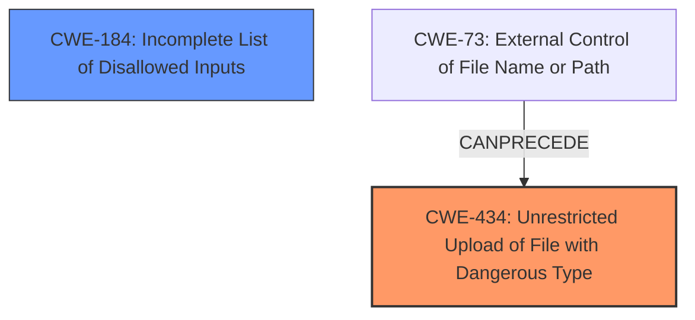

# Enhanced Analysis for CVE-2024-13212

# Summary

| CWE ID | CWE Name | Confidence | CWE Abstraction Level | CWE Vulnerability Mapping Label | CWE-Vulnerability Mapping Notes |
|---|---|---|---|---|---|
| CWE-434 | Unrestricted Upload of File with Dangerous Type | 1.0 | Base | Allowed | Primary CWE |
| CWE-184 | Incomplete List of Disallowed Inputs | 0.6 | Base | Allowed | Secondary Candidate |

## Evidence and Confidence

*   **Confidence Score:** 0.8
*   **Evidence Strength:** HIGH

## Relationship Analysis

The primary relationship is between CWE-434 and CWE-184. CWE-434 represents the **unrestricted upload** itself, while CWE-184 could describe the underlying reason for the **unrestricted upload**, which is an incomplete list of disallowed file types. CWE-73 (External Control of File Name or Path) can precede CWE-434 and may have played a role, but there is not enough information to know.



## Vulnerability Chain

The vulnerability chain starts with an **unrestricted upload** due to a **missing** or **incomplete list of disallowed inputs**.

1.  **Root Cause:** The `singleUpload` method in `src/main/java/com/house/wym/controller/AddHouseController.java` **does not restrict** the types of files that can be uploaded (CWE-434). It might stem from an **incomplete list of disallowed inputs** (CWE-184).
2.  **Weakness:** **Unrestricted file upload** due to **lack of validation** on uploaded file types. Front-end only validation is performed on the file name.
3.  **Impact:** Allows an attacker to upload arbitrary files, potentially including malicious scripts (e.g., HTML with JavaScript, JSP files). Could lead to further attacks, such as cross-site scripting (XSS) or remote code execution (RCE) if the uploaded files are processed unsafely.

## Summary of Analysis

The primary weakness is clearly an **unrestricted upload** of a file with a dangerous type (CWE-434). The description and the CVE reference summary strongly support this. The reference summary states that the `singleUpload` method does not restrict file types, which directly aligns with the definition of CWE-434. The secondary weakness could be the **incomplete list of disallowed inputs** (CWE-184) if that is indeed the reason why the upload is unrestricted.

*   "The `singleUpload` method in `src/main/java/com/house/wym/controller/AddHouseController.java` **does not restrict** the types of files that can be uploaded."

CWE-434 is at the Base level of abstraction and is the most accurate representation of the vulnerability. Other CWEs such as CWE-79 (Cross-site Scripting), CWE-22 (Path Traversal), and CWE-89 (SQL Injection) are possible impacts of the **unrestricted upload** but are not the root cause itself.

I considered CWE-73 (External Control of File Name or Path) because it could be involved in exploiting the vulnerability by manipulating the file name. However, the primary issue is the **lack of restriction** on the file type itself, so I chose CWE-434 as the primary CWE.


## CWE Relationship Analysis

Current CWEs represent these abstraction levels: .


### Vulnerability Chain Analysis

**Chain starting from CWE-89:**
- 89 (Improper Neutralization of Special Elements used in an SQL Command ('SQL Injection')) - ROOT


**Chain starting from CWE-22:**
- 22 (Improper Limitation of a Pathname to a Restricted Directory ('Path Traversal')) - ROOT


### CWE Relationship Diagram

```mermaid
graph TD
    classDef primary fill:#f96,stroke:#333,stroke-width:2px
    classDef secondary fill:#69f,stroke:#333
    classDef tertiary fill:#9e9,stroke:#333
```