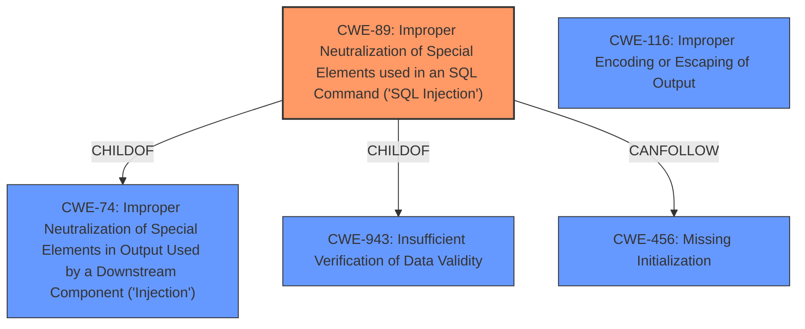

# Enhanced Analysis for CVE-2024-13235

# Summary
| CWE ID  | CWE Name                                                                | Confidence | CWE Abstraction Level | CWE Vulnerability Mapping Label | CWE-Vulnerability Mapping Notes |
| :-------- | :---------------------------------------------------------------------- | :--------- | :-------------------- | :------------------------------ | :------------------------------ |
| CWE-89    | Improper Neutralization of Special Elements used in an SQL Command ('SQL Injection') | 1          | Base                  | Primary                         | Allowed                       |
| CWE-116   | Improper Encoding or Escaping of Output                               | 0.7        | Class                 | Secondary                       | Allowed-with-Review           |

## Evidence and Confidence

*   **Confidence Score:** 0.9
*   **Evidence Strength:** HIGH

## Relationship Analysis
The primary weakness is CWE-89, which is a Base level CWE and accurately reflects the **SQL Injection** vulnerability. CWE-89 is a child of CWE-74 (Improper Neutralization of Special Elements in Output Used by a Downstream Component ('Injection')) and CWE-943 (Insufficient Verification of Data Validity). It can also precede CWE-456 (Missing Initialization).

CWE-116 is a Class level CWE and a parent of more specific Base level CWEs, but it is a relevant secondary weakness given the description mentioning **insufficient escaping**.



## Vulnerability Chain
The vulnerability chain starts with **insufficient escaping** and **lack of sufficient preparation** of the SQL query, leading to the **SQL Injection** vulnerability. This allows attackers to **extract sensitive information from the database**.

## Summary of Analysis
The primary CWE is CWE-89 because the vulnerability description explicitly states "SQL Injection" and provides details about **insufficient escaping** and **lack of sufficient preparation** on the existing SQL query. This aligns directly with CWE-89's definition: "The product constructs all or part of an SQL command using externally-influenced input...but it does not neutralize or incorrectly neutralizes special elements that could modify the intended SQL command".

CWE-116 is considered a secondary weakness because the description mentions **insufficient escaping**, which relates to the encoding or escaping of data. However, since the primary issue is the resulting **SQL Injection**, CWE-89 is the more direct and specific classification.

The evidence is strong, as the vulnerability description clearly points to an **SQL Injection** vulnerability due to **insufficient escaping** and **lack of sufficient preparation**. The retriever scores also support CWE-89 as a relevant CWE.

Other CWEs were considered but deemed less appropriate:
*   CWE-74, CWE-90, CWE-94, CWE-502, CWE-352, CWE-425, CWE-862, CWE-863, CWE-790: These CWEs are either too broad or address different types of vulnerabilities (e.g., LDAP Injection, Code Injection, CSRF, Missing Authorization). They do not directly address the specific issue of **SQL Injection** caused by **insufficient escaping** and **lack of sufficient preparation** on the existing SQL query.
*   CWE-138: Improper Neutralization of Special Elements. This is too high level.
*   CWE-472: External Control of Assumed-Immutable Web Parameter. While external input is involved, the core issue is the improper handling of that input in the SQL query.
*   CWE-303: Incorrect Implementation of Authentication Algorithm. This is unrelated to the **SQL Injection** vulnerability.
*   CWE-212: Improper Removal of Sensitive Information Before Storage or Transfer. This is about sensitive information exposure, not the injection itself.
*   CWE-178: Improper Handling of Case Sensitivity. This is unrelated to the **SQL Injection** vulnerability.
*   CWE-471: Modification of Assumed-Immutable Data (MAID). This is not about modifying data.
*   CWE-613: Insufficient Session Expiration. This is unrelated to the **SQL Injection** vulnerability.
*   CWE-98: Improper Control of Filename for Include/Require Statement in PHP Program ('PHP Remote File Inclusion'). This is related to PHP file inclusion and not related to **SQL Injection**.


## CWE Relationship Analysis

Current CWEs represent these abstraction levels: .


### Vulnerability Chain Analysis

**Chain starting from CWE-471:**
- 471 (Modification of Assumed-Immutable Data (MAID)) - ROOT


**Chain starting from CWE-94:**
- 94 (Improper Control of Generation of Code ('Code Injection')) - ROOT


### CWE Relationship Diagram

```mermaid
graph TD
    classDef primary fill:#f96,stroke:#333,stroke-width:2px
    classDef secondary fill:#69f,stroke:#333
    classDef tertiary fill:#9e9,stroke:#333
```